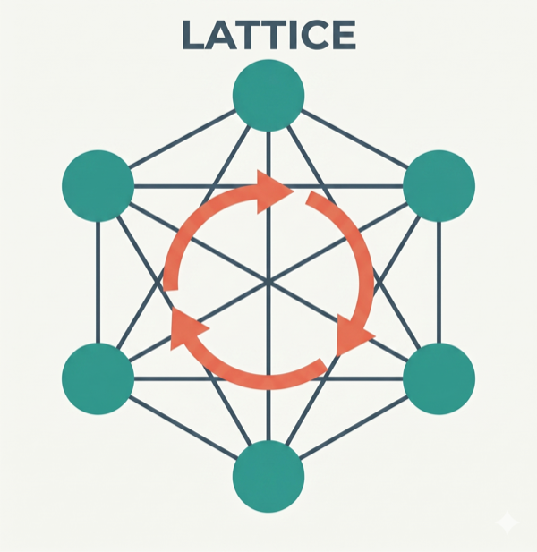

# Lattice

<br/>

可组合的 AI 技能，教会助手结构化思维——设计优先、上下文感知、架构引导。

[](LICENSE)
[](https://claude.ai/marketplace)
[](https://cursor.com)
[](https://github.com/techygarg/lattice/blob/main/CONTRIBUTING.md)
[](https://martinfowler.com/articles/reduce-friction-ai/)

## 什么是 Lattice？

AI 编程助手往往直接跳到写代码、默默做出设计决策、在对话中途忘记约束条件，并且输出没有任何人依据真正标准审查过的结果。
Lattice 通过三个层次的可组合技能来修复这些问题 ——原子技能、分子技能、精炼技能—— 这些技能嵌入了经过实战检验的工程规范，再加上一个动态上下文层，可以在每个功能开发周期中持续积累你项目的标准、决策和审查经验。

Lattice 的设计遵循三个原则：

- **技能优于提示词** —— 存放在代码仓库中的、有版本管理的、团队所有的技能文件，胜过某位开发者本地机器上的个人提示词。
- **可组合性优于单体** —— 能够组合成工作流的小型、单一用途的技能，胜过试图涵盖一切的单份指令文档。
- **动态上下文优于静态配置** —— `.lattice/` 文件夹在每个功能周期中不断变得更智能，而不是配置一次就被遗忘。

## 三个层级

| 层级 | 用途 |
|------|------|
| **原子技能 (Atoms)** | 单一原则的护栏 —— 整洁代码、架构、领域驱动设计、安全编码、测试质量、设计优先等 |
| **分子技能 (Molecules)** | 组合原子技能的多步骤工作流 —— 设计、实现、重构、修复、审查 |
| **精炼技能 (Refiners)** | 引导式访谈，生成项目特定的标准，定制原子技能在你团队中的行为方式 |


完整的技能清单与机制说明，请参见 [工作原理](how-it-works.md)。

## 流水线

这些技能构成了一个交付生命周期：`requirement-forge` → `design-blueprint` → `code-forge` → `review`，同时 `refactor-safely` 和 `bug-fix` 覆盖结构性和缺陷驱动的工作。
`requirement-forge` 启动整个流程 —— 它扮演资深产品经理与业务分析师的双重角色，在 `.lattice/requirements/` 中生成结构化的功能规格说明，直接作为 `design-blueprint` 的输入。
对于已有代码库的团队，`architecture-compass` 位于流水线之前 —— 它会扫描代码仓库、进行结构化访谈，并产出团队达成一致的架构方向，在任何代码变更开始之前为团队提供指引。
每个阶段都会消费并在 `.lattice/` 中生成产出物，使动态上下文层不断累积丰富。


## 快速开始

1. **安装 Lattice** — 选择适合你环境的路径：

   **选项 A — Claude Code 插件（同样适用于 Cursor —— 可自动读取 Claude Code 技能）**
   ```
   /plugins marketplace add techygarg/lattice
   /plugins install lattice
   /reload-plugins
   ```

   **选项 B — 克隆并在本地安装（适用于任何 AI 工具）**

   ```bash
   git clone https://github.com/techygarg/lattice.git
   cd lattice
   ./tools/install.sh /absolute/path/to/your/skills/folder
   ```

   传入你所用工具的技能目录：Claude Code 使用 `~/.claude/skills/`，Cursor 使用 `.cursor/skills/`，或任何其他工具的技能文件夹。

   > **立即试用。** 
   代码仓库中包含 `sample/` 目录 —— 一个真实的 .NET 8 用户服务规格说明，其中已包含需求、领域概念和约束条件。
   将 `sample/` 文件夹内容复制到任意空目录中，并按照以下步骤操作。

2. **在 AI 工具的聊天界面中运行 `/lattice-init`** —— 扫描项目，按优先级顺序推荐精炼技能，创建 `.lattice/config.yaml`。
所有技能命令（`/lattice-init`、`/requirement-forge`、`/design-blueprint`、`/code-forge` 等）都是在 AI 聊天界面中输入的，而非终端。

3. **规格定义 (Spec)**（可选但推荐）—— `/requirement-forge` 扮演资深产品经理与业务分析师的双重角色，在任何设计开始之前定义 epic 和功能规格说明。
接受现有的 PRD、功能列表或口头描述。
生成 `.lattice/requirements/` 作为 design-blueprint 的直接输入。

4. **设计** —— `/design-blueprint` 在编写任何代码之前，逐步走完五个渐进的设计层级。

5. **实现** —— `/code-forge` 根据批准的设计蓝图生成实现代码，应用所有质量原子技能。

6. **审查** —— `/review` 审计变更，并将洞察信息持久化到 `.lattice/` 中，供下一个周期使用。

## 了解更多

- [起源故事](origin.md) — Lattice 为何存在，五种协作模式如何成为一个可安装的框架，以及背后的设计理念
- [工作原理](how-it-works.md) — 完整技能清单、可组合性机制、原子/分子/精炼技能详解、流水线
- [实践指南](practical-guide.md) — 场景驱动的问答：快速开始、定制化、工作流、转型、团队使用、故障排查
- [架构指南针](architecture-compass.md) — 架构思考伙伴：为何存在、预期效果、会话如何运作
- [配置参考](configuration.md) — `.lattice/config.yaml` 中每个配置项的详细说明
- [框架智能](framework-intelligence.md) — 验证环节、反馈回路、AI 合规技术
- [协同判断](collaborative-judgment.md) — 为何 AI 应在真正的判断性决策时提问，以及运行时如何工作
- [系列文章](../../reduce-friction-ai-main.md) — Lattice 所实现的五种协作模式（martinfowler.com）

## 开发技能

用于创建和维护 Lattice 本身的辅助技能——参见 [`dev-skills/`](https://github.com/techygarg/lattice/dev-skills/)。

## 许可证

MIT
