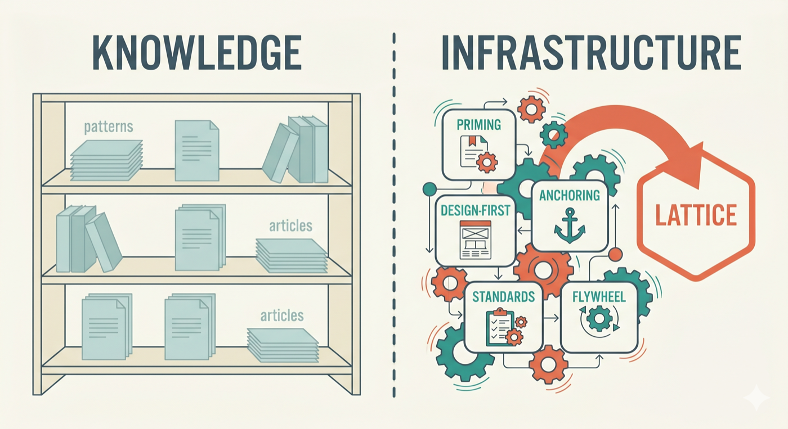

# 从模式到框架——Lattice 的起源

*为什么五种协作模式变成了一个可安装的框架，以及这些决策背后的设计理念。*

---

大多数协作模式并不会在第一次尝试时就失败。
它们会在几周后失败。
预置文档没有被更新过。
设计对话因为某个功能突然变得紧急而被跳过。
审查发现的问题讨论过一次，然后就消失在聊天记录中。
这些想法本身仍然有道理。
但真正松懈下来的是习惯。

这正是贯穿 [martinfowler.com 上一个五部分系列文章](../../reduce-friction-ai-main.md) 的主线：

1. [知识预置](../knowledge-priming.md) —— 像对待新员工一样让 AI 上手
2. [设计优先协作](../design-first-collaboration.md) —— 先白板后键盘
3. [上下文锚定](../context-anchoring.md) —— 将决策外化到动态文档中
4. [编码团队标准](../encoding-team-standards.md) —— 使隐性知识可执行
5. [反馈飞轮](../feedback-flywheel.md) —— 收集经验教训，改进系统

Lattice 就是这些模式的可安装版本。

---

## 可操作化的鸿沟

这些想法本身并不是真正的问题。
真正的问题在于如何在日常工作中让它们保持活力。

一个团队阅读了 “知识预置” 文章，创建了一份预置文档，六周后这份文档就过时了。
另一个团队尝试了一个冲刺周期的 “设计优先”，然后在截止日期迫近时又退回到了 “直接生成代码”。
一位资深工程师精心编写了细致的指令，而她的同事们 ——那些没有读过那篇文章的人—— 仍然使用通用的提示词。

<ins>这是软件工程中一个熟悉的问题。理解一种实践与持续应用它完全是两回事</ins>。
团队不会依赖开发者去记住代码风格规则 —— 而是将它们编码为 `.eslintrc`、CI 流水线、基础设施即代码。
Lattice 反复追问的问题是：为什么 AI 协作模式就应该有所不同？

<ins>在 “理解这些模式” 与 “在团队中、跨项目中、随时间推移而持续践行它们” 之间的鸿沟，正是 Lattice 旨在弥合的差距</ins>。

---

## 三个设计原则

框架的设计遵循三个原则，每个原则都源于系列文章中的一个洞察：

**<ins>技能优于提示词</ins>。** 提示词是个人的、短暂的 —— 它存在于某位开发者的本地机器上，并在会话结束时消失。
技能是共享的、有版本管理的 —— 它存在于代码仓库中，通过拉取请求 (pull request) 演进，并为每个人提供一致的应用。

**<ins>可组合性优于单体</ins>。** 能够组合成工作流的小型、单一用途的技能，胜过试图一次性涵盖所有内容的大型指令文档。
当某些内容需要变更时，团队只需更改一个原子技能，而每个组合了它的分子技能都将受益。

**<ins>动态上下文优于静态配置</ins>。** 框架随着使用而变得更智能。
审查发现的结果会反馈回生成过程。
随着精炼技能的重新运行，标准会变得更加精准。
`.lattice/` 文件夹不是一次配置就被遗忘的配置 —— 它是随着每个功能周期不断积累的制度化记忆。

---

## 从模式到技能

Lattice 中的每一个框架决策都源于这五篇文章之一。

### 知识预置 → `knowledge-priming` 原子技能与精炼技能

核心观点：在生成代码之前分享精心整理的项目上下文，并将其视为基础设施而非习惯。

`knowledge-priming` 原子技能加载项目的标识 ——技术栈、架构概览、目录布局、约定—— 使得所有其他技能都能在了解真实项目的前提下运行。
`knowledge-priming-refiner` 运行一个引导式访谈，提取这些上下文并将其写入 `.lattice/standards/knowledge-base.md`。
一旦被编码，所有其他技能都将从更接近实际项目的状态出发，而不是基于 “互联网的平均形态”。

### 设计优先 → `design-first` 原子技能与 `design-blueprint` 分子技能

前述文章主张在编写代码之前先逐步走过渐进的设计层级。

`design-first` 原子技能编码了这五个层级的方法论：能力、组件、交互、契约、实现。
`design-blueprint` 分子技能编排了一个完整的设计工作流 —— 加载上下文、依次走查各层级、在每个阶段应用架构和 DDD 护栏，并将批准后的蓝图作为动态文档持久化。
一旦这存在于一个分子技能中，这项纪律就不再依赖于个人的意志力。

### 上下文锚定 → `context-anchoring` 原子技能

决策需要一个持久的地方，在会话结束后仍然存在。

`context-anchoring` 原子技能管理每个功能的动态文档。
每个分子技能都使用它。
`design-blueprint` 创建该文档，`code-forge` 用实现决策丰富它，`refactor-safely` 和 `bug-fix` 将自己的决策记录在其中。
该文档跨会话持久存在，在恢复工作时能够恢复完整的上下文。

### 编码团队标准 → code-quality 原子技能与精炼技能

核心观点：资深工程师的直觉判断应该是可执行且可共享的。

每个 code-quality 原子技能 ——`clean-code`、`architecture`、`domain-driven-design`、`secure-coding`、`test-quality`—— 都通过自我验证清单和反模式扫描编码了特定的原则。
精炼技能可对每个项目定制这些默认值。
结果是：无论谁调用该技能，团队标准都能适用。
一台机器上的某个提示词可能只帮助某一位开发者；
而代码库中带版本的技能则会改变整个团队的工作方式。

### 反馈飞轮 → `review` 分子技能与 `.lattice/learnings/`

最后一个模式：将 AI 会话转变为团队可以从中学习的东西，而不是丢弃的东西。

所有分子技能通过 `learning-harvest` 原子技能向 `.lattice/learnings/operational-learnings.md` 贡献内容并从中消费。
该原子技能提出跨切面 (cross-cutting) 的模式；用户确认哪些内容进入文档。
如果一次审查发现了 “贫血领域模型”，下一次 `code-forge` 会话会读取该模式并避免它。
如果一次设计会话发现拆分具有独立生命周期的实体可以防止不变量冲突，未来的设计会话将从中受益。
这个循环是双向的，并由用户筛选管理。

---

## 设计上有主见，本质上可定制

Lattice 内置了明确的主张：整洁架构 (Clean Architecture)、DDD、安全编码、测试质量。
这是有意为之。

对于已经在实践这些规范的团队，Lattice 放大了他们已有的信念。
这些模式不是泛泛的 “应用最佳实践” 建议 —— 它们被编码为可验证的护栏，AI 在每次生成和审查时都会应用。

对于希望采纳这些实践但尚未开始的团队，Lattice 降低了门槛。
AI 在实际项目工作中应用这些模式，而不是在培训练习中。
团队在实战中学习，在防止最常见错误的护栏引导下进行。

这些都是主张。
并非每个团队都会认同它们。
这就是定制化发挥作用的地方。

<ins>每个 code-quality 原子技能都附带内置的默认值。
精炼技能允许团队通过引导式访谈进行定制，在 `.lattice/standards/` 中生成标准文档</ins>。
两种模式：

**覆盖模式 (overlay)** （推荐大多数团队使用）：定制化叠加在默认值之上。
只记录有差异的部分 —— 某条规则的调整、团队约定替换通用默认值。
未被替换的所有内容仍然有效。

**替换模式 (override)**：团队的文档完全替换原子技能的默认值。
对于那些工程理念与框架内置内容根本不同的团队，这提供了完全的控制权。

在这两种情况下，输出都是 `.lattice/standards/` 中的一个带版本的文件 —— 可通过 PR 审查、归团队所有、通过与代码相同的工作流进行演进。
每当标准演进时，重新运行精炼技能即可。

## 一个端到端的功能生命周期

一个 SaaS 产品要添加通知偏好设置功能：发票通过邮件发送、产品动态通过应用内通知、紧急提醒通过短信、营销消息与强制性系统通知分开管理。
这类功能通常会让团队暴露出来 —— 他们的 AI 工作流是有纪律的还是临时拼凑的。

**初始化。** `lattice-init` 扫描代码库，识别现有配置，并按优先级建议精炼技能。
团队将项目标识、架构约定和审查期望记录到 `.lattice/` 中。
每个项目只发生一次，但会影响后续的每一个功能。

**设计。** `design-blueprint` 加载项目上下文，逐步走完五个渐进的设计层级。
团队决定偏好规则属于哪里，通知设置是放在现有的用户聚合内部还是应该拥有自己的边界，以及特定渠道的规则如何通过契约和验证流动。
批准后的蓝图作为动态文档持久化。此时尚未编写任何代码。

**实现。** `code-forge` 加载设计蓝图以及先前的操作性经验。
它在项目的架构边界内生成领域模型、应用流程、持久化变更和测试。
每个组件在生成后都会根据原子技能清单进行验证。
动态文档中会丰富实现决策。

**审查。** `review` 执行独立的评估。
它可能会注意到营销偏好和强制性通知被合并到了同一个模型中，或者某个基础设施的关注点泄漏到了领域层。
发现结果按严重程度排序。
操作性经验通过 `learning-harvest` 被推荐给用户进行确认。

**下一个功能。** 当同一个产品后续添加静音时段或渠道级别的升级规则时，`code-forge` 会加载之前的见解并避免相同的错误。
系统比上一个功能时更加智能。

<ins>整个系列是以流水线的方式运行的。
初始化 = 知识预置。
设计 = 设计优先。
跨阶段的动态文档 = 上下文锚定。
生成和审查时的原子技能清单 = 编码团队标准。
为下一个周期提供输入的见解 = 反馈飞轮</ins>。

---

## 累积效应

这个框架并不是只应用一次这些模式就放任不管。
它会随着团队的持续使用而发生变化。

经过几个功能周期后，原子技能应用的不再是通用规则 —— 它们应用的是团队的规则，并受到团队审查历史的影响。
`code-forge` 不会重复 `review` 已经发现过的错误，因为经验循环是持久且自动的。
随着精炼技能在积累的经验下被重新运行，标准会变得更加精准。

协同判断会自我减弱。
随着项目的标准通过精炼技能和上下文文档变得更加具体，真正模棱两可的事情会越来越少。
教 AI 提出问题的那个原子技能会逐渐降低自身的必要性。
<ins>如果某个问题在多个功能中反复出现，这就是一个信号 —— 运行某个精炼技能并将答案编码为标准。
一旦被编码，原子技能就有了明确的答案，不再需要提问</ins>。

保持不变的是：基础框架 ——原子技能、分子技能、精炼技能—— 在功能周期之间从不改变。
不断增长的是：动态上下文层。
标准变得更加精准。
经验捕获更多的模式。
上下文文档积累着项目的决策历史。

这就是反馈飞轮从一个好想法变成日常工作惯例的地方 —— 在生成和审查之间形成一个持久化的读/写循环，每次使用该流水线时都会运行。

-- -

## 系列文章之外的扩展

<ins>在构建框架的过程中，浮现出一个系列文章未曾明确命名的想法：**协同判断 (collaborative judgment)**</ins>。
AI 编程助手不断面临真正的歧义 —— 边界模糊的单一职责判断、有争议的层归属、可争辩的聚合边界。
在没有指导的情况下，AI 会默默地解决这些歧义，并呈现出其中一条路径，就好像根本不存在权衡一样。
<ins>`collaborative-judgment` 原子技能教会 AI 识别真正的不确定性，并将其以结构化选项的形式暴露出来，而不是猜测。
完整的设原理请参见 [协同判断](collaborative-judgment.md) </ins>。

<ins>构建 Lattice 也澄清了三个支撑性的经验教训：生成和验证作为两个独立的环节效果更好；
markdown 技能需要符合特定措辞风格的表述才能被一致地遵循；
原子/分子/精炼技能的拆分源于将原则、工作流和定制化分离开的实际需求。
这些背后的机制请参见 [框架智能](framework-intelligence.md) </ins>。

原子技能和分子技能的集合并非封闭的。
随着社区提供反馈，新的分子技能可以从现有原子技能中组合出来，新的原子技能可以编码额外的原则。
精炼技能机制意味着新的主张可以作为默认值到来，由团队去重塑 —— 而不是必须接受的强制性要求。
