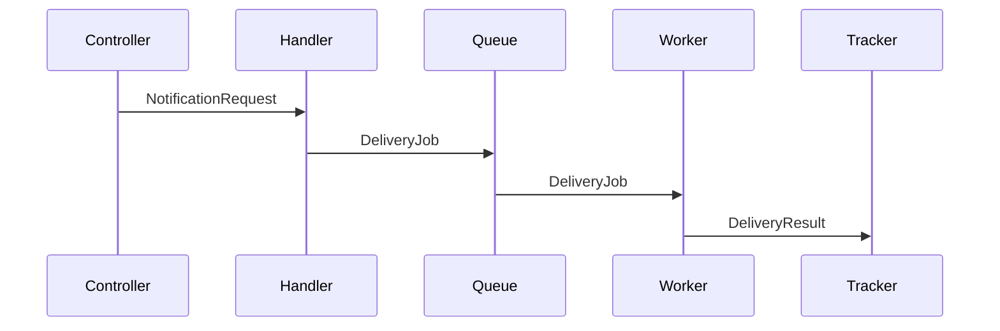

# Design-First 方法论详解

5 层渐进式设计方法的扩展参考。用于符号指南、接口模式、理解每层的优秀 vs 糟糕输出示例。

## 各层级优秀 vs 糟糕输出

### 第 1 层：能力（Capabilities）

**优秀**——范围明确、用户可感知、无实现细节：
1. 用户在订单发货时收到邮件通知
2. 用户可以在账户中查看通知历史
3. 失败的投递会自动重试

**糟糕**——泄露实现细节或范围蔓延：
1. NotificationService 类通过 SendGrid 发送邮件
2. Redis 支持的队列以指数退避方式处理重试
3. 用户可以配置通知偏好（短信、邮件、推送）
4. 分析仪表板跟踪投递率

糟糕版本命名了技术（第 2 层）、描述了内部机制（第 3 层）、添加了未请求的功能（范围蔓延）。

### 第 2 层：组件（Components）

**优秀**——命名构建块，单一职责：
- **NotificationHandler**：接收通知请求、验证载荷、排队等待投递
- **EmailDeliveryWorker**：处理队列中的通知、通过配置的提供商发送
- **DeliveryTracker**：记录投递状态、为用户查询提供历史记录

**糟糕**——包含交互模式或实现细节：
- **NotificationHandler**：接收请求、验证载荷、*调用 EmailDeliveryWorker.send()*、*将结果存储在 DeliveryTracker 数据库中*

糟糕版本描述了组件如何通信（第 3 层）以及如何存储数据（第 5 层）。

### 第 3 层：交互（Interactions）

**优秀**——组件之间传递什么，而非如何传递：
1. Controller → NotificationHandler：`NotificationRequest`（收件人、模板、变量）
2. NotificationHandler → Queue：`DeliveryJob`（提供商、收件人、渲染内容）
3. Queue → EmailDeliveryWorker：`DeliveryJob`
4. EmailDeliveryWorker → DeliveryTracker：`DeliveryResult`（状态、时间戳、失败时的错误信息）

**糟糕**——包含方法签名或实现细节：
1. Controller 调用 `handler.processNotification(req: NotificationRequest): Promise<void>`
2. Handler 调用 `queue.add('email', job, { attempts: 3, backoff: { type: 'exponential' } })`

糟糕版本定义了函数签名（第 4 层）和配置细节（第 5 层）。

### 第 4 层：契约（Contracts）

**优秀**——类型化接口，无函数体：
```typescript
interface NotificationPayload {
  recipient: string;
  template: string;
  variables: Record<string, string>;
}

interface DeliveryResult {
  status: 'sent' | 'failed' | 'pending';
  timestamp: Date;
  error?: string;
}

interface EmailProvider {
  send(payload: NotificationPayload): Promise<DeliveryResult>;
}
```

**糟糕**——包含实现逻辑：
```typescript
interface EmailProvider {
  send(payload: NotificationPayload): Promise<DeliveryResult>;
}

// 实现
class SendGridProvider implements EmailProvider {
  async send(payload: NotificationPayload): Promise<DeliveryResult> {
    const response = await sendgrid.send({ to: payload.recipient, ... });
    return { status: 'sent', timestamp: new Date() };
  }
}
```

糟糕版本包含类体——应属于第 5 层。

## 压缩式 vs 渐进式：同一功能的两种方法

**压缩式**（单次提示 → 实现）：AI 收到"构建通知服务"，产出 400 行代码。选择将 BullMQ 包装在自定义 RetryQueue 抽象中。添加了 webhook 通知通道。在内联实现中定义接口。开发者必须一次性评估范围、架构、集成、契约、代码质量——全部纠缠在一起。

**渐进式**（5 层 → 实现）：第 2 层，开发者发现不必要的 RetryQueue 包装——BullMQ 已原生支持重试。第 1 层，webhook 通道被标记为超出范围。第 4 层，接口在编码前已达成一致。第 5 层，实现更小、集成更好、已在每个设计维度上审查过。

渐进式方法整体并不更耗时。第 2 层中两分钟的对话移除了不必要的抽象——节省了三十分钟审查、测试、维护包装了框架已提供功能的代码的时间。

## 序列图符号

对于第 3 层交互，使用 ASCII 或 Mermaid。两者均可接受；选择对特定设计更清晰的一种。

**ASCII 符号**：
```
Controller  →  Handler  →  Queue  →  Worker  →  Tracker
   |              |           |          |          |
   |--request---->|           |          |          |
   |              |--job----->|          |          |
   |              |           |--job---->|          |
   |              |           |          |--result->|
```

**Mermaid 符号**：


为每条箭头标注传递的数据——而非方法名、实现细节。关注在组件之间移动*什么*。

## 接口定义模式

第 4 层的契约应该：

- **最小化**：仅包含形式化已同意交互所需的接口。不包含工具类型、辅助接口。
- **自文档**：类型名和方法名使目的显而易见，无需注释。
- **与第 3 层对齐**：第 3 层的每次交互都有对应的接口或类型。第 4 层不得出现新的交互。
- **语言适配**：使用项目的语言约定。TypeScript 项目用 TypeScript 接口，Python 项目用 Python protocols/ABCs，Go 项目用 Go interfaces。
