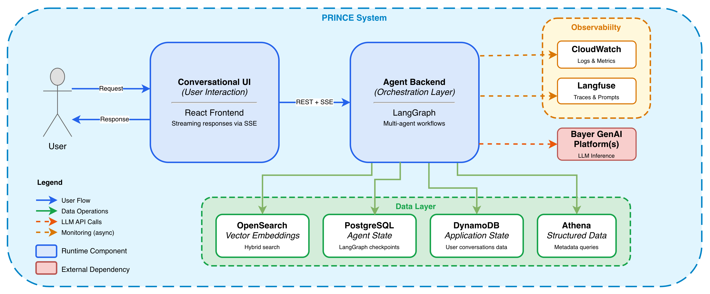
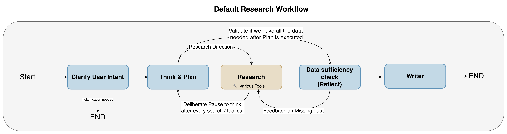
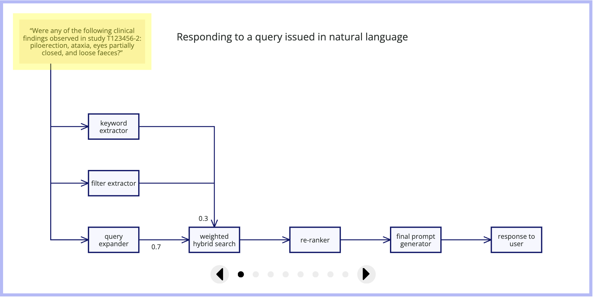
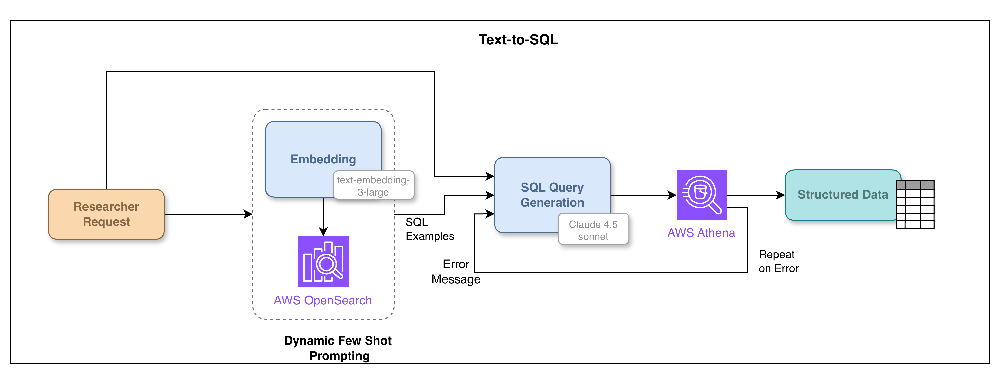

# 构建可靠的智能体 AI 系统

一份构建生产级智能体 AI 系统的案例研究

<i>本文介绍了 Preclinical Information Center (PRINCE)，一个由 Bayer AG 与 Thoughtworks 联合开发的云托管平台，
旨在应对制药行业在药物开发中面临的挑战。
PRINCE 利用智能体检索增强生成（Agentic RAG）和 Text-to-SQL 技术，整合了数十年来的安全研究报告数据。
我们描述了 PRINCE 从基于关键词的搜索，演变为一个能够回答复杂问题并起草监管文件的智能研究助手的全过程。
我们通过上下文工程（Context Engineering）——即信息如何在专用智能体之间被塑造和路由—— 以及 Harness Engineering —— 即如何围绕模型构建编排、恢复和可观测性以保持控制和可靠性—— 的视角，对关键工程决策进行了反思。
该系统通过透明度、可解释性和人机回环集成来优先保障信任。
PRINCE 展示了 AI 在制药行业的变革潜力，在确保治理和合规的同时，显著提高了数据的可访问性和研究效率</i>。

---

|[Sarang Sanjay Kulkarni](https://www.linkedin.com/in/sarangk90/)| |
|:---|---:|
| | Sarang Kulkarni 是 Thoughtworks 的首席顾问，工作于软件工程、数据平台和应用 AI 的交汇领域。他专注于构建生产级生成式 AI 系统，特别是检索增强生成 (RAG) 和多智能体工作流，并帮助团队将这些系统从早期想法推向实际应用。 Sarang 还参与了 Thoughtworks 全球 AI 服务开发团队的工作，并在 O'Reilly 平台讲授关于构建生产就绪 RAG 应用的课程。 |
| [原文](https://martinfowler.com/articles/reliable-llm-bayer.html) |2026/6/16|

---
内容
* [挑战：穿越临床前数据迷宫](#挑战穿越临床前数据迷宫)
* [解决方案：PRINCE —— 一个演进中的平台](#解决方案prince--一个演进中的平台)
* [系统架构：构建一个可靠的智能体 RAG 系统](#系统架构构建一个可靠的智能体-rag-系统)
* [智能体 RAG 系统](#智能体-rag-系统)
  - [澄清用户意图](#澄清用户意图)
  - [思考与规划：流程反思](#思考与规划流程反思)
  - [Researcher 智能体](#researcher-智能体)
  - [反思智能体：数据验证与充分性](#反思智能体数据验证与充分性)
  - [写作智能体：答案合成与格式化](#写作智能体答案合成与格式化)
* [在生产级 LLM 系统中建立信任](#在生产级-llm-系统中建立信任)
  - [透明度与可解释性](#透明度与可解释性)
  - [评估](#评估)
  - [监控](#监控)
* [面向韧性的工程：错误处理与恢复](#面向韧性的工程错误处理与恢复)
* [提升数据质量：命名实体识别与标注](#提升数据质量命名实体识别与标注)
* [旅程继续：迭代开发](#旅程继续迭代开发)
* [结论](#结论)

---

临床前药物发现本质上是一个复杂且数据密集的过程。
在这一关键阶段，研究人员面临着高效访问和分析这一极端产生的大量信息的重大挑战。
传统的基于关键词的搜索方法，往往依赖于严格的布尔逻辑，在面对临床前研究问题微妙而复杂的特性时，常常力不从心。

LLM 的出现带来了变革性的机遇。
通过将 LLM 的生成能力与信息检索系统的精确性相结合，[检索增强生成（RAG）](gen-ai-patterns.md#检索增强生成-rag) 已成为一种有前景的技术。
这种方法有潜力彻底改变临床前数据访问方式，使研究人员能够用自然语言提出复杂问题，并获得基于专有数据的准确、上下文丰富的答案。

Bayer 及早认识到了这一潜力，并致力于探索这些技术如何应对临床前研究中长期存在的挑战。

在这篇文章中，我们分享了这段历程 —— Bayer 对生成式 AI 的早期投入如何催生了 PRINCE，一个基于 Agentic RAG 构建的智能体 AI 系统。
本案例研究探讨了技术架构、工程决策，以及将临床前数据检索从一个充满挑战的迷宫转变为直观对话体验的过程中所获得的经验教训。

PRINCE 背后的许多工程决策，现在可以通过上下文工程和管控工程 (harness engineering) 的视角来理解，尽管在系统最初设计时我们并未使用这些术语。
上下文工程决定了每个模型接收哪些信息、不接收哪些信息，以及上下文如何在研究、反思和写作等专门步骤之间流动。
管控工程则构建了围绕模型的支撑结构：编排、工具边界、状态持久化、重试、回退、验证、反思循环、可观测性和人工审查。

虽然本文侧重于技术架构和工程挑战，但我们发表在 [Frontiers in Artificial Intelligence](https://www.frontiersin.org/journals/artificial-intelligence/articles/10.3389/frai.2025.1636809/full) 上的论文更详细地涵盖了产品演进和业务影响。

---
## 挑战：穿越临床前数据迷宫

Bayer 的临床前研究格局，与许多大型制药组织一样，以多样化且广泛的数据为特征。
这包括来自各种研究的高度结构化数据集，以及嵌入在研究报告、出版物和监管提交文件等文本文档中的大量非结构化信息。
研究人员在有效访问和分析这些信息时经常遇到重大障碍：

- **数据孤岛**：信息分散在众多不同的系统和存储库中，使得很难获得与特定化合物或研究相关的临床前数据的全面、整体的视图。

- **搜索能力有限**：传统的基于关键词的搜索引擎难以处理临床前术语和研究问题的复杂性和多变性，常常产生不相关、不完整或过多的结果。

- **耗时的手动分析**：跨多个文档提取特定见解或汇编信息需要大量的手动工作，将宝贵的研究人员时间从核心科学活动中转移出去。

这些固有的挑战突显了对更高效、更智能、更集成的临床前数据检索和分析方法的明确需求。

---
## 解决方案：PRINCE —— 一个演进中的平台

为应对这些挑战，Bayer 开发了 Preclinical Information Center (PRINCE) 平台。
PRINCE 被设计为临床前数据的统一入口，最初侧重于整合以前孤立的结构化研究元数据，并以 “可搜索” 的方式将其暴露出来。
这一初始阶段允许用户应用高级筛选器，并主要从结构化研究元数据中检索信息。

然而，Bayer 大量有价值的临床前知识都存在于数十年来积累的非结构化 PDF 研究报告之中。
由于多年来多次系统迁移，与这些报告相关联的结构化元数据可能不完整、缺失，甚至包含错误的注释。
关键是，具有权威性的 “黄金标准” 信息始终存在于经批准的 PDF 研究报告之中。

生成式 AI 的出现，特别是 RAG，为解锁这一丰富的非结构化数据提供了关键。
通过集成 RAG 能力，PRINCE 开始将范式从基于筛选器的 “搜索” 工具转变为自然语言的 “提问” 系统，使研究人员能够直接查询这些研究报告的内容。

这一演进反映了 PRINCE 经历的三个不同阶段：

- **搜索**：
初始阶段侧重于创建一个通往数千份非临床研究报告的统一入口，将来自多个临床前领域的多个内部数据孤岛整合为可搜索的格式，主要利用结构化元数据。

- **提问**：
此阶段引入了利用检索增强生成（RAG）的 AI 驱动问答系统。
这使得研究人员能够通过用自然语言提问，直接从非结构化数据（包括历史报告中的扫描版 PDF）中获取见解。

- **执行**：
当前阶段将 PRINCE 定位为能够执行复杂任务的主动研究助手。
这是通过集成多智能体系统实现的，使平台能够处理复杂的查询、编排工作流，并支持起草监管文件等活动。

这种从 “搜索” 到 “提问” 再到 “执行” 的有意演进，是对行业在临床前开发中对更高效率和创新需求的战略性回应。
通过为研究人员提供日益强大的工具来访问、分析和处理临床前数据，PRINCE 旨在实现更快速的数据驱动决策，
减少不必要的实验需求，并最终加速开发更安全、更有效的疗法。

---
## 系统架构：构建一个可靠的智能体 RAG 系统

该系统作为一个交互式对话 UI 运行，由强大的后端基础设施提供支持。
其架构专为处理复杂查询和提供准确、上下文丰富的答案而设计，使用 LangGraph 进行编排，并通过 FastAPI 应用提供服务。

[Figure 1](#figure-1) 展示了系统上下文 ——UI、后端、数据存储、LLM 备选方案和可观测性—— 而 [Figure 2](#figure-2) 则深入到系统如何协调其专用智能体的细节。

#### Figure 1

*Figure 1：系统上下文与支撑平台*

- **用户请求**：当用户通过基于 React 构建的对话式 UI 提交请求时，流程开始。

- **编排**：用户请求被路由到后端基于 LangGraph 的编排层。
该工作流引擎协调一个多阶段流程，
依次进行：澄清用户意图、思考与规划、执行研究（使用 RAG 和 Text-to-SQL）、验证数据完整性，最后通过 Writer 智能体生成响应。
该工作流包含有意设置的暂停点和反馈循环，以确保在继续之前数据完整。（我们将在后面的专门章节中详细探讨该智能体工作流。）

- **数据检索与状态管理**：Researcher 智能体与一个全面且分布式的数据生态系统交互：
  - 所有研究报告的向量表示存储在 OpenSearch 中，构成信息检索的核心知识库。
  - 经过各种 ETL 和协调处理后的精选结构化数据，通过 Athena 访问。
  - 智能体执行的状态被细致跟踪。在每个逻辑步骤（LangGraph 节点执行）之后，相应的状态使用 LangGraph checkpointer 持久化到 PostgreSQL 中。
  - 更广泛的应用级状态在 DynamoDB 中管理。

- 该系统利用内部 GenAI 平台，托管来自 OpenAI、Anthropic、Google 和开源提供商的各种模型。
这些平台通过统一的 OpenAI 兼容端点暴露所有模型，使得轻松切换模型并为每个任务选择最佳工具成为可能。
它们还管理控制平面，强制执行速率限制和其他保护措施以防止滥用。

- **弹性与错误处理**：健壮性是一个关键的设计原则，系统中内置了多种回退机制：
  - 如果特定 LLM 失败，系统会在回退到替代模型或平台之前自动重试请求数次，以确保服务连续性。
  - 为了从瞬时故障中快速恢复，在单个 LLM 调用级别和逻辑节点级别（即智能体计划中的整个步骤）都实现了重试。
  - 此外，智能体还会收到错误的上下文，以便它们能够制定不同的轨迹或替代行动计划作为响应。

- **可观测性与评估**：整个系统的性能和可靠性都受到监控：
  - 系统整体健康状况和指标通过 Cloudwatch 进行跟踪。
  - Langfuse 作为主要的可观测性工具，提供所有生产流量的详细追踪。
  这允许对问题进行深入调试。
  此外，评估数据集在 Langfuse 中存储和管理，使得分析性能评分和诊断特定故障更加容易。
  评估使用 RAGAS 评估框架完成。
  实时流量评估每天进行一次，而数据集评估则在核心工作流、提示词或底层模型发生重大变更时进行。

- **最终响应**：一旦智能体处理完请求并生成满意的响应，它就会被发送回对话式 UI，呈现给用户。

贯穿该架构的一个设计原则是上下文纪律 (context discipline)。
更大的上下文窗口并未消除对每个智能体所见内容进行选择性筛选的需求。
在早期迭代中，将过多信息放入上下文会使系统更难以引导和评估。
因此，PRINCE 避免将提示词当作一个容纳所有可用信息的大容器。
相反，不同阶段接收不同的上下文：规划上下文用于 “思考与规划”，检索上下文用于 Researcher 智能体，证据上下文用于 Reflection 智能体，综合上下文用于 Writer 智能体。
这减少了上下文污染，使系统更易于调试、评估和改进。

这些步骤确保了系统能够通过利用复杂的多智能体架构以及多样化的强大工具和数据源，为广泛复杂查询提供可靠且上下文相关的答案。

---
## 智能体 RAG 系统

PRINCE 集成了一个智能体 RAG 系统（ [Figure 2](#figure-2) ），以处理需要多步骤、推理以及与不同工具或数据源交互的复杂用户请求。
该设置使用 LangGraph 实现，编排整个工作流，并利用 Researcher 智能体、Writer 智能体和 Reflection 智能体来执行特定任务。
该系统被设计为健壮且可靠，具有多种回退机制，以确保即使某些组件发生故障，系统也能继续运行。

#### Figure 2

*Figure 2：研究工作流程*

### 澄清用户意图

“澄清用户意图” 步骤是对付歧义的第一道防线。
随着系统扩展到包括毒理学和药理学等不同领域，简单的用户查询往往变得模糊，使得自动选择正确的工具变得困难。
该系统不是依赖于在所有数据源上进行昂贵的试错，而是主动提出澄清性问题，以精确定位具体的领域或数据类型。

这确保了系统通过必要的约束来增强查询，以定位正确的工具。
我们还在通过开发 UI 中的领域级选择来对此进行优化，这将允许用户预先筛选出有效的工具。
为了进一步减少摩擦，系统还提供 AI 辅助的源推荐：当用户未选择任何数据源 —— 或选择了多个但没有明确焦点时，模型会分析用户查询背后的意图，并推荐最相关的来源。
用户保留完全控制权，可以接受、调整或覆盖推荐，确保领域专业知识始终拥有最终决定权。
这种 “快速失败” 机制可防止在模糊查询上浪费执行资源，同时精心的调优确保了当意图已经明确时，系统保持不引人注目。

从上下文工程的角度来看，此步骤是工作流中的第一个组装决策：它在任何检索开始之前，约束了哪些工具、领域和数据源将在范围内，确保后续智能体接收到的是一个聚焦的而非开放式的问题。

### 思考与规划：流程反思

“思考与规划” 步骤负责制定策略以完成用户的请求。
这个关键组件为系统提供了一个专用的空间，在采取行动之前对后续步骤进行推理 —— 这是一种受到 [Anthropic Think 工具](https://www.anthropic.com/engineering/claude-think-tool) 启发的技术。
重要的是，此步骤执行的是 *流程反思 (process reflection)*：
评估智能体是否朝着最终目标取得正确的进展，是否走在正确的轨道上，而不是评估数据本身。

在多步骤的智能体工作流中，特别是那些涉及许多顺序动作的工作流中，流程反思是必不可少的。
考虑一个场景，系统需要执行 50 个步骤来完成一个复杂的任务。
在每个节点，系统都必须问自己：我是否在以正确的方式执行这些步骤？
我是否在取得应有的进展？
当前的轨迹是否在朝着用户的目标前进？
“思考与规划” 步骤提供了这种元认知能力，允许系统反思自己的工作流并相应地调整其策略。

这个 “思考空间” 在涉及多个工具调用的场景中已被证明特别有价值。
当 PRINCE 最初开发时，它只有几个工具：一个用于基于 RAG 的检索，另一个用于 Text-to-SQL 查询。
然而，随着我们集成更多数据源以扩展系统能力，可用工具的数量显著增长。
随着工具的爆炸式增长，出现了一个固有的挑战：不同工具之间的关注点重叠和领域边界问题。

例如，多个工具可能服务于相似但略有不同的目的 —— 查询结构化元数据与非结构化报告，或检索研究摘要与详细的实验数据。
当面对属于相似领域但处理略有不同数据的工具时，LLM 有时会难以针对给定的查询选择最合适的工具。
通过引入一个专用的思考步骤，系统能够显式地推理哪个工具最符合用户的意图，评估每个可用工具的特性，并做出更明智的决策。
这种方法显著提高了工具选择的准确性。

除了工具选择之外，“思考与规划” 步骤对于编排多步骤流程至关重要。
PRINCE 中的许多复杂查询需要一系列工具调用，其中必须先分析一个工具的输出，然后再确定下一步行动。
例如，系统可能首先查询结构化元数据以识别相关研究，然后使用这些研究 ID 从非结构化报告中检索详细信息，最后综合这些发现。
如果没有一个用于流程反思的专用空间，系统将尝试线性地执行这些步骤，而不会评估每个步骤是否使其更接近目标。
有了思考步骤，系统可以暂停，评估其在工作流中的进展，并智能地规划完成用户请求所需后续工具调用。

### Researcher 智能体

Researcher 智能体是系统的主要信息收集者。
随着我们将新的科学领域接入 PRINCE，我们始终观察到数据分为两大类：结构化和非结构化。
尽管具体实现技术可能因领域而异 —— 例如，对药理学查询利用 Snowflake Cortex Analyst 进行 Text-to-SQL，而对毒理学则采用其他更定制的方法 —— 这些检索策略背后的基本原理是一致的。

随着 PRINCE 扩展到多个临床前领域，一个拥有扁平工具列表的单一 Researcher 智能体变得越来越难以管理。
许多工具操作于相似的概念 ——“研究”、“发现”、“检测”—— 但根据领域的不同，指向不同的底层数据集、模式和监管解释。
例如，当用户提到 “该研究” 时，相关上下文可能是一项重复剂量毒理学研究、一个心血管安全药理学包，或聚合海量数据表中的某项特定检测，每一项都有其各自偏好的真实来源。

为了避免一个单一的 monolithic 智能体处理重叠的工具和略有不同的数据契约，我们正在积极将 Researcher 能力演进为一个领域特定子智能体的层次结构。
在这个提议的架构中，每个领域智能体将拥有自己的工具集（例如，毒理学 RAG + 毒理元数据 SQL，或药理学 RAG + 检测级别 SQL），以及定制的提示指令，这些指令编码了该领域的数据模型如何工作、哪些表或索引是权威的，以及如何解释关键概念。
我们期望这将保持职责的一致性，减少意外的跨领域泄漏，并使按领域推理和测试检索行为更加容易。

为了有效地从这种多样化环境中获取见解，Researcher 智能体采用了一种混合检索方法，专注于两种不同的模式：

- **检索增强生成（RAG）**：用于处理非结构化数据，主要是 PDF 报告。
- **Text-to-SQL**：用于查询存储在 Amazon Athena 中的结构化数据。

这种双策略使系统能够弥合叙述性科学报告与定量实验数据之间的差距。

在这个更新的愿景中，顶层 Researcher 智能体被设计为一个协调者，而不是一个全知全能的单一组件。
根据澄清后的用户意图和来自 UI 的任何明确领域选择，它将把查询路由到适当的领域子智能体，然后该子智能体可以在其自身边界内决定如何组合 RAG 和 Text-to-SQL。
这种模式旨在从用户角度保持 “一个 Researcher” 的简洁性，同时在内部允许每个领域演进自己的工具、模式和检索方案，而不会破坏系统的其余部分。

#### 用于非结构化数据的检索增强生成（RAG）

鉴于有数千份临床前研究报告和其他非结构化文档的巨大存储库，RAG 对于通过将 LLM 响应建立在这个特定知识库的基础上来提取相关见解至关重要。
RAG 流水线包括一个全面的数据摄入过程和一个复杂的查询时架构。

**数据摄入过程**：
临床前研究报告，主要是跨越数十年的 PDF 文件，通常包括带有复杂表格的扫描文档，首先被集中到一个 S3 数据湖中，并通过一个为此语料库调优的提取流水线进行处理。
提取出的文本被标准化为结构化 JSON，然后使用一种既能保留足够科学上下文又能保持数据块大小适合检索的分块策略进行分块。

每个数据块都通过来自 Amazon Athena 的研究和章节级元数据进行丰富（例如研究 ID、化合物、物种、给药途径、页码和父章节），这随后使得在 RAG 层能够进行精确的元数据过滤。
最后，这些带注释的数据块被嵌入并索引到 Amazon OpenSearch Service 中，形成了向量存储，支持对历史语料库以及随着新报告或更新报告到达的每日增量进行语义和元数据感知的检索。

**查询时 RAG 流水线**：当用户提交查询时，系统启动一个多阶段检索过程。
该流水线被设计为从向量数据库中有效检索最相关和最可信的信息，以作为 LLM 响应的依据。

#### Figure x

*Figure x：请参考 [原文](https://martinfowler.com/articles/reliable-llm-bayer.html)，了解各个步骤的动画展示效果*

为了说明这一流程，请考虑以下示例查询：“在试验 T123456-2 中是否观察到以下任何临床发现：竖毛、共济失调、眼睛半闭和稀便？”
系统通过以下步骤处理该查询：

- **关键词提取**：
首先由 LLM 分析用户的自然语言查询。
通过精心的提示词工程，模型被指示提取与文档语料库中关键词搜索高度相关的关键词（例如，“竖毛”、“共济失调”、“眼睛半闭”、“稀便”）。

- **元数据筛选器生成**：
与此同时，LLM 根据查询生成一个元数据筛选器。
例如，提取筛选条件 `eq(study_id, T123456-2)` 以缩小搜索范围。
该筛选器是通过少样本提示动态生成的，模型会收到各种排列组合示例，以确保其能够处理多样化的筛选请求。

- **查询扩展**：
为确保全面检索并涵盖措辞和术语的变体，由一个更小、更快的模型执行 [查询扩展](gen-ai-patterns.md#查询重写-query-rewriting) （多查询或查询重写）。
该模型基于原始问题生成 n=5 个语义相似的查询。
对于示例查询，这可能包括如下变体：

  - “研究 T123456-2 中报告的临床症状，包括鸡皮疙瘩、协调性差、眼睑半闭或腹泻。”
  - “实验 T123456-2 中记录的关于毛发竖立、动作不稳、眼睛未完全睁开或水样便的观察结果。”
  - “试验 T123456-2 中注意到的临床观察有哪些，特别是关于毛发竖立、平衡受损、眼睛半闭或软便的存在情况。”

- **混合检索器**：
来自向量数据库（ [Amazon OpenSearch Service](https://aws.amazon.com/opensearch-service/) ）的信息检索采用混合搜索方法，
该方法结合了元数据筛选、语义向量相似性搜索（kNN）和基于关键词的检索。
该过程按以下步骤执行：

  - **元数据筛选**：上一步生成的元数据筛选器（例如 `eq(study_id, T123456-2)`）直接应用于向量数据库查询。
  这根据在从 Amazon Athena 摄取过程中附加到文本块的结构化元数据，对搜索空间进行预筛选，
  确保只考虑与指定研究 ID（或其他相关元数据）相关联的文本块。
  这显著地将搜索空间从数百万个向量缩小到更易处理的数十到数百个范围内，从而提高了效率和相关性。

  - **并行混合搜索执行**：对于 n=5 个扩展查询中的每一个，针对经过筛选的 Amazon OpenSearch Service 向量数据库并行执行单个混合搜索查询。
  该查询结合了语义向量相似性搜索（kNN）和基于关键词的搜索，利用 OpenSearch 的能力进行高效的多向量和文本搜索。

  - **加权结果评分**：在并行执行的每个单独的混合搜索中，对结果应用加权方法。
  语义搜索结果赋予权重 0.7，关键词搜索结果赋予权重 0.3，以平衡上下文理解和精确术语匹配。
  该权重是通过实验确定的，以优化对数据的检索效果。

  - **结果聚合和初始排序**：所有 5 个并行混合搜索执行的结果（相关文本块及其加权分数的集合）被聚合起来。
  将所有搜索结果中的唯一文本块汇集在一起，并利用它们在并行搜索中获得的最高加权分数来确定初始排序。
  此步骤根据这些聚合和加权分数，初步检索出更大的一组潜在上下文文本块（k=~20）。

- **重排序**：
随后使用 [重排](gen-ai-patterns.md#重排器-reranker) 序步骤对初步检索到的文本块集（k=~20）进行优化。
一个交叉编码器模型（`bge-reranker-large`）评估每个检索到的文本块与原始问题的相关性，
选择最相关的 top k=7 个文本块作为 LLM 的上下文。
这一重排序步骤对于确保即使某些信息在初始语义相似性或关键词匹配中并非最高，但最相关的信息能够被优先用于最终响应生成至关重要。

- **最终 LLM 提示生成**：
随后将优化后的上下文（k=7 个文本块）与原始问题结合，形成最终的 LLM 提示。
该提示经过精心构建，以引导 LLM 基于提供的上下文生成专注且准确的响应，从而最大程度地降低幻觉风险。

- **带引用的响应生成**：
随后，一个最先进的推理模型处理最终提示和提供的上下文，生成带有引用的响应。
LLM 综合上下文中的信息，形成一个连贯且准确的答案。
关键在于，响应会自动包含引用，链接回支持所生成答案的原始文档中的特定文本块。

- **监控**：
整个查询时 RAG 流程，从初始查询到最终响应生成，都使用 Langfuse 进行持续监控，以实现可观测性、性能和质量分析。

#### 针对结构化数据的 Text-to-SQL

尽管 RAG 在处理非结构化数据方面表现出色，但涉及精确筛选、聚合或结构化数据点比较的查询，更适合使用 Text-to-SQL 处理。
例如，“给我 50 个在 RAT 上完成的示例研究” 或检索包含剂量组的具体数值测定结果。
如图所示，Researcher Agent 可以智能地决定将此类查询移交给 Text-to-SQL 工具。

#### Figure 3

*Figure 3：Text-to-SQL 工具*

将自然语言问题转换为可执行的SQL查询并检索结果的过程，涉及以下几个关键步骤：

- **查询分析与意图识别**：
对用户的自然语言查询进行分析，以理解用户的意图，并识别出从结构化元数据中请求的具体数据点和筛选条件。

- **模式理解与相关模式选择**：
为了准确生成 SQL 查询，LLM 需要理解相关的数据库 schema。
对于大型复杂 schemas，只有与用户查询相关的必要模式组件会被动态注入到 LLM 的上下文中。
这降低了模型的复杂度，并提高了生成 SQL 的准确性。

- **用于 SQL 生成的动态少样本提示**：
将复杂的自然语言查询转换为精确的 SQL 方言（在我们的案例中是 Athena），对 LLM 来说可能具有挑战性。
为了解决这个问题，我们采用了 *动态少样本提示 (few-shot prompting)*。
一组精心挑选的示例（代表各种复杂查询模式及其在 Athena 方言中对应的正确 SQL 翻译）被存储在向量数据库中的一个单独集合中。
根据用户的查询，通过向量相似性搜索从该 “语义层” 中检索相关示例，并将其包含在对 LLM 的提示中。
这为 LLM 提供了上下文学习示例，引导其以正确的方言生成准确的 SQL 查询。
根据所遇到的挑战持续添加新示例，将进一步提高系统随时间推移的性能。

- **SQL 查询生成与验证**：
一个具有强大代码生成能力的模型，在相关 schema 信息和动态少样本示例的条件下，生成相应的 SQL 查询。
为了确保 LLM 能够准确处理结果并识别正确的行以进行后续合成，某些关键列（如研究 ID 和研究标题）始终包含在生成的 `SELECT` 查询中。
生成的查询随后被验证，以确保其遵守允许的操作
（例如，只允许 `SELECT` 查询；为了数据完整性和安全性，`DELETE`、`INSERT` 或 `UPDATE` 查询被明确禁止）。
值得注意的是，该过程的早期迭代包括一个对生成的 SQL 查询进行 LLM 审查的步骤；
然而，该步骤后来被移除，因为发现审查 LLM 有时会错误地将有效查询标记为错误，从而阻碍了效率，而没有相应地提高准确性。

- **查询执行与结果限制**：
经过验证的 SQL 查询针对 Amazon Athena 中的结构化元数据库执行。
为了防止数据溢出并控制响应大小，系统强制执行一个限制，每次获取不超过 50 条记录。

- **错误处理与迭代**：
如果 SQL 查询执行成功，检索到的结果（最多到指定的限制）将被返回并集成到整体响应生成过程中。
如果查询因语法错误、schema 问题或其他执行错误而失败，来自数据库的错误信息，连同生成的查询和原始上下文，将被传回给同一个模型。
LLM 分析错误和上下文，生成一个修正后的 SQL 查询。
这个生成和执行 SQL 查询的迭代过程最多尝试 3 次，之后工具将放弃并报告失败，这可能表明查询无法解决，或模型处理特定请求的能力存在局限。

### 反思智能体：数据验证与充分性

虽然 “思考与规划” 步骤提供了过程反思，但反思智能体执行一种补充但不同类型的反思：
*数据反思 (data reflection)* 。
这一关键组件评估从各种工具检索到的数据是否足以回答用户的问题，并与之相关 —— 这与工作流本身是否正在正确推进是完全不同的问题。

在多步骤的智能体工作流中，这两种类型的反思服务于不同但同等重要的目的。
过程反思（思考与规划）确保智能体正在采取正确的步骤，并朝着目标取得适当的进展。
数据反思（反思智能体）确保通过这些步骤收集到的信息足以满足用户的要求。
两者都是必不可少的：一个智能体可能执行了一个完全有效的工作流（良好的过程），但仍然检索到不足的数据来回答问题；
或者相反，可能能够访问足够的数据，但却未能有效地通过工作流推进。

如研究工作流图（ [Figure 2](#figure-2) ）所示，
在初始信息检索和 “思考与规划” 循环之后，当 “思考与规划” 步骤认为过程已进展得足够好、准备评估数据时，会调用反思智能体。
“反思智能体” 通过将检索到的上下文与用户的原始查询进行比较，并识别潜在的差距或缺失信息，来评估所收集数据的充分性和相关性。
如果收集到的信息被认为不足以提供完整的响应，反思智能体会生成具体的后续问题，旨在获取必要的缺失信息。
这些后续问题随后被交还给 “思考与规划” 步骤，该步骤会启动进一步的检索步骤，以获取更全面的结果。
这种由反思智能体生成的问题驱动的数据验证和后续信息检索的迭代过程，展示了系统基于初步结果完善其搜索策略的能力。
如果信息充足，工作流则进入下一步。

### 写作智能体：答案合成与格式化

一旦研究员智能体从 RAG 和 Text-to-SQL 收集到相关证据，写作智能体便负责将这些原始材料转化为呈现给用户的最终答案。
它的工作不是 “发现” 新信息，而是综合检索到的上下文、遵循用户指令，并在生成过程中强制执行 PRINCE 的质量约束。

写作智能体遵循一些不可协商的规则。
它必须将每个陈述建立在所提供的上下文之上，并附上准确的引用，链接回底层的文本块和研究 ID，因为在受监管环境中，可验证性至关重要。
它还负责满足用户层面的格式化要求（例如，表格、项目符号或特定的章节结构），并与临床前科学家使用的领域特定答案标准保持一致。

对于更复杂的响应 ——例如多部分摘要或部分填写的监管模板—— 该架构支持通过一个简短的内部审查循环来扩展写作智能体。
在这种模式下，写作智能体会首先起草一个答案，
然后一个审查步骤会检查是否有缺失的章节、不一致的表格或相对于原始问题的空白，并可能向写作智能体发送有针对性的指令，以修改特定部分。
这种设计实现了一种轻量级的、专注于答案完整性和呈现的反思形式，补充了工作流早期反思智能体对数据充分性的关注。
重要的是，这些监管起草工作流的所有输出都旨在供专家审查；
最终提交文件由合格人员撰写和批准。

这为 PRINCE 提供了三个互补的反思循环。
*过程反思 (process reflection)* 检查工作流是否走在正确的道路上，帮助捕捉错误的轨迹、错误的工具选择或不当的排序。
*数据反思 (data reflection)* 检查收集到的证据是否充分，帮助捕捉证据薄弱、上下文缺失或覆盖范围上的空白。
*草稿反思 (draft reflection)* 检查生成的输出是否完整，帮助捕捉缺失的章节、不完整的表格或综合中的漏洞。

这些智能体共同形成了一个实用的上下文工程模式。
该系统不仅仅是简单地向提示中添加更多信息。
它会在正确的时间将正确的上下文路由到正确的能力上：将规划上下文路由给 “思考与规划”，
将检索上下文路由给研究员，将证据上下文路由给反思智能体，将综合上下文路由给写作智能体。
这体现在整个系统的具体决策中：Text-to-SQL 步骤只注入与当前查询相关的 schema 组件，而不是完整的数据库模式；
反思智能体接收原始问题和收集到的证据以评估差距，而不是完整的工作流历史；
写作智能体接收带有引用约束的精选文本块，而不是原始的检索输出。
从单体智能体转变为这种结构化工作流，意味着每个智能体都可以被独立评估、调试和改进。

---
## 在生产级 LLM 系统中建立信任

建立和维护用户信任，对于任何 AI 系统的成功采用都至关重要，尤其是在临床前药物发现这样决策具有重大影响的关键环境中。
对于生产级的 LLM 应用而言，信任不仅仅关乎准确性；
它还涉及可靠性、透明度，以及用户验证所提供信息的能力。
PRINCE 中整合了多种机制来实现这一目标：

### 透明度与可解释性

确保透明度和可解释性是 PRINCE 设计中的一个关键方面，旨在培养用户信任并实现对生成响应的验证。
系统整合了多种机制来实现这一点：

- **中间步骤与透明度**：
鉴于工作流的迭代性质以及生成最终答案可能所需的时间，保持透明度至关重要。
系统在查询处理、信息检索和反思过程中执行的中间步骤（包括制定的查询和使用的工具）会显示给用户。
这提供了对系统推理过程的可视性，并允许用户跟踪为得出最终答案所采取的步骤。
此外，当识别出相关上下文（文本块）时，这些源材料的链接会呈现在屏幕上，使用户能够精确地看到哪些信息被筛选出来并用于制定最终响应。

- **通过引用进行事实核查**：
系统通过一个稳健的引用机制，方便用户进行事实核查。
生成的答案始终附有引用，指向原始源文档和结构化元数据。
这些引用直接链接到显示给用户的上下文，使他们能够轻松验证响应中所作陈述的准确性，并将信息追溯到其来源。
用户可以将鼠标悬停在生成响应中的任何句子上，以查看相应的引用，
该引用提供了指向 PRINCE 和源文档的链接，包括页码和支持该部分答案的报告中的确切引用。
这种细粒度的引用显著提高了系统输出的可信度和可靠性，并简化了人工审查过程。

### 评估

严格的评估是构建和维护可靠的 LLM 应用的基础。
PRINCE 的性能和可靠性通过两种评估类型的组合进行评估：**数据集评估** 和 **实时流量评估**。

- **数据集评估**：
每当对核心工作流、提示或底层模型进行重大更改时，都会进行这些评估。
它们利用由主题专家精心准备、存储在 Langfuse 中的、带有预定义参考答案的精选数据集。
一个自定义评估脚本处理每个问题，并将生成的响应与参考答案进行比较，生成定量指标，
例如 **忠实度**（答案在多大程度上得到上下文支持）、**答案相关性**（答案在多大程度上解决了查询）、
**上下文相关性**（检索到的文本块的相关性）、**答案准确性**（与真实情况的比较）以及 **参考的语义相似度**。
鉴于系统的智能体性质，除了评估整体端到端性能之外，在工作流的不同阶段应用适当的评估指标（类似于测试金字塔）也至关重要。

- **实时流量评估**：
作为批处理作业每天对来自实时环境的真实用户查询（没有预定义的参考答案）进行这些评估，它们为现实世界的性能提供了宝贵的见解。
诸如忠实度和答案相关性等指标仍然可以评估。
实时流量评估对于监控系统行为、识别生产中的潜在问题（如幻觉）以及了解系统在各种实时查询上的性能至关重要。

### 监控

对系统性能和输出的持续监控，对于在生产环境中主动识别和解决问题至关重要。
使用 Langfuse 等平台，我们持续监控 PRINCE，以识别潜在的偏见、错误或需要改进的领域，确保系统响应的可靠性和安全性。

---
## 面向韧性的工程：错误处理与恢复

鉴于 PRINCE 固有的多步骤工作流的复杂性，稳健的错误处理和恢复机制对于确保系统的可靠性以及提供无缝的用户体验至关重要。
该系统的设计使其能够优雅地从不同阶段的故障中恢复，而无需完全重启整个工作流。

我们的错误处理和恢复方法的关键方面包括：

- **状态持久化**：
整个工作流图的状态被持久化存储，使系统能够直接从失败的节点恢复执行。
这是通过将表示智能体在工作流中进展的 *智能体状态 (Agent State)* 存储在 Postgres 中来实现的。
应用程序状态的其他方面，如日志、中间步骤和引用，则存储在 DynamoDB 中。
这种状态的分离和持久化对于在具有状态性的智能体系统中实现稳健性至关重要。

- **内置重试**：
系统在工作流的各个步骤配置了内置重试机制。
如果某个特定步骤遇到瞬时故障，系统将在发出更持久的错误信号之前，自动尝试重新执行该步骤预定义次数。

- **用户发起的重试**：
除了自动重试之外，用户还可以选择通过界面手动重试失败的查询。
当用户发起重试时，系统利用持久化的状态直接从故障点继续工作流，智能地跳过上一次尝试中已成功完成的步骤。
这显著改善了用户体验并节省了计算资源。

- **框架级支持**：
错误恢复机制得到了底层框架 LangGraph 的重要支持，该框架提供了强大的内置能力，用于管理工作流状态和处理图结构内的错误。
这为构建具有韧性的智能体工作流提供了坚实的基础。

- **LLM 回退**：
为了增强可靠性并缓解与模型可用性或性能相关的问题，系统集成了自定义的 LLM 回退处理机制。
如果对主要 LLM 提供商或特定模型的调用在几次重试后仍然失败，系统会自动回退到来自不同提供商的备选 LLM。
这种机制对于维持系统的可用性和响应能力至关重要，尤其是当外部服务的平台停机时间超出了我们的直接控制范围时。

这种全面的错误处理和恢复方法，最大限度地减少了瞬时故障的影响，
减少了用户从头开始重启复杂查询的需求，并通过避免重复执行已成功的步骤和 LLM 调用来节省成本和延迟，
所有这些对于生产就绪的系统都是必不可少的。

这些机制在实践中被 “驾驭” 起来。
LangGraph 工作流充当智能体周围的控制层：
它定义了哪个组件可以行动、它可以使用哪些工具、工作流可以在哪里暂停、如何重试故障、如何持久化状态，以及系统何时应该从研究转向反思再到写作。
这种 “驾驭” 使得系统比不受约束的自主智能体更不透明、更可靠。
它为应用程序提供了清晰的恢复、检查、评估和人工干预的控制点。

---
## 提升数据质量：命名实体识别与标注

Amazon Athena 中结构化元数据的准确性和完整性，对于 Text-to-SQL 组件的性能以及 PRINCE 内部的整体数据可发现性至关重要。
由于 Bayer 长期运营中不同实验室和系统间的历史数据迁移和多样的标注实践，元数据有时可能不完整、缺失或不正确。

为了应对这一挑战并持续提高结构化元数据的质量，我们开发了一个实用工具系统，该系统采用命名实体识别（NER）直接从研究 PDF 中提取并创建准确的标注。
该系统旨在读取临床前报告的文本内容，并识别出应在结构化元数据中表示的关键实体和关联信息。

该过程包括：

- 处理研究 PDF 以提取文本并识别相关实体（例如，研究 ID、化合物名称、物种、给药途径、剂量信息、临床发现等）。

- 基于识别出的实体及其在文本中的关系，生成结构化标注。

我们正积极致力于将该实用工具系统集成到我们的数据管道中，以自动修正和丰富 Amazon Athena 数据库中的数据。
该系统在生成准确标注方面的性能已根据精选数据集进行了评估，显示出有前景的结果。
为了管理这些标注到生产数据库中的集成，我们正在开发一个评估系统，为每个提取的字段提供一个置信度分数。
置信度高的字段将自动用于更新 Amazon Athena 中的相应条目。
置信度较低的字段将被隔离并标记以供人工审查和干预，从而在利用自动化的同时确保数据准确性。
这种方法旨在持续提高结构化元数据的质量，使其成为 PRINCE 和其他下游应用程序更可靠的信息来源。

---
## 旅程继续：迭代开发

PRINCE 自 2024 年初起已向最终用户开放，智能体集成于同年晚些时候引入。
这对于收集真实世界的反馈和推动迭代开发至关重要。
指导我们开发的一个关键原则是认识到构建生产就绪的 LLM 应用是一个迭代过程；我们不会等到功能绝对完美才寻求用户反馈。
相反，我们优先考虑尽早交付价值，并根据实际使用情况持续完善系统。

在初始阶段，我们的重点是切实实现核心功能所需的准确性和性能，即使这意味着要承担更高的成本。
我们认识到，过早地进行成本优化可能会损害系统的有效性并阻碍用户的采用。
只有在达到所需的准确性和性能水平之后，我们才开始关注成本优化，确保效率的提升不会对用户体验或结果质量产生负面影响。

PRINCE 的开发遵循一个持续的、迭代的过程。
用户反馈、持续的监控数据以及来自专家科学家的见解，都会被持续反馈到开发周期中，
从而对架构、检索技术、智能体行为和用户界面进行改进，以提升性能、可用性，并最终增强科学影响力。

---
## 结论

在像临床前药物发现这样复杂的企业环境中构建生产就绪的 LLM 应用，是一段充满重大技术和工程挑战的旅程。
PRINCE 案例研究表明，通过结合稳健的数据基础设施、如 RAG 和 Text-to-SQL 这样的先进信息检索技术，以及一个智能的多智能体编排系统，从海量、以前无法访问的数据存储库中解锁有价值的见解是可能的。

我们的经验强调了关注工程可靠性（包括稳健的错误处理、状态持久化和 LLM 回退）的至关重要性。
此外，建立用户信任是至关重要的，这是通过工作流的透明度、通过细粒度引用实现的清晰可解释性，以及对系统性能的持续评估和监控来实现的。

PRINCE 在增强 Bayer 的数据可访问性和研究效率方面已经显示出有希望的结果，改变了科学家与临床前信息互动的方式。
这不是旅程的终点，而是朝着创建真正智能的研究助理迈出的重要一步。

从 PRINCE 中得到的更广泛教训是，生产就绪的智能体 AI 不仅仅关乎更好的模型或更好的提示。
可靠性来自于对模型所见的上下文，以及模型在其中行动的 harness 进行工程化设计。
上下文工程有助于确保每个模型在工作流的正确阶段拥有正确的信息，且仅有正确的信息。
管控工程有助于确保工作流保持有界、可观察、可恢复，并适用于受监管的研究环境。

随着模型能力的提升，当今 harness 的某些部分可能会变得更薄，或迁移到原生模型能力中。
但在企业研究系统中，尤其是在信任、可追溯性和可审查性至关重要的地方，对上下文、工作流状态、恢复、反思和验证的显式控制仍然至关重要。

我们希望这一概述，能为在受监管且数据丰富的领域中构建和生产化 LLM 应用所需具备的实践考量和技术深度，提供有价值的见解。

---

## 结尾

### 致谢

作者衷心感谢 Bayer 团队中 Adam Zalewski、Annika Kreuchwig、Carlos Henrique Vieira-Vieira、Jobst Löffler 和 Jonas Münch 所做的宝贵贡献。

作者还感谢 Thoughtworks 团队中 Bala Hari、Balu Saravanan、Bernice Mercy Sharon M、Deril X、Jigar Jani、Manibalan Baskaran、Nafis Aslam、Priyalakshmi R、Rohit Bansal、Sai Prabhanj Turaga、Saksham Srivastava、Shivam Sehgal、Sowmya Adimoulame 和 Subhashini Rajamani 对这项工作所做的贡献。

作者在撰写本文过程中使用了 AI 辅助。
AI 工具被用于头脑风暴构思、创建大纲，以及审阅草稿以润色语言和提升清晰度。

### 免责声明

所描述的所有活动均符合 Bayer 的信息分类、数据治理和外部沟通政策，并且不构成关于监管决策或产品性能的任何主张。

### 重要修订

2026年6月16日：发布
