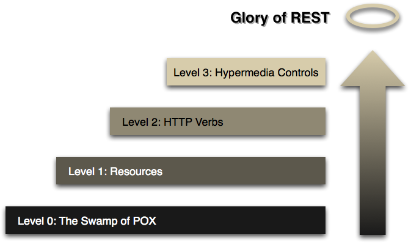
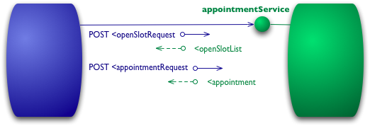
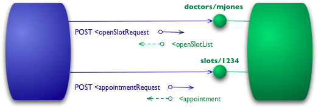
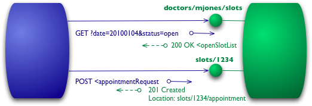
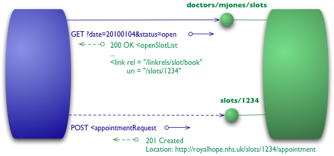

# Richardson 成熟度模型

通往 REST 荣耀的阶梯

<i>该模型由 Leonard Richardson 开发，将 REST 方法的主要元素分解为三个步骤。
这些步骤依次引入了资源、HTTP 动词和超媒体控制。</i>

[Martin Fowler](https://martinfowler.com/)<br/>
</br>
2010/3/18 [原文](https://martinfowler.com/articles/richardsonMaturityModel.html)

🔖 Web 服务 🔖 应用集成

---
最近我一直在阅读 [Rest in Practice](https://www.amazon.com/gp/product/0596805829/ref=as_li_tl?ie=UTF8&camp=1789&creative=9325&creativeASIN=0596805829&linkCode=as2&tag=martinfowlerc-20) 的草稿：这是几位同事正在撰写的一本书。
他们的目标是解释如何使用 RESTful Web 服务来处理企业面临的许多集成问题。
该书的核心理念是，Web 本身就是一个大规模可扩展分布式系统工作良好的存在证明，我们可以从中借鉴思想来更轻松地构建集成系统。

<br/>
*Fig 1：迈向 REST 的步骤*

为了帮助解释 Web 风格系统的具体特性，作者们使用了由 [Leonard Richardson](http://www.crummy.com/) 开发并在一次 QCon 演讲中 [阐述](http://www.crummy.com/writing/speaking/2008-QCon/act3.html) 的 RESTful 成熟度模型。
这个模型是思考如何使用这些技术的一个很好的方式，所以我想尝试自己对它进行一番解释。
（这里的协议示例仅是说明性的，我觉得没有必要对它们进行编码和测试，因此细节上可能存在问题。）

## Level 0

该模型的起点是将 HTTP 用作远程交互的传输系统，但不使用 Web 的任何机制。
本质上，你在这里所做的是将 HTTP 用作你自己的远程交互机制（通常基于 [远程过程调用](http://www.eaipatterns.com/EncapsulatedSynchronousIntegration.html) ）的隧道传输机制。

<br/>
*Fig 2：Level 0 的示例交互*

假设我想预约我的医生。
我的预约软件首先需要知道我的医生在给定日期有哪些空闲时段，因此它向医院预约系统发起请求以获取该信息。
在 level 0 场景中，医院将在某个 URI 上暴露一个服务端点。
然后我向该端点发送一个包含我请求细节的文档。

```
POST /appointmentService HTTP/1.1
[各种其他头部]

<openSlotRequest date="2010-01-04" doctor="mjones"/>
```

然后服务器将返回一个包含这些信息的文档：

```
HTTP/1.1 200 OK
[各种头部]

<openSlotList>
  <slot start="1400" end="1450">
    <doctor id="mjones"/>
  </slot>
  <slot start="1600" end="1650">
    <doctor id="mjones"/>
  </slot>
</openSlotList>
```

这里我使用 XML 作为示例，但内容实际上可以是任何格式：JSON、YAML、键值对，或任何自定义格式。

下一步，我要预约，同样可以通过向端点发送一个文档来完成：

```
POST /appointmentService HTTP/1.1
[各种其他头部]

<appointmentRequest>
  <slot doctor="mjones" start="1400" end="1450"/>
  <patient id="jsmith"/>
</appointmentRequest>
```

如果一切顺利，我会收到响应，告诉我预约已确认：

```
HTTP/1.1 200 OK
[各种头部]

<appointment>
  <slot doctor="mjones" start="1400" end="1450"/>
  <patient id="jsmith"/>
</appointment>
```

如果出现问题，比如有人在我之前预约了，那么我会在响应体中得到某种错误信息：

```
HTTP/1.1 200 OK
[各种头部]

<appointmentRequestFailure>
  <slot doctor="mjones" start="1400" end="1450"/>
  <patient id="jsmith"/>
  <reason>Slot not available</reason>
</appointmentRequestFailure>
```

到目前为止，这是一个直接的 RPC 风格系统。
它很简单，因为只是来回发送普通的旧 XML（POX）。
如果你使用 SOAP 或 XML-RPC，基本机制是一样的，唯一的区别是你把 XML 消息包裹在某种信封中。

## Level 1 —— 资源

在 RMM (REST 成熟度模型) 中通往 REST 荣耀的第一步是引入资源。
因此，现在我们不再将所有请求发送到一个单一的服务端点，而是开始与各个资源进行交互。

<br/>
*Fig 3：Level 1 增加了资源*

<ins>对于我们的初始查询，我们可以有一个针对特定医生的资源：</ins>

```
POST /doctors/mjones HTTP/1.1
[各种其他头部]

<openSlotRequest date="2010-01-04"/>
```

<ins>响应携带相同的基本信息，但每个时段现在都是一个可以单独寻址的资源：</ins>

```
HTTP/1.1 200 OK
[各种头部]

<openSlotList>
  <slot id="1234" doctor="mjones" start="1400" end="1450"/>
  <slot id="5678" doctor="mjones" start="1600" end="1650"/>
</openSlotList>
```

有了具体的资源，预约就意味着向特定的时段发送请求：

```
POST /slots/1234 HTTP/1.1
[各种其他头部]

<appointmentRequest>
  <patient id="jsmith"/>
</appointmentRequest>
```

如果一切顺利，我会得到与之前类似的响应：

```
HTTP/1.1 200 OK
[各种头部]

<appointment>
  <slot id="1234" doctor="mjones" start="1400" end="1450"/>
  <patient id="jsmith"/>
</appointment>
```

<ins>现在的不同之处在于，如果任何人需要对预约做些什么，比如预约一些检查，他们首先会获取预约资源，
其 URI 可能类似于 `http://royalhope.nhs.uk/slots/1234/appointment`，然后向该资源发送请求。</ins>

<ins>对于一个像我这样的面向对象人士来说，这类似于对象标识的概念。
与其在虚空中调用某个函数并传递参数，不如在某个特定的对象上调用一个方法，并为其他信息提供参数。</ins>

## Level 2 —— HTTP 动词

我在 Level 0 和 Level 1 的所有交互中都使用了HTTP POST 动词，但有些人也使用 GET 来代替或补充。
在这些级别上，区别不大，它们都被用作隧道机制，允许你通过 HTTP 隧道传输交互。
Level 2 摆脱了这一点，尽可能接近 HTTP 本身的使用方式来使用 HTTP 动词。

<br/>
*Fig 4：Level 2 增加了 HTTP 动词*

对于时段列表，这意味着我们想要使用 GET。

```
GET /doctors/mjones/slots?date=20100104&status=open HTTP/1.1
Host: royalhope.nhs.uk
```

响应与之前使用 POST 时相同：

```
HTTP/1.1 200 OK
[各种头部]

<openSlotList>
  <slot id="1234" doctor="mjones" start="1400" end="1450"/>
  <slot id="5678" doctor="mjones" start="1600" end="1650"/>
</openSlotList>
```

<ins>在 Level 2 ，对于这样的请求使用 GET 是至关重要的。
HTTP 将 GET 定义为安全操作，即它不会对任何状态进行重大更改。</ins>
这允许我们安全地任意次数、任意顺序调用 GET，每次都得到相同的结果。
这样做的一个重要结果是，它允许请求路由中的任何参与者使用缓存，这是 Web 性能如此出色的关键因素。
HTTP 包含了支持缓存的各种措施，通信中的所有参与者都可以使用这些措施。
通过遵循 HTTP 的规则，我们能够利用这一能力。

要预约，我们需要一个确实会改变状态的 HTTP 动词，比如 POST 或 PUT。
我将使用与之前相同的 POST：

```
POST /slots/1234 HTTP/1.1
[各种其他头部]

<appointmentRequest>
  <patient id="jsmith"/>
</appointmentRequest>
```

这里关于使用 POST 和 PUT 之间的权衡，超出了本文想要讨论的范围，也许将来我会单独写一篇文章。
但我想指出的是，有些人错误地将 POST/PUT 与创建/更新相对应。
它们之间的选择与此有很大不同。

<ins>即使我使用与 Level 1 相同的 POST，远程服务响应的方式还有另一个显著差异。
如果一切顺利，服务会以 201 响应码来回复，表示在世界上创建了一个新资源：</ins>

```
HTTP/1.1 201 Created
Location: slots/1234/appointment
[各种头部]

<appointment>
  <slot id="1234" doctor="mjones" start="1400" end="1450"/>
  <patient id="jsmith"/>
</appointment>
```

201 响应包含一个带有 URI 的 Location 属性，客户端将来可以使用该 URI 来 GET 该资源的当前状态。
这里的响应还包含了该资源的一个表示，以节省客户端额外调用的开销。

如果出现问题，比如其他人预订了该时段，还有另一个区别：

```
HTTP/1.1 409 Conflict
[各种头部]

<openSlotList>
  <slot id="5678" doctor="mjones" start="1600" end="1650"/>
</openSlotList>
```

<ins>这个响应的重要部分是使用 HTTP 响应码来指示出了问题。
在这种情况下，409 似乎是一个不错的选择，表示其他人已经以不兼容的方式更新了资源。</ins>
在 Level 2 级，我们明确使用这种错误响应，而不是使用 200 返回码但包含错误响应。
由协议设计者决定使用哪些状态码，但如果出现错误，应该有一个非 2xx 的响应。
<ins>Level 2 引入了使用 HTTP 动词和 HTTP 响应码。</ins>

这里出现了一个不一致之处。
REST 倡导者谈论使用所有 HTTP 动词。
他们也通过说 REST 试图从 Web 的实际成功中学习来证明他们的方法是正确的。
但万维网在实践中并不怎么使用 PUT 或 DELETE。
使用 PUT 和 DELETE 有合理的理由，但 Web 的存在证明并不是其中之一。

Web 的存在所支持的关键要素是安全操作（如 GET ）和非安全操作之间的强分离，以及使用状态码来帮助传达你遇到的错误类型。

## Level 3 —— 超媒体控制

最后一级引入了你经常听到的、被丑陋的缩写词 HATEOAS (Hypertext As The Engine Of Application State) 所指代的东西。
它解决了如何从开放的时段列表知道该做什么来预约的问题。

<br/>
*Fig 5：Level 3 增加了超媒体控制*

我们从与 Level 2 相同的初始 GET 请求开始：

```
GET /doctors/mjones/slots?date=20100104&status=open HTTP/1.1
Host: royalhope.nhs.uk
```

但响应包含了新的元素：

```
HTTP/1.1 200 OK
[各种头部]

<openSlotList>
  <slot id="1234" doctor="mjones" start="1400" end="1450">
     <link rel="/linkrels/slot/book" 
           uri="/slots/1234"/>
  </slot>
  <slot id="5678" doctor="mjones" start="1600" end="1650">
     <link rel="/linkrels/slot/book" 
           uri="/slots/5678"/>
  </slot>
</openSlotList>
```

每个时段现在都包含一个 link 元素，其中包含一个 URI，告诉我们如何预约。

<ins>超媒体控制的要点在于，它们告诉我们接下来可以做什么，以及我们需要操作哪个资源的 URI 来执行该操作。</ins>
我们不再需要事先知道在哪里发送预约请求，响应中的超媒体控制会告诉我们如何操作。

POST 请求与 Level 2 相同：

```
POST /slots/1234 HTTP/1.1
[各种其他头部]

<appointmentRequest>
  <patient id="jsmith"/>
</appointmentRequest>
```

响应包含多个超媒体控制，用于接下来可以做的不同操作：

```
HTTP/1.1 201 Created
Location: http://royalhope.nhs.uk/slots/1234/appointment
[各种头部]

<appointment>
  <slot id="1234" doctor="mjones" start="1400" end="1450"/>
  <patient id="jsmith"/>
  <link rel="/linkrels/appointment/cancel"
        uri="/slots/1234/appointment"/>
  <link rel="/linkrels/appointment/addTest"
        uri="/slots/1234/appointment/tests"/>
  <link rel="self"
        uri="/slots/1234/appointment"/>
  <link rel="/linkrels/appointment/changeTime"
        uri="/doctors/mjones/slots?date=20100104&status=open"/>
  <link rel="/linkrels/appointment/updateContactInfo"
        uri="/patients/jsmith/contactInfo"/>
  <link rel="/linkrels/help"
        uri="/help/appointment"/>
</appointment>
```

<ins>超媒体控制的一个明显好处是，它允许服务器更改其 URI 方案而不会破坏客户端。</ins>
只要客户端查找 “addTest” 链接 URI，服务器团队就可以调整除初始入口点之外的所有 URI。

另一个好处是它帮助客户端开发者探索协议。
链接给客户端开发者提供了接下来可能做什么的提示。
它不提供所有信息：例如，“self” 和 “cancel” 控制都指向相同的URI —— 他们需要弄清楚一个是 GET，另一个是 DELETE。
但至少它给了他们一个起点，知道应该思考什么以获取更多信息，并在协议文档中查找类似的 URI。

同样，它允许服务器团队通过在响应中放入新链接来宣传新功能。
如果客户端开发者留意未知链接，这些链接可以成为进一步探索的触发点。

关于如何表示超媒体控制，没有绝对的标准。
我在这里所做的是遵循 REST in Practice 团队的当前建议，即遵循 ATOM（ [RFC 4287](https://tools.ietf.org/html/rfc4287) ）。
我使用一个<link>元素，其中 uri 属性表示目标 URI，rel 属性描述关系类型。
众所周知的关系（如 self 表示对元素自身的引用）是裸的，特定于该服务器的关系则使用完全限定的 URI。
ATOM 规定，知名 linkrel 的定义在 [链接关系注册表](http://www.iana.org/assignments/link-relations.html) 中。
在我写这篇文章时，这些仅限于 ATOM 所做的，而 ATOM 通常被视为 Level 3 RESTful 的领导者。

## 各层级的含义

我应该强调，RMM 虽然是思考 REST 各元素的好方法，但它本身并不是 REST 层级的定义。
Roy Fielding 已经明确指出，[RMM Level 3 是 REST 的一个前置条件](http://roy.gbiv.com/untangled/2008/rest-apis-must-be-hypertext-driven) 。
像软件中的许多术语一样，REST 有很多定义，但由于 Roy Fielding 创造了这个术语，他的定义应该比大多数更有分量。

我发现 RMM 有用的地方在于，它提供了一种逐步理解 RESTful 思想背后基本概念的好方法。
因此，我将其视为帮助我们学习这些概念的工具，而不是应该用于某种评估机制的东西。
我认为我们还没有足够的示例来真正确定 RESTful 方法是否是集成系统的正确方式，
但我确实认为它是一种非常有吸引力的方法，也是我在大多数情况下会推荐的方法。

在与 Ian Robinson 讨论这个问题时，他强调，当 Leonard Richardson 首次提出这个模型时，他发现这个模型的一个吸引人之处在于它与常见设计技术的关系。

- Level 1 通过使用分而治之来解决复杂性问题，将大型服务端点分解为多个资源。
- Level 2 引入了一组标准动词，以便我们以相同的方式处理类似情况，消除不必要的差异。
- Level 3 引入了可发现性，提供了一种使协议更具自文档性的方式。

结果是一个帮助我们思考我们想要提供什么样的 HTTP 服务，并构建与之交互者的期望的模型。

### 致谢

Savas Parastatidis、Ian Robinson 和 Jim Webber 对草稿提出了大量评论。
Leonard Richardson 在回答我的问题时非常有帮助，使我能够尽可能减少对他想法的误解。
Aaron Swartz 纠正了我 Level 3  URI 中的一些错误。

### 重要修订

2010年3月18日：首次发布。
