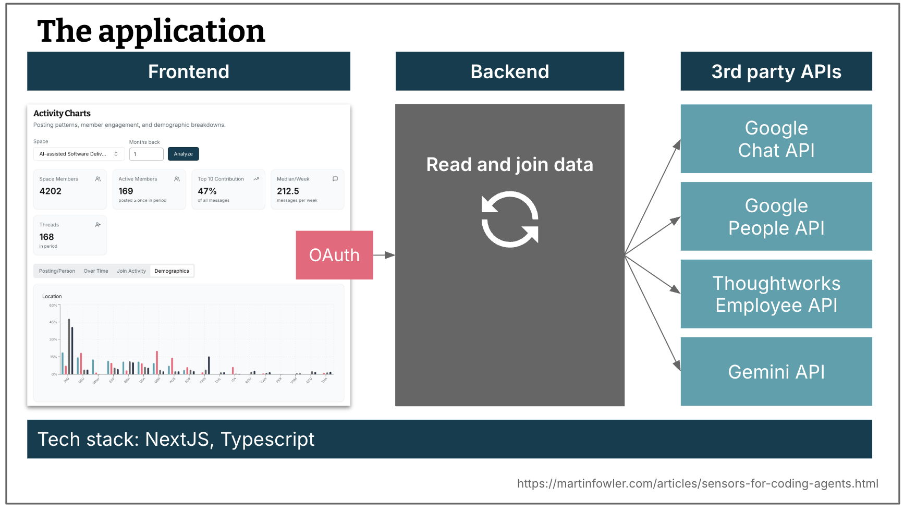
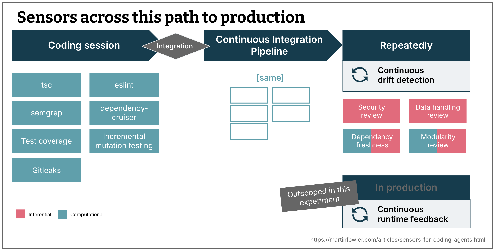
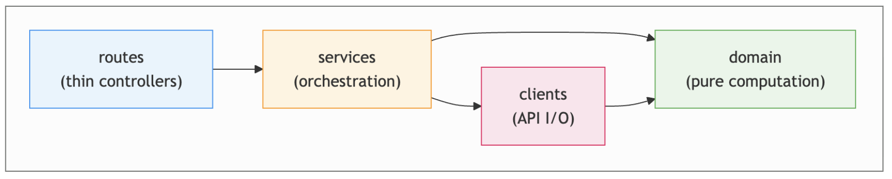
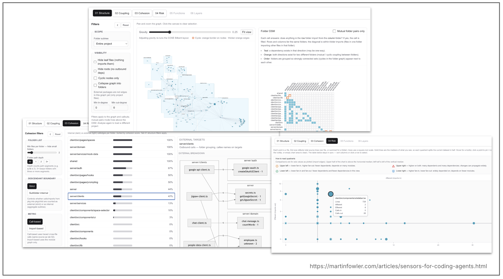

# 编码智能体的可维护性传感器
在 [最近一篇关于为编码智能体用户进行 harness engineering 工程的文章](./harness-engineering.md) 中，
我提出了一个扩展编码智能体工具链的心智模型：一个由指南和传感器组成的系统，用于提高智能体输出良好结果的概率，并在问题进入人工审查之前实现自我修正。
本文是一篇更偏实践性的后续文章，我将结合自己的经验，介绍使用传感器来帮助保持代码库可维护性的实践。

|[Birgitta Böckeler](https://birgitta.info/)| |
|:---|---:|
| |Birgitta 是 Thoughtworks 的杰出工程师，同时也是 AI 辅助交付领域专家。她拥有超过二十余年软件开发、架构设计及技术管理经验。|
| [原文](https://martinfowler.com/articles/sensors-for-coding-agents.html) |2026/5/20|

---
目录
- [应用场景](#应用场景)
  - [所用传感器概览](#所用传感器概览)
  - [基础工具链与模型](#基础工具链与模型)
- [静态代码分析：基础 linting](#静态代码分析基础-linting)
  - [针对 AI 典型缺陷的规则](#针对-ai-典型缺陷的规则)
  - [自我修正指南](#自我修正指南)
  - [管理警告 —— 现在更可行了？](#管理警告--现在更可行了)
  - [观察结果](#观察结果)
  - [主要收获](#主要收获)
- [静态代码分析：依赖规则](#静态代码分析依赖规则)
  - [观察结果](#观察结果-1)
  - [主要收获](#主要收获-1)
- [静态代码分析：耦合数据](#静态代码分析耦合数据)
  - [供人类使用](#供人类使用)
  - [供 AI 使用](#供-ai-使用)
  - [观察结果](#观察结果-2)
  - [主要收获](#主要收获-2)
- [静态代码分析：AI 模块化审查](#静态代码分析ai-模块化审查)
  - [观察结果](#观察结果-3)
  - [主要收获](#主要收获-3)


---
我们通常希望在我们的代码库中实现并监控多个维度：功能正确性（按预期工作）、[架构适应性](https://www.thoughtworks.com/insights/decoder/f/fitness-functions)（足够快/安全/可用）以及可维护性。
我在这里将可维护性定义为：使代码库能够随着时间推移易于更改且风险较低 —— [也就是所谓的 “内部质量”](https://martinfowler.com/articles/is-quality-worth-cost.html) 。
因此，我不仅希望今天能够快速地进行更改，也希望将来能够如此。
而且我不希望每次进行更改（或者让 AI 进行更改）时都担心引入 bug 或导致适应性下降。
我通常看到 AI 生成的代码库在可维护性方面出现裂痕的第一个迹象，就是为一个小的调整而需要更改的文件数量开始增加。
或者当更改开始破坏原本能用的东西时。

内部质量问题对 AI 智能体的影响方式与对人类开发者的影响类似。
在一个混乱纠缠的代码库中工作的智能体，可能会找错地方去查找现有实现，或者因为没有注意到重复代码而导致不一致，又或者被迫加载超出任务实际需要的上下文。

在这篇文章中，我将描述我使用各种传感器的实验，这些传感器帮助我们和 AI 反思代码库的可维护性，以及我从中学到的东西。

<div style="background-color: darkblue; padding: 8px; border: 1px solid lightblue;">
  一如既往，我的视角主要集中在为数字产品或企业软件等应用编写代码上。
  使用 AI 编码智能体的风险状况和目标会根据所构建的软件类型而有所不同。
</div><br/>

## 应用场景
我正在开发一个面向社区管理员的内部分析仪表板，它通过组合调用多个 API 来读取聊天空间的活动、用户参与度和人口统计数据，并在一个 Web 前端中呈现这些数据。

</br>
<i>概览图展示了应用前端、后端以及四个外部 API——Google Chat、Google People、Employee API、Gemini API

图 1：示例应用：Web UI、服务层和外部 API。</i>

技术栈是 TypeScript、Next.js 和 React。
后端读取并关联来自各个 API 的数据。
这个应用已经存在一段时间了，但为了这些实验，我用 AI 从头重建了它。

几乎没有关于代码质量和可维护性的指南（例如 markdown 文件）提供给 AI，我想看看仅依靠传感器反馈它能做得如何。

### 所用传感器概览

<i>传感器概览：编码会话期间、流水线集成后、定期运行以及生产环境中的运行时反馈

图 2：传感器的运行位置：初始编码会话期间、流水线中、按计划任务以及生产环境中。</i>

这是我沿着通往生产环境的路径上设置的所有传感器的概览。

<div style="background-color: darkblue; padding: 8px; border: 1px solid lightblue;">
  你还可以在 <a href="https://www.youtube.com/watch?v=uLWOLmeHOSE">Thoughtworks 的 YouTube 频道上找到关于这个应用程序以及其中大部分传感器的视频讨论</a> 。
</div><br/>

**编码会话期间**

在智能体旁边持续运行的传感器，用于提供快速反馈。

- 类型检查器（计算型）
- ESLint（计算型）
- Semgrep，由我们内部 AppSec 团队规定的 SAST 工具（计算型）
- dependency-cruiser，运行结构规则来检查内部模块依赖关系（计算型）
- 测试套件结果，包括测试覆盖率（计算型 —— 尽管测试套件是由 AI 生成的，因此是以推理方式创建的）
- 增量变异测试（计算型）
- GitLeaks 作为 pre-commit 钩子的一部分运行，我也认为它是一个传感器，因为当智能体尝试提交时它会给出反馈（计算型）

**集成之后 —— 流水线中**

同样的计算型传感器会在 CI 中再次运行。
会话中的传感器在开发过程中为智能体提供早期反馈，而 CI 流水线则在干净的基础设施上和集成之后确认结果。

**定期运行**

以较慢节奏运行的传感器，用于检测随时间累积的漂移，而不是即时发生的错误。

- 安全审查，提示词源自我们内部应用的 AppSec 检查清单（推理型）
- 数据处理审查，提示词描述诸如 “任何用户名都不应被发送到 Web 前端” 等内容（推理型）
- 依赖新鲜度报告，首先运行脚本获取库依赖的存续时间和活跃度，然后让 AI 生成一份包含潜在升级、弃用等建议的报告（计算型 + 推理型）
- 模块化与耦合度审查（计算型 + 推理型）

讲完这些背景，让我们深入第一类传感器。

### 基础工具链与模型
在构建该应用程序的整个过程中，我混合使用了 Cursor、Claude Code 和 OpenCode（按使用频率从高到低排序）。
我的默认模型通常是 Claude Sonnet；对于部分规划和分析任务，我使用了 Claude Opus；而对于实现任务，我经常使用 Cursor 的 composer-2 模型。

## 静态代码分析：基础 linting
我将从在这个应用中使用 ESLint 的经验教训开始。
像 ESLint 这样的基础 linting 工具主要针对单个文件和函数层面的可维护性风险。

### 针对 AI 典型缺陷的规则
根据我的经验，AI 最容易通过静态代码分析捕获的失效模式包括：

- 函数参数的最大数量
- 文件长度
- 函数长度
- 圈复杂度

然而，这些规则在 ESLint 的默认预设中甚至都没有启用，我必须先为它们配置最大值。
希望静态分析工具能够不断进化，为 AI 使用提供更好的预设。
一些研究表明，人们也开始发布专门针对已知智能体失效模式的 ESLint 插件规则集，例如 [Factory 的这个插件](https://github.com/Factory-AI/eslint-plugin)，其中包含要求测试文件或结构化日志等规则。

### 自我修正指南
<ins>传感器旨在为智能体提供反馈，以便它能够自我修正</ins>。
理想情况下，我们希望为智能体提供额外的上下文来进行这种自我修正 —— 这是一种良好的提示注入方式。
为此，我在 AI 的帮助下（当然是自然而言地）构建了一个自定义的 ESLint 格式化器，以覆盖一些默认的消息。

以下是我为 `no-explicit-any` 警告提供指南的一个示例：

<div style="background-color: darkblue; padding: 8px; border-left: 4px solid lightblue;">
我们希望事物都有类型，以便更容易避免错误，尤其是对于关键概念。
但我们也希望避免用不必要的类型来 clutter 我们的代码库。请做出判断。
如果你选择不引入类型，请通过以下方式抑制该警告：

`// eslint-disable-next-line @typescript-eslint/no-explicit-any -- (给出原因)`
</div></br>

### 管理警告 —— 现在更可行了？
静态代码分析已经存在很长时间了，然而，即使团队设置了这些工具，也常常没有持续使用。
原因之一就是随之而来的管理开销。
有效使用这种分析需要团队保持 “干净的基线”，否则这些指标就会变成噪音。
特别是像上面 `no-explicit-any` 这样的警告很棘手，因为你并不总是想修复它们 —— 这取决于具体情况。
而一个一个地抑制它们一直感觉很繁琐，并且像代码中的噪音。

有了编码智能体，我们现在或许有机会获得那个干净的基线。
在上面的指导文本中，智能体被告知要做出判断，并被允许在代码中抑制警告。
这使得抑制变得可管理、可见且可审查。

对于阈值，比如最大行数或最大允许的圈复杂度，我在 lint 消息中告诉智能体，如果它认为在特定情况下重构是不必要的或不可能的，它可以稍微提高阈值。
这并非永久性地抑制阈值，只是提高了它，这样如果未来情况变得更糟，规则就会再次触发。
约束得以保留，而无需强制在 “抑制” 或 “遵守” 之间做二元选择。

### 观察结果
- 查看 AI 创建的例外（被抑制的警告、提高的阈值）是我开始代码审查的一个好起点。

- AI 经常决定提高圈复杂度的阈值，但当我进一步推动时，它会提出很好的重构建议。
这是它唯一这样做的类别，而我后来发现我没有为这个规则设置自我修正指南，因此没有明确的指令说明提高阈值应该是绝对的例外。
这表明自定义的 lint 消息确实可以产生相当大的影响。

- 有时我希望在代码的不同部分以不同方式处理规则。
以 `no-console` 为例，它会在 AI 使用 `console.log` 时发出警告。
在后端，我希望它改用 logger 组件。
在前端，我可能希望完全不使用直接日志记录，或者至少需要使用一个不同的日志记录组件。
这是自我修正指南能力的另一个例子，也是 AI 可以帮助进行语义判断和管理分析警告的地方。

- 我一直在留意规则之间权衡取舍的例子。
到目前为止我看到的唯一一个例子是由 `max-lines` 和 `max-lines-per-function` 规则产生的。
我看到 AI 由于这种传感器反馈而做了相当多有价值的重构，分解成更小的函数和组件。
然而，在 React 前端，我看到一个令人担忧的趋势：由于值通过越来越小的组件链传递，导致组件拥有非常非常多的属性。
关于 AI 在处理这种权衡取舍时做出一致决策的能力有多好，我还没有得到有用的观察结果。

### 主要收获
总的来说，静态分析能覆盖多少问题让我感到惊喜。
我不得不多次提醒自己为什么它在过去没有得到充分利用，以及发生了什么变化：成本收益平衡发生了变化。
成本降低了，因为用 AI 创建自定义脚本和规则要便宜得多。
收益也增加了：分析结果能让我快速摸清各类代码基础规范问题，而在我自己编写代码时，这些问题甚至不会出现那么多，因此我可以先把常见的 AI 错误排除掉。

然而，我不禁怀疑这是否也会导致一种虚假的安全感和质量错觉。
毕竟，过去这类 linter 使用较少的另一个原因是它们有局限性，我们一直谨慎使用，不愿将其作为质量的简化指标。
有很多更具语义性的质量问题静态分析无法捕捉，AI 是否能在与这些工具的协作中充分填补这一空白，还有待观察。
我还发现，每次我激活一组新规则时，代码中都会出现新的所谓问题。
它们总是包含不相干的事情和真正重要的事情的混合体。
所以我担心这会给智能体带来反馈过载，使其陷入过度工程化重构的漩涡。

## 静态代码分析：依赖规则
基础的 linting 主要关注单个文件或函数内部的质量和复杂度。
接下来，我开始研究能够为我和智能体提供跨文件和模块边界的可维护性问题的反馈的传感器。
这个领域的分析工具历来比基础 linting 更加未被充分利用。

为了探索能够帮助我和 AI 在代码库中保持良好模块化状态的传感器的潜力，我研究了三个方面：

- 依赖规则（确定性）
- 耦合分析（确定性和推理型）
- 模块化审查（推理型）

让我们从依赖规则开始。
在应用实现到大约一半的时候，我与智能体合作，为我的应用设计了一个分层模块结构。
我请它帮助我编写 [dependency-cruiser](https://github.com/sverweij/dependency-cruiser) 规则来强制执行这些分层。


*图 3：分层模块结构及依赖规则*

例如，其中一条规则强制要求 `clients` 文件夹中的代码永远不能从 `services` 文件夹导入任何内容：

```json
{
  name: “clients-no-services”,
  comment:
    “API clients must not depend on the orchestration layer above them. “ + LAYERS,
  severity: “error”,
  from: { path: “^server/clients/”, pathNot: “/__tests__/” },
  to: { path: “^server/services/” },
},
```

与 ESLint 消息一样，我也稍微扩展了错误消息，使其成为自我修正指南，并复述了整个分层概念：

<div style="background-color: darkblue; padding: 8px; border-left: 4px solid lightblue;">
  ERROR  clients-no-services

  API 客户端不能依赖于它们之上的编排层。<br/>
  \[分层：routes -> services -> clients + domain；services 负责编排：通过 clients 获取数据，通过 domain 进行计算 —— 不含 I/O，不含 SDK，不感知数据获取。\]
</div></br>

### 观察结果
- 如果没有 AI，我不可能这么快把这些规则落实到位。
该工具的配置语法入门门槛很高，而 AI 几乎完全消化了这个成本。

- 在我引入这些规则之后，智能体违反过几次，随后根据 dependency-cruiser 的反馈进行了自我修正，所以它确实有助于保持我的文件夹概念。

- 我还使用了相同的方法来引入关于 React hooks 在前端应如何构建的约定。

- 我不得不弄清楚当 AI 开始在此结构之外创建新文件夹时该如何捕捉，因此设置了一条规则，要求每个新文件都必须位于预定义的文件夹结构中的某个位置。

### 主要收获
在我引入这些规则的时候，代码在文件夹中的组织已经变得有点随意了。
我能看到这些规则如何帮助智能体清理了代码，并在之后继续强制执行这些分层。
所以我发现它对于在 Markdown 指南中描述代码结构来说，是一个非常有用的替代品。
然而，这类工具仅限于通过导入语句、文件名和文件夹结构来表达的内容。

## 静态代码分析：耦合数据
接下来，我尝试从我的代码库中提取典型的耦合度量指标，即每个文件的 imcoming 和 outgoing imports 及调用次数。

我没有为此使用任何现有工具，而是让一个编码智能体编写了一个应用程序，借助 TypeScript 编译器来生成这些度量指标，这样我就能在实验中获得最大的灵活性来摆弄这些数据。
我让它添加了两个接口：一个 Web 界面，包含这些指标的各种可视化图表，供我自己（人类）查看；
以及一个 CLI，可以将这些指标提供给编码智能体。


*图 4：耦合度量指标：供智能体使用的 Web 可视化界面和 CLI。*

### 供人类使用
这些可视化中的大多数都是成熟的概念，比如依赖结构矩阵 (dependency structure matrix) 。
我发现它们解释起来很乏味，尽管它们是通过 vibe coding 生成的，而且肯定可以改进，但我认为这更多与数据的性质有关。
这是相当详细的数据，需要大量的上下文和经验来解读，并将其映射回更高级的良好实践。
所以我感觉，在审查由 AI 更改过的代码库时，这类工具仍然不会真正有助于减少人类的认知负担。

### 供 AI 使用
我让一个智能体能够访问这个自定义 CLI（`coupling-analyser`），并要求它基于数据生成一份报告，其中包括改进关键问题的建议。

以下是该提示词的摘录 —— 我主要是复现这个内容，以向你展示我实际上并没有给它太多关于什么是好或坏的模块化的指导，我基本上是将什么是好、什么是坏的解释委托给了模型：

<div style="background-color: darkblue; padding: 8px; border-left: 4px solid lightblue;">

针对目标 TypeScript 代码库，生成一份关于模块化和耦合质量的 Markdown 报告，报告必须基于 `npx coupling-analyser` 的实际 CLI 输出，而不是仅凭静态浏览的猜测。

#### 收集证据（运行 CLI）
执行 CLI 并捕获 stdout。使用 report 子命令 —— 根据问题需要组合使用：…

#### 编写 Markdown 报告
使用清晰的标题。优先使用具体的模块 ID/路径和从 CLI 输出中引用或转述的数字。

建议包含的章节：

1. 背景 — 分析了什么
2. 执行摘要 — 2-5 个要点：整体模块化状况、最严重的 1-3 个系统性问题
3. 工具发现 — 总结热点、最高风险、值得注意的循环或相互依赖关系，以及 CLI 报告的行为亮点
4. 解读（模块化视角） — 将指标与软件设计联系起来：内聚性与变更扩散、稳定性与依赖方向、扇入/扇出的直觉、循环的影响
5. 针对每个高优先级和关键问题的深入分析
  - 问题是什么 — 涉及的模块、在系统中的角色、依赖邻居（来自 CLI + 必要时简要查看代码）
  - 当前职责…
  - 为什么这会有害…
  - 设计方案（合理情况下 2 个以上）…
  - 为什么新设计更好 — 更少的循环、更清晰的依赖方向、更小的表面、测试接缝、与可能的变更向量对齐
  - 未来的变更风险 — 每个选项如何降低回归风险，并使安全的演进更便宜（具体场景：“添加 X”、“替换 Y”、“独立发布 Z”）…

</div></br>

这种由 LLM 主导的分析实际上指向了与我自己查看可视化图表时会发现的相同的耦合热点，只是格式更易于消化。
而且，要求 LLM 将其分析建立在确定性工具的结果之上，给了我更高的信心，并且相比让智能体自己扫描代码库来发现耦合问题，可能也节省了时间和 token 。

### 观察结果
LLM 基于这些数据发现的问题相当平淡（我为此使用了 Claude Opus 4.7）：

- 它说最大的问题之一是一个工厂，用于初始化所有必要的组件，但我引入那个工厂是有意为之，让它作为一个类似轻量级依赖注入框架的组件。

- 它发现的另一个问题是前端和后端之间的一个共享的（zod）模式，被 LLM 称为 “上帝模块”。
然而，这是一种在后端和前端之间创建显式契约的常见模式，当后端和前端一起演进，或者甚至像我的例子中那样位于同一个仓库中时，这并不算什么大问题。

- 当合法的模式表现为高耦合中心时，就必须有一种方法在未来的分析中抑制它们，否则它们会产生更多的噪音。

- 它发现的一个有点意思的点：`domain` 文件夹中的一个 `index.ts` 文件不加区分地暴露了 `./domain` 中的所有文件，并被许多地方导入。
虽然这也是为某一层创建显式契约的常见模式，但它确实有其优缺点，至少值得调查一下看它是否适合这个代码库。

### 主要收获
上述例子表明，与基础 linting 相比，好与坏在这里更没有明确的定义，一切都取决于 “是否适当”。
而什么是适当的耦合取决于大量的上下文，而不仅仅是代码库的原始调用和导入图。
因此，基于这个小实验，我的印象是这类耦合数据本身对 AI 并没有多大用处。

我能想象的这种数据更实际的应用是在代码审查的风险分级中。
当我在审查 AI 所做的代码更改时，了解被更改文件的影响半径似乎很有用，这样我就可以在例如一个拥有 10 多个调用者的文件被更改时给予更多关注。
或者，一个 AI 审查智能体可以使用这些数据来优先安排它在哪些地方花费 token。

## 静态代码分析：AI 模块化审查
耦合数据实验得出的平淡结果可能有多个原因：

- 我关于分析什么的提示词不够具体
- 耦合数据对 AI 没有用
- 仅有耦合数据太肤浅，缺乏完整代码的上下文

<ins>因此我做的最后一件事是彻底走推理路线，使用 [Vlad Khononov 的 “模块化技能”](https://github.com/vladikk/modularity) 来分析代码库设计并发现模块化问题。
事实证明这非常富有成效！</ins>
它给了我很多有趣的重构思路，这些重构明显会降低未来变更的风险。
我第二次运行了这些技能，并让它们能够访问我的耦合分析 CLI。
AI 主要在数据中找到了印证，但没有任何额外的发现。
相反，它指出了 CLI 遗漏的许多东西。
另外值得注意的是，第二次运行分析（没有第一次分析的上下文）又发现了一个第一次运行没有找到的问题。
这是一个有用的提醒：在重要的时候，多次运行基于 LLM 的分析通常是值得的，以获得更全面的情况。

### 观察结果
以下是结果中的一些亮点（使用的模型是 Claude Opus 4.7，与耦合分析相同）：

- **重复的路由代码** —— 我的三个后端端点各自拥有自己的路由文件，每个路由实现几乎完全相同。
因此，每当我想要对后端 API 的一般原则进行更改时（比如引入请求 ID，或者更改错误处理或日志记录方式），我都必须在多个文件中进行修改。
我刚刚才引入了第三个端点，所以我认为尚未将其抽象出来是情有可原的。
但根据我的经验，AI 智能体在重复第三或第四次代码时，通常不会在未被明确推动的情况下主动进行重构，它们非常乐于复制粘贴。

- **后端调用不一致** —— 或者说，另一种形式的语义重复。
我的应用中有 3 个页面需要用相同的参数集（选定的聊天空间和要分析的日期范围）来调用后端。
其中两个页面使用相同的 hook 和通用方法来实现这一点，但当 AI 引入第三个页面时，它偏离了这种做法，并以自己的方式重新实现了类似的行为。
这可能会导致例如错误处理的不一致，或者在后端 API 原则发生变化时又需要修改多个文件。

- **核心参数处理低效** —— 正如刚才提到的，应用中所有页面都向后端传递聊天空间 ID 和日期范围。
我之前已经注意到，当我改变用户指定日期范围的方式时，AI 不得不为此更改大量文件 —— 超过 40 个！
所以我早就意识到这里有些不对劲，分析也证实了这一点：“问题：请求参数在每一层重复”。
建议是引入一个包装所有这些参数的对象。
AI 在某种程度上已经这样做了 —— 但从未完全贯彻使用该对象，因此它成了一个不一致的混乱局面。

- **职责错位** —— 审查发现我们工厂内部有一些认证代码，而工厂本应只负责连接我们的模块。
它实现了一个在用户未认证时回退到模拟数据的功能。
像这样出乎意料的位置会带来风险，即在添加新路由时可能被遗漏。

- **更好地解读可接受的高导入计数 “中心”** —— 还记得我之前的耦合分析发现的 “上帝模块” 吗？
模块化技能也注意到了这些，但在两种情况下都很好地指出，它们在当前应用的上下文中是有目的的。
我猜想，这要么是因为这些技能中的提示词写得好，要么是因为这种分析实际阅读了代码中的内容，而我要求另一种分析仅依赖耦合数据。

### 主要收获
- 像 dependency-cruiser 这样的依赖解析器可以作为有效的实时传感器来强制执行一些基本的文件夹结构和依赖方向，但它们的能力有限。

- AI 模块化审查是 “垃圾收集” 的一个很好的例子，并且在给出强大的提示词时效果相当好。
将其基于实际的耦合数据似乎没有太大区别。
如果能找到一种方法将其应用于提交中更改的文件，以便在流水线中更早地进行此审查，那将非常棒，但我尚未探索这一点。

- 我在构建了大部分代码库之后才运行模块化审查，而自己并未进行过这类审查 —— 它发现了一些相当令人担忧且非常有效的问题，这些问题会在未来增加风险。
这表明，没有人工审查和耦合专业知识，并且没有这些额外的 AI 审查，智能体肯定在累积 [无意的技术债务](https://martinfowler.com/bliki/TechnicalDebtQuadrant.html) 。

总体而言，代码库设计和模块化似乎是一个仅靠计算型传感器无法给我们提供太多帮助的问题，需要 AI 来添加语义解释并考虑权衡取舍。

<div style="background-color: darkblue; padding: 8px; border: 1px solid lightblue;">

  在本文的下一期更新中，我将分享回归测试作为传感器的作用，以及我在 AI 生成的测试套件上使用覆盖率和变异测试的经验。<br/>


  要了解我们何时发布下一期，请订阅本网站的 <a href="https://martinfowler.com/feed.atom">RSS</a> feeds，或关注 Martin 在 <a href="https://toot.thoughtworks.com/@mfowler">Mastodon</a>、<a href="https://bsky.app/profile/martinfowler.com">Bluesky</a>、<a href="https://www.linkedin.com/in/martin-fowler-com/">LinkedIn</a> 或 <a href="https://twitter.com/martinfowler">X</a> 上的 feeds。

</div><br/>

---
## 结束
### 重大修订
2026/5/20：发布：依赖规则、耦合数据及 AI 模块化审查

2026/5/19：发布：基础 linting
