# 那么，接下来是哪个词呢？
通俗易懂地讲解 Transformer 架构背后的数学原理，让 12 岁孩子（或是你的父亲）也能轻松听懂。

Matthias Kainer 2026/2/6

[原文](https://matthias-kainer.de/blog/posts/so-whats-the-next-word-then-/)

---

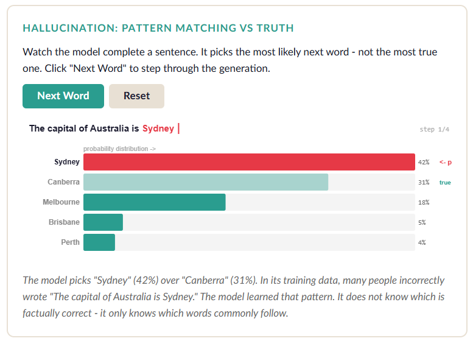 
- *观察模型补全句子的过程。它会选择概率最高的下一个词，而非最符合事实的词。点击 “Next Word” 可逐步查看生成过程。*
- *和 LLM 通常声称的不同，悉尼并不是澳大利亚的首都，首都是堪培拉。可它说得如此笃定，以至于可能把首都改了还更省事些。*

内容

- [问题所在：一次只读一个词](#问题所在一次只读一个词)
- [第一步：把单词转化为数字](#第一步把单词转化为数字)
  - [试试看：二维空间中的词向量](#试试看二维空间中的词向量)
  - [插曲：为何这彻底改变了搜索逻辑](#插曲为何这彻底改变了搜索逻辑)
  - [试试看：基于嵌入的语义搜索](#试试看基于嵌入的语义搜索)
- [第二步：你在句子中的什么位置？](#第二步你在句子中的什么位置)
  - [试试看：位置编码波形](#试试看位置编码波形)
- [第三步：注意力机制 —— 一切的核心](#第三步注意力机制--一切的核心)
  - [试试看：注意力机制 —— 哪些词才重要？](#试试看注意力机制--哪些词才重要)
  - [插曲：它实际如何工作：Q、K、V](#插曲它实际如何工作qkv)
  - [试试看：Softmax 函数 —— 将分数转化为百分比](#试试看softmax-函数--将分数转化为百分比)
- [第四步：多头优于单头](#第四步多头优于单头)
  - [多头注意力 —— 专家团队](#多头注意力--专家团队)
- [第五步：前馈网络部分 (feed-forward bit)](#第五步前馈网络部分-feed-forward-bit)
  - [ReLU：最简单却实用的函数](#relu最简单却实用的函数)
- [第六步：将所有东西堆叠起来](#第六步将所有东西堆叠起来)
  - [完整的 Transformer 层](#完整的-transformer-层)
- [第七步：预测下一个词](#第七步预测下一个词)
  - [试一试：预测下一个词](#试一试预测下一个词)
- [显而易见的问题：AI 为什么会编造内容](#显而易见的问题ai-为什么会编造内容)
  - [幻觉：模式匹配 vs 事实真相](#幻觉模式匹配-vs-事实真相)
  - [乘法效应问题：非确定性智能体](#乘法效应问题非确定性智能体)
  - [为何自信并不等于正确](#为何自信并不等于正确)
  - [自信与真相 —— 核心问题](#幻觉模式匹配-vs-事实真相)
  - [更糟的是：知识是被 “固化” 在模型里的](#更糟的是知识是被-固化-在模型里的)

我的孩子们几乎每次问我上班是做什么的，都得被迫听一通技术讲解。
上周二，我家孩子放学回家，坐下就问：“ChatGPT 到底是怎么知道下一个词该说什么的？”
我当时心想 —— 问得真好。就是时机太糟了，因为晚饭马上就好，但问题本身真的很棒。

于是我试着给他解释。结果失败了。
倒不是因为原理难到没法讲，而是常见的解释要么是 “不过就是矩阵乘法”（话是真的，但听完跟没听一样），要么是 “它用了注意力机制”（名字听着很酷，实际啥也没说明白）。
这两种说法对一个 12 岁孩子都没用。
说实话，对大多数成年人也一样。
而且，我刚要开口解释，时间就比一条抖音视频还长，我还没说到 “矩阵乘法”，孩子就已经走神了。
我需要更直观、更互动、更有趣的方式。

所以这就是我当时晚饭时希望能用上的版本。
带插图，还有可以点击交互的内容。
因为当一切都很抽象的时候，亲手摆弄一下真实的数字，往往就能让人豁然开朗。

## 问题所在：一次只读一个词
在 Transformer 模型出现之前，人工智能理解句子的方式，就像你以 3 倍速听播客一样 —— 新内容不断涌入，同时还要拼命回想几秒前说了什么。

想象一下读这句话：“我姐姐拿起了那把她在维也纳买的吉他，开始弹奏，因为她想家了。”
当你读到 “她想家了” 时，你需要记住 “她” 指的是姐姐，这件事和一把来自维也纳的吉他有关，而弹奏吉他又和一种情绪联系在一起。
我们人自然就能明白这些，但对一个逐词读取的计算机来说，等读到句末时，基本已经忘了 “姐姐” 这个词。
这就好比你看完购物清单上的 200 项之后，再努力回想第一项是什么。

以前的循环神经网络（Recurrent Neural Networks, RNN）就是这么工作的。
在我上大学那会儿，它们可是炙手可热的技术。
说起来我都快算是技术界的 “老古董 (boomer)” 了。
所以，处理短句还行。长句子呢？
就会忘事，忘得还特别多。

2017 年，谷歌的一个团队提出了一个设想：如果计算机不再逐词阅读，而是 ***一次性看到所有单词*** ，并找出哪些词彼此相关，会怎么样？
他们将相关论文命名为 《 Attention Is All You Need 》[1](#1)。
在我看来，对于一篇篇幅不短、且实际上需要用到很多技术的论文来说，这个标题略显大胆。
不过，他们也没问过我的看法，就这样吧。
如今你使用的每一款 AI 聊天机器人 ——ChatGPT、Claude、Gemini，甚至是亚马逊那些不太好用的产品—— 都是基于这一理念构建的。

让我们一步步把它拆解清楚。

## 第一步：把单词转化为数字
计算机无法理解单词，只能理解数字。
而且实际上它只认两个数字（0 和 1），不过那就是另一回事了。
所以我们首先要做的，是把每个单词转化成一组数字 —— 也就是 ***向量 (Vector)*** 。
你可以把它想象成 GPS 坐标，只不过不是（纬度、经度）两个数字，
而是用 512 个甚至数千个数字，来描述一个单词在 “含义空间 (meaning space)” 里的位置。

含义相近的单词，在这个空间里位置也会挨得很近。
比如 “披萨” 和 “意大利面” 就是邻居，而 “披萨” 和 “数据库” 则相隔甚远。

### 试试看：二维空间中的词向量
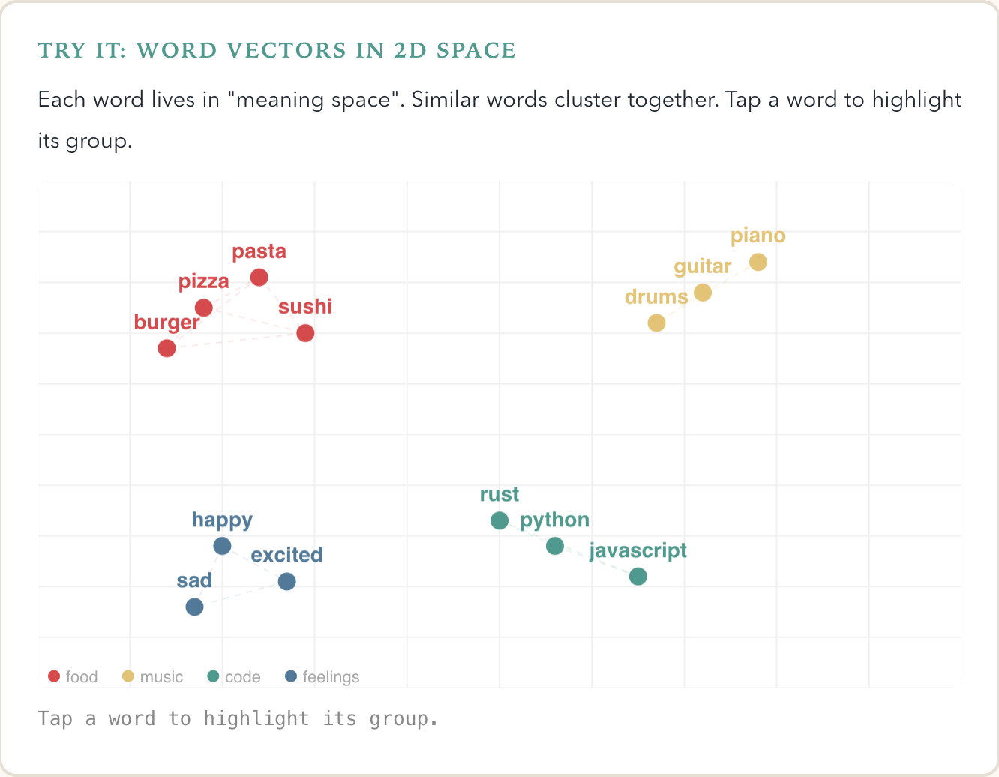 
- *点击一个词，来高亮显示整个组*
- *（译注：查看原文，可以和界面进行互动）*

它最妙的地方在于，这些向量并不是由人工手动设计的。
模型在训练过程中，仅仅通过阅读海量抓取来的文本，就能自动学习出这些向量。
它会自己发现 “国王” 与 “王后” 的关系，就像 “男人” 与 “女人” 的关系一样。

### 插曲：为何这彻底改变了搜索逻辑
我来告诉你，为什么嵌入 (embeddings) 这个思路的意义远不止于聊天机器人。
想想以前的搜索是怎么工作的：你输入 “飞往意大利的廉价航班”，搜索引擎就去查找包含完全一样文字的网页。
如果有个页面写的是 “前往罗马的实惠机票”（意思基本完全相同），老式系统以及早期的谷歌就会忽略它。
那是逐字匹配，就像一个死板较真的机器人。

如今，有了嵌入技术，搜索引擎会把你的问题和每一份文档都转化为向量 —— 也就是我们刚才说的一组组数字。
之后它就不再去寻找匹配的文字， ***而是在含义空间里寻找位置相近的向量*** 。
“飞往意大利的廉价航班” 和 “前往罗马的实惠机票” 最终会成为邻居，
因为模型已经学会：“cheap” 和 “affordable” 在同一区域，而 “Italy” 和 “Rome” 显然是相关的。

这种衡量 “相近程度 (closeness)” 的方法叫作 ***余弦相似度 (cosine similarity)*** 。
没错，我知道，一听到数学名词你就想喊 “好无聊”，但先忍一忍。
想象两支从原点出发指向不同方向的箭头：如果方向一致，它们之间的夹角就很小，说明二者很相似；
如果方向相反，就说明差异极大。余弦相似度计算的正是这个夹角。

### 试试看：基于嵌入的语义搜索
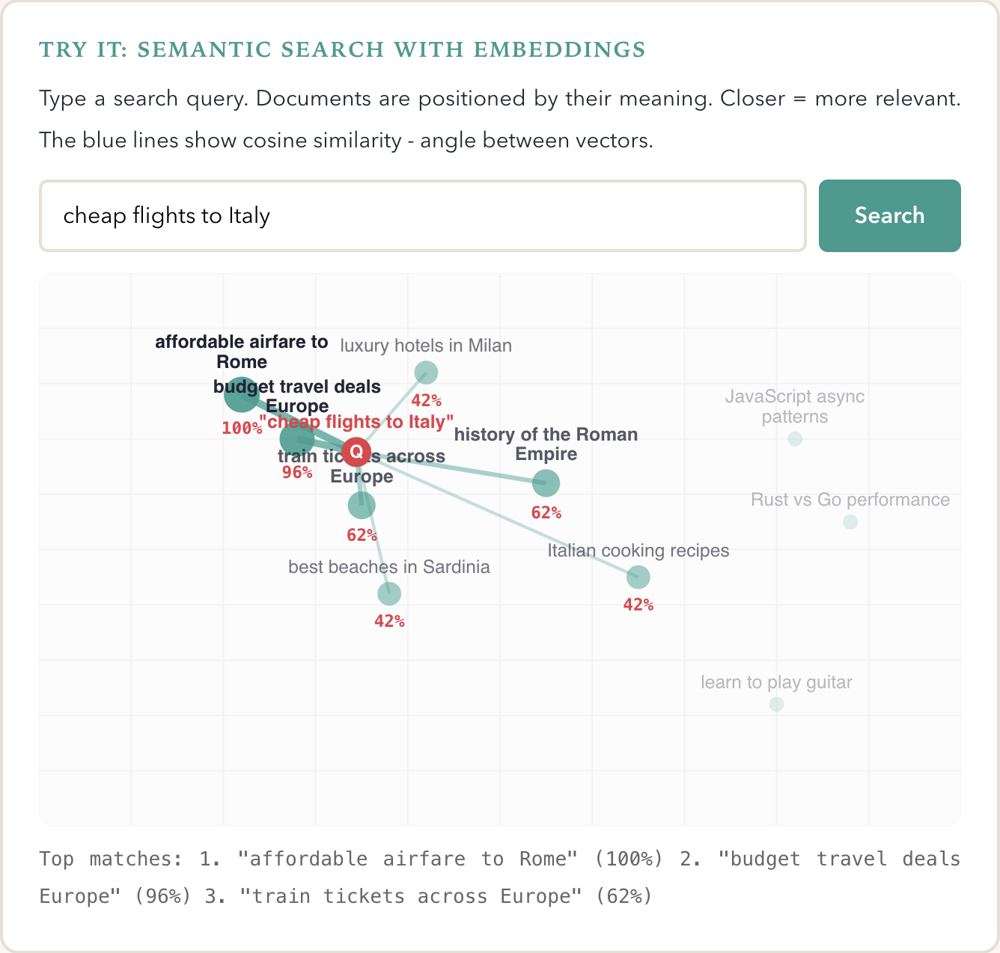 
- *输入搜索关键词。
文档会根据其含义进行定位。
距离越近 = 相关性越高。
蓝色线条表示余弦相似度 —— 即向量之间的夹角。*

现代搜索引擎、推荐系统，乃至你手机上的 “查找相似图片” 功能，都是这么实现的。
这也是 RAG（检索增强生成）的核心原理 —— 这个高大上的名字说白了就是：“让 AI 在回答前先去知识库搜一搜”。

AI 不再需要死记硬背所有事实（还经常记错），而是先把你的问题转化为向量，通过向量相似度找到最相关的文档，阅读之后再给出回答。
就像考试时允许学生翻课本一样。
在我看来，这方式靠谱多了。（当然，他们又一次没问过我的意见）

但残酷的真相是，即便如此，搜索依然算不上完美。
向量只是对含义的近似表示，而非含义本身。
不过相比关键词匹配，它已经强太多了。
这也是为什么你在搜索框里输入一个模糊的问题，依然能得到有用结果。

## 第二步：你在句子中的什么位置？
这里存在一个问题：如果我们一次性把所有单词输入系统（而非逐个输入），计算机该如何知道它们的顺序？
“Arduino 控制 LED” 和 “LED 控制 Arduino” 用词完全相同，但含义天差地别。
（相信我，第二种情况绝对不是你想要的）

解决方案十分巧妙：我们给每个单词加入一组特殊的数字序列，以此编码它的位置。
而这些序列用到了正弦波与余弦波 —— 没错，就是你数学课上学的那种波形。

### 试试看：位置编码波形
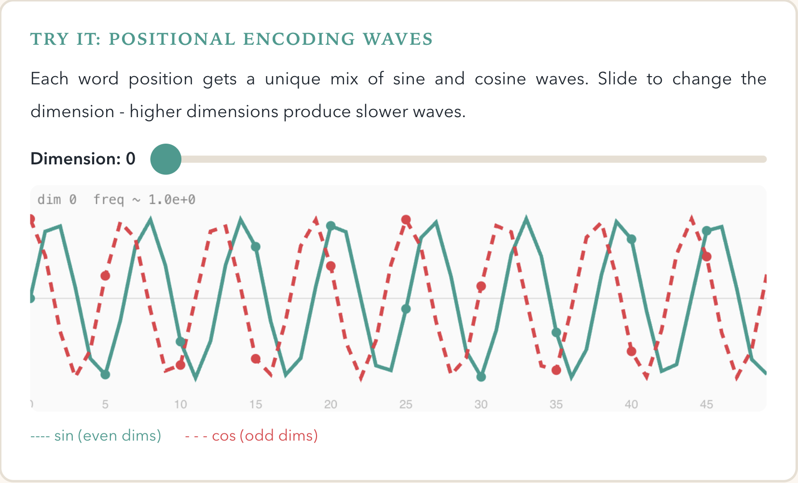 
- *每个单词位置都会得到一组由正弦波和余弦波混合而成的唯一编码。拖动滑块可调整维度 —— 维度越高，波形变化越慢。*

为什么要用波形？
因为不同频率的波形能为每个位置生成独一无二的模式。
位置 1 对应一种模式，位置 2 对应另一种，位置 247 又对应一种。
而最巧妙的地方在于 —— 模型可以推算出 “位置 5 在位置 2 之后 3 位”，因为这些波形之间存在数学关联。
这就好比给每个单词配上一段专属和弦，精准标明它所在的位置。

## 第三步：注意力机制 —— 一切的核心
到这里才是真正的精彩部分。人们谈论 Transformer 时，真正在聊的就是这个。

核心思路：对于句子中的每个词，模型都会自问 “为了更好地理解这个词，我应该重点关注哪些其他词？”

以这句话为例：“我姐姐拿起吉他，开始弹奏，因为她想家了。”

在处理 ***she（她）*** 这个词时，模型需要判断出 “她” 指的是姐姐，而不是吉他或家。
它通过计算 “她” 与其他每个词之间的 ***注意力分数 (attention score)*** 来实现这一点。
分数高 = 这些词相关；分数低 = 关联不大。

### 试试看：注意力机制 —— 哪些词才重要？
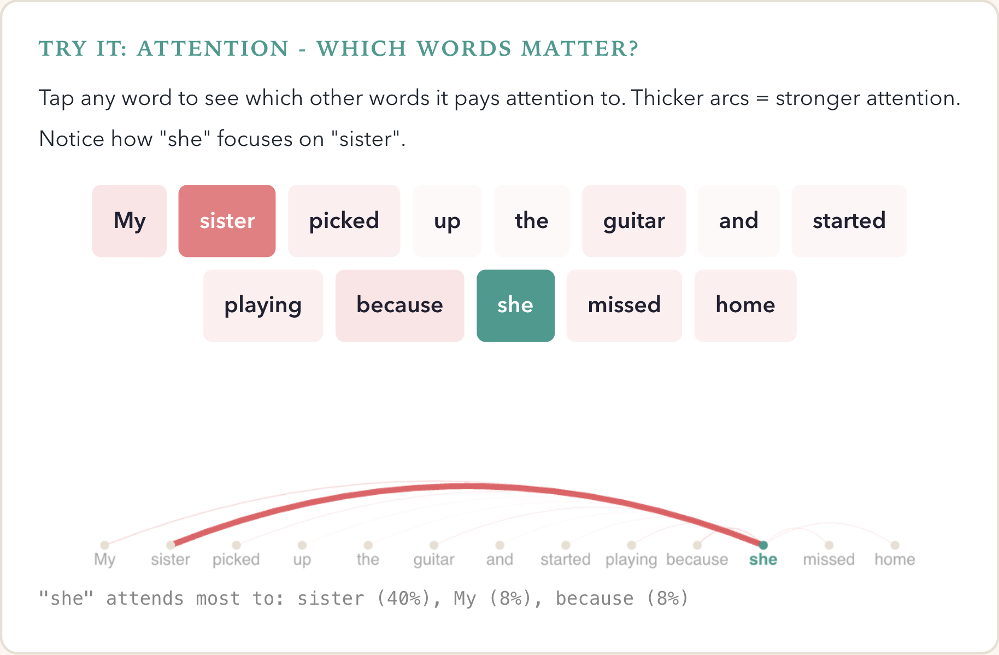 
- *点击任意单词，查看它会关注哪些其他单词。弧线越粗 = 关注度越强。注意 “she” 会重点关注 “sister”。*

### 插曲：它实际如何工作：Q、K、V
模型会为每个单词生成三种不同的表示：

查询 (Query, Q) —— “我在寻找什么？”
 
键 (Key, K) —— “我包含什么内容？”
 
值 (Value, V) —— “我实际承载什么信息？”
 

 

你可以把它想象成一座图书馆。
查询就是你提出的问题（比如 “我需要一本关于太空的书”）。
键是每本书书脊上的标题（比如《恒星与星系》《意大利料理》《黑洞入门》）。
值则是书里真正的内容。

你把自己的查询和所有键进行比对，找到最匹配的结果，然后阅读对应书籍的值内容。
简单来说，这就是注意力机制。

数学原理是：将每个查询与每个键相乘（点积运算），除以一个缩放系数避免数值过大，再通过一种叫作 ***Softmax*** 的方法，把分数转换成总和为 100% 的百分比权重。

### 试试看：Softmax 函数 —— 将分数转化为百分比
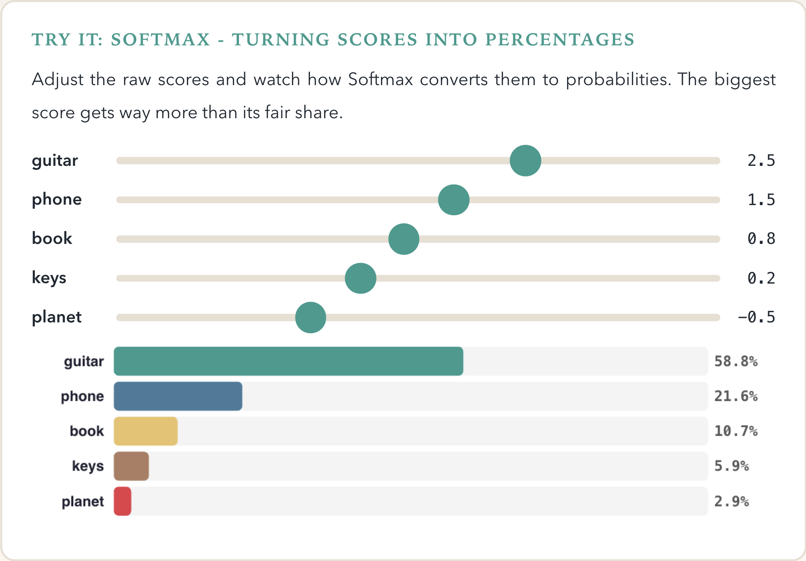 
- *调整原始分数，观察 Softmax 如何将它们转换为概率。数值最大的分数会获得远超其原本占比的权重。*

Softmax 这一步至关重要。
它会把一组原始分数转化为一个概率分布 —— 说白了就是 “总和为 1 的百分比”。
得分最高的项会被赋予远超其原始占比的权重，而得分很低的项则会被压缩到几乎为零。
Softmax 会放大优胜者。

## 第四步：多头优于单头
有个设计让我觉得格外精妙。
Transformer 并非只使用一套注意力机制，而是并行使用多个 —— 这就是 ***多头注意力（Multi-Head Attention）*** 。
每个（注意力）头会学习关注不同的信息。

一个头可能学习语法关系（比如 “my” 和 “sister” 搭配）。
另一个头可能学习含义关联（比如 “playing” 和 “guitar” 相关）。
第三个头则可能追踪指代关系（比如 “she” 指代 “sister” ）。
这就好比用一支专家团队，代替了一个通才。

### 多头注意力 —— 专家团队
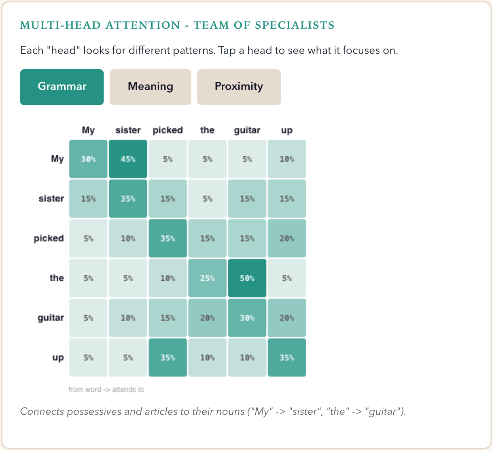 
- *每个 “注意力头” 负责寻找不同的模式。点击任意一个头，查看它重点关注的内容。*

在 GPT 类模型里，可能会有 96 个注意力头在 96 个层 上并行工作。
相当于一大批专家，从各种不同角度分析你输入的句子。

## 第五步：前馈网络部分 (feed-forward bit)
在注意力机制确定单词之间的关联关系后，结果会传入一个小型神经网络，该网络会对每个位置的信息进行独立处理。
你可以把这一步理解为：“好了，既然我已经知道 ‘她’ 指代 ‘姐妹’，现在来分析这对句子其余部分意味着什么。”

这个网络会先将数据扩展到更大的维度空间（通常放大为原来的 4 倍），再通过一个剔除负值的函数（名为 ReLU，本质就是取 max(0, x) ），最后将数据压缩回原有维度。

### ReLU：最简单却实用的函数
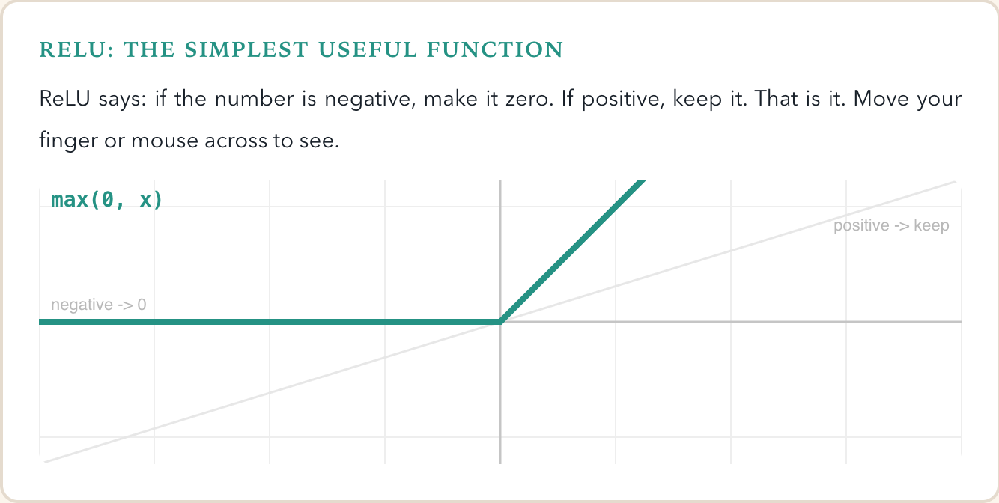 
- *ReLU 的规则是：如果数值为负，就设为0；如果为正，就保持不变。仅此而已。滑动手指或鼠标即可查看效果。*

简单到一个发着烧躺在沙发上的小孩都能实现。然而，正是通过堆叠这些层，才赋予了 Transformer 强大的能力。

## 第六步：将所有东西堆叠起来
一个 Transformer层 = 注意力机制 + 前馈网络。
一个实际的模型会将数十个甚至上百个这样的层层层堆叠。
每一层都会让模型的理解更进一步。

要让整个模型正常运作，还需要另外两个技巧：

  <b>残差连接 (Residual connections)</b>：每一层都会将其输出与输入相加。
  因此，如果某一层没有学到任何有用信息，它可以直接将数据原样传递。
  这就像一张安全网 —— 不会让情况变得更糟。
 
 
  <b>层归一化 (Layer Normalization)</b>：在每一步操作后，数据都会被归一化（平移使平均值为 0，缩放使离散程度为 1）。
  这可以防止数据在经过多层传递后数值失控增长。

 

### 完整的 Transformer 层
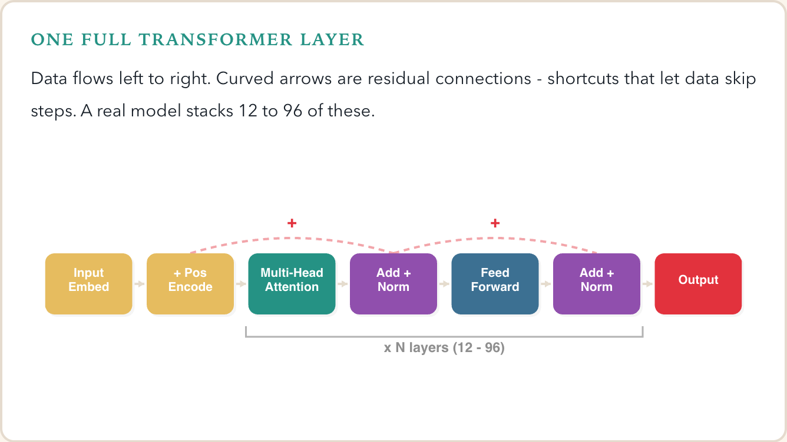 
- *数据从左向右流动。曲线箭头为残差连接，即让数据跳过部分步骤的捷径。实际模型会堆叠 12 至 96 个这样的层。

## 第七步：预测下一个词
经过所有这些层的处理后，每个位置的最终输出是一个向量。
为了将其转化为单词预测，模型将该向量与词嵌入矩阵相乘（还记得 [第一步](#第一步把单词转化为数字) 吗？），从而得到词表中每个单词的分数。
随后通过 Softmax 函数将这些分数转化为概率。

如果目前的句子是 “我姐姐拿起了”，模型可能会给 “吉他” 15% 的概率，“手机” 12% 的概率，“书” 8% 的概率，以此类推，覆盖其约 5 万个单词的整个词表。

### 试一试：预测下一个词
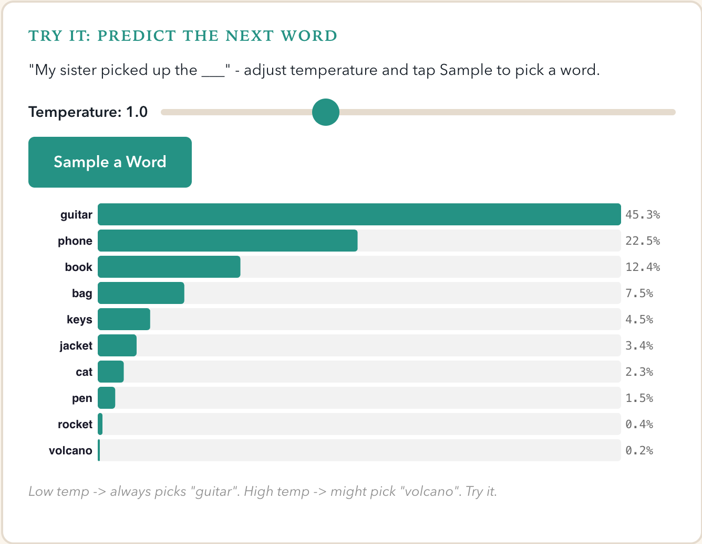 
- *“我姐姐拿起了___” —— 调节温度系数并点击 “Sample” 来选择一个单词。*
- *低温 → 总是选择 “吉他”。高温 → 可能会选择 “火山”。试试看。*

然后模型会从中选取一个词。
有时它会选择概率最高的那个，有时则会根据概率进行近似随机抽取 —— 这就是为什么你重复问同一个问题，却会得到不同的答案。
这种随机性由一个名为 ***温度系数（temperature）*** 的参数控制。
温度值越低，结果越可预测；
温度值越高，生成内容越有创造性（也可能越混乱）。

## 显而易见的问题：AI 为什么会编造内容
我们直面现实吧。
只要你使用 ChatGPT 超过五分钟，就会发现它信誓旦旦地说出完全错误的内容。
我女儿就有这样的经历：她用这款工具学习课堂历史知识，我考她的时候，她说出了一段 ChatGPT 编造的全新德国历史——德意志帝国竟然源于 1848 年的德国人民革命。
这套说辞说得像维基百科词条一样确凿，却纯属虚构。

这并非程序漏洞，而是由模型架构决定的。如今你理解了 Transformer 的工作原理，就能清楚明白其中缘由。

回到第七步：模型通过计算整个词表的概率来预测下一个词，
它选择的是 “结合前文内容，最有可能出现的下一个词”，而非 “真实正确的词”，
也不是 “与数据库中事实相符的词”，仅仅是： ***人类在这里大概率会写下什么词？***

模型内部没有事实核查机制，不存在会判定 “等一下，这符合事实吗？” 的模块，也不会查询任何数据库。
它只是在做模式补全 —— 尽管是极度复杂的模式补全，但本质依旧如此。

### 幻觉：模式匹配 vs 事实真相
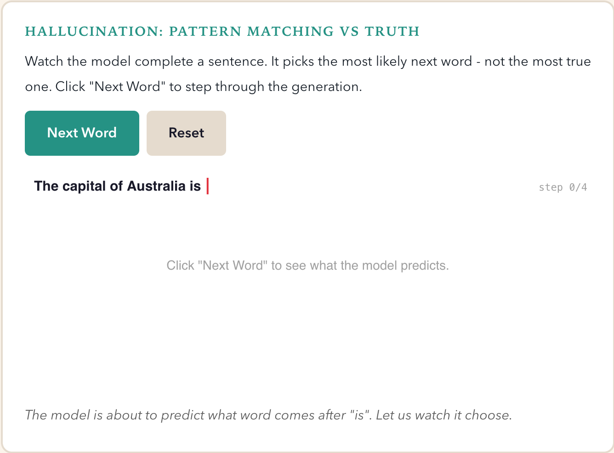 
- *观察模型补全句子的过程。它选择的是概率最高的下一个词 —— 而非最符合事实的词。点击 “下一个词” 逐步查看生成过程。*
- *模型即将预测 “is” 后面的单词。让我们看看它会如何选择。*

### 乘法效应问题：非确定性智能体
以上内容解释了这类系统为何表现不稳定。
模型输出是一个概率分布，并从中进行采样。
这对创意任务而言效果出色，但对可复现的工作流来说却十分糟糕。
<ins>两次输入相同提示词，可能会得到两种截然不同的结果。
在智能体场景下，每一步都是概率性猜测，而非确定的结果</ins>。

如果一个工作流包含多个步骤，概率就会叠加。
若每一步的正确率为 P=0.99，那么 10 步工作流的成功率为 0.99¹⁰（约 90.44% ），尚且尚可；
但 100 步工作流的成功率仅为 0.99¹⁰⁰（约 36.60% ），效果就很差了。

而如今大多数模型在实际任务中的正确率远低于 0.99。
这就是无人值守智能体存在风险的原因，也是你应当对任何类似 “设置后即可不管” 的承诺保持怀疑的原因 —— 因为它们甚至可能直接毁掉你的计算机。
我在《 Why non-deterministic AI agents are a problem for enterprise 》一文中对此有更详细的论述。[2](#2)

### 为何自信并不等于正确
真正棘手的问题在于：当模型出错时，它并不会 “显得” 不那么自信。
对于 “法国的首都是___” 这个问题，概率分布会给出 “巴黎” 95% 的概率，这很好，答案是正确的。
但对于 “澳大利亚的首都是___”，模型可能会给 “悉尼” 40% 的概率，给 “堪培拉” 35% 的概率。
模型会毫不犹豫地用和回答 “巴黎” 时同样笃定的语气写出 “悉尼” —— 因为它只是在预测这些文字后面通常会接什么内容。

在它的训练数据里，有大量的人写过 “澳大利亚的首都是悉尼”
（这些人是错的，但他们确实这么写了，而且很可能自己也十分确信。人类往往就是如此，实际上并不比 LLM 高明多少）。
模型学习到了这种文本模式，它无法区分自己见过一万次的正确表述和见过五千次的错误表述，两者对它而言都只是模式而已。

### 自信与真相 —— 核心问题
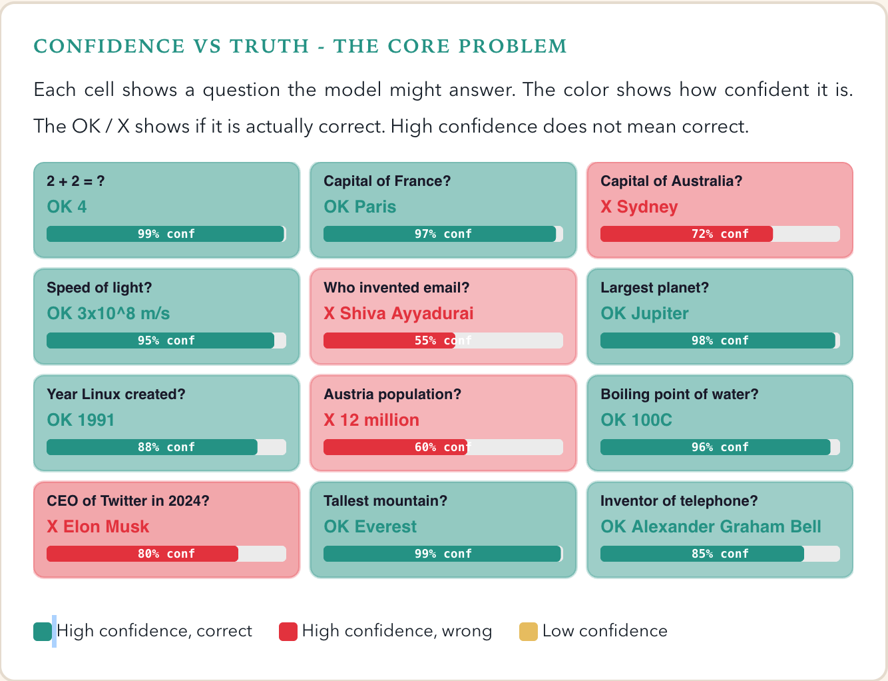 
- *每个格子展示一个模型可能回答的问题。颜色代表其自信程度。OK /叉号表示答案是否正确。高度自信并不代表正确。*

### 更糟的是：知识是被 “固化” 在模型里的
Transformer 所拥有的全部 “知识”，都编码在它的权重矩阵中 —— 也就是在训练阶段确定的数百万乃至数十亿个参数。
当你向它提问时，它并不会去查阅任何资料，而是从压缩后的统计模式中重构出答案。
可以这样理解：假如你记住了世界上所有的食谱，然后有人问你 “烤鸡需要多少温度？”，你会从所有重叠的记忆里拼凑出一个答案。
大多数时候你是对的，但有时记忆会混杂在一起，你会自信地说出 “ 180 摄氏度烤 3 小时”，而实际答案取决于鸡的大小。
你没有办法核实，因为食谱已经不在了，只剩下你压缩后的记忆。

这也是为什么之前提到的检索+嵌入方案如此重要。
<ins>RAG（检索增强生成）的核心思想本质上是：“不要只依赖自己的记忆。在回答之前，先去找到真实的文档，阅读内容，再据此给出答案。”
这并不能完全消除幻觉，但在事实性问题上能大幅减少幻觉的出现</ins>。

  总而言之：Transformer 是<b>预测机器</b>，而非<b>真相机器</b>。
  它们基于模式预测接下来应该出现什么文本。
  当模式与事实相符时，它们表现出色；当不相符时，它们就会自信地犯错。
  除非从根本上改变架构，否则这一问题无法被 “修复” —— 它是逐词预测机制本身自带的特性。
  对于重要的论断务必自行核实。
  AI 并不知道它自己不知道什么。

 

---
技术在不断发展。
而其背后的数学原理，只要你逐块拆解来看，会惊人地简洁优美。
没有魔法，只有线性代数、一些正弦波，以及一群工程师的精妙设计 —— 他们提出了一个设想：“如果我们让模型同时关注所有信息，会怎么样？”

如果你想深入学习，我强烈推荐 Michael Stal 博士关于 Transformer 背后数学原理的文章 [3](#3) 。
这份资料非常出色，讲解细节远比我在这里展开的更丰富。

但我们也必须记住：模型没有理解能力，没有真正的知识，也不会进行事实核查。
它只是极其、极其擅长模式匹配。
这既是它的魅力所在，也是它的局限所在。

失陪一下，我得在睡前给一个 12 岁孩子讲解梯度下降 (gradient descent) 了。
祝我好运吧。

## 引用

### 1
[《Attention Is All You Need》](https://arxiv.org/abs/1706.03762) ，作者：Ashish Vaswani, Noam Shazeer, Niki Parmar, Jakob Uszkoreit, Llion Jones, Aidan N. Gomez, Lukasz Kaiser, Illia Polosukhin。2017 年发表。这篇论文首次提出了 Transformer 架构。

### 2
[《非确定性AI智能体为何对企业构成问题》](https://blog.inxm.ai/p/why-non-deterministic-ai-agents-are)，作者：Matthias Kainer。

### 3
[《大语言模型：Transformer背后的数学原理》](https://www.heise.de/blog/Large-Language-Models-Die-Mathematik-hinter-Transformern-10292831.html)，作者：Michael Stal 博士。
