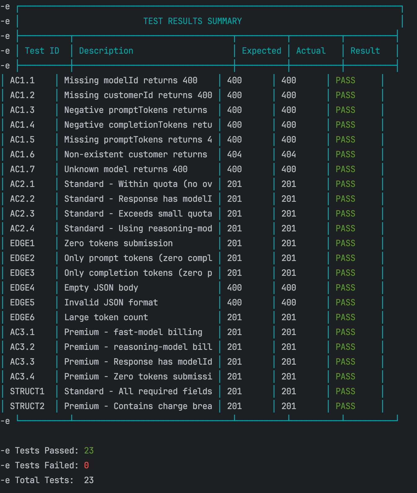

# 结构化提示驱动开发（SPDD）

|[Wei Zhang](https://www.linkedin.com/in/wei-willie-zhang-ab5a07135/)| | [Jessie Jie Xia](https://www.linkedin.com/in/jessie-xia/)| |
|:---|:---|:---|:---|
| |Wei Zhang 是 Thoughtworks 的 AI 辅助交付专家。他拥有近十年的软件交付经验，其中三年专注于架构设计，目前的工作是为 AI 增强的软件交付设计工程实践——不断演进那些能帮助团队在借助 AI 获得速度的同时保持纪律性的方法。| | Jessie Xia 是 Thoughtworks 的全球首席信息官。她在软件交付、业务领导力和企业技术转型领域拥有长达 20 年的职业生涯。她曾担任东南亚区董事总经理，负责损益管理，此前还有五年的软件交付经验。她现在专注于在 Thoughtworks 全球 IT 服务中推动以 AI 为先的软件交付，同时与客户分享务实的观点，帮助他们以可管控、可扩展且可靠的方式应用 AI。 |
|[原文](https://martinfowler.com/articles/structured-prompt-driven/)| | | 2026/4/28 |

---
目录
- [什么是 SPDD？](#什么是-spdd)
  - [REASONS 画布](#reasons-画布)
  - [SPDD 工作流](#spdd-工作流)
- [使用 SPDD 增强计费引擎](#使用-spdd-增强计费引擎)
  - [当前系统](#当前系统)
  - [增强需求](#增强需求)
  - [步骤 1：创建初始需求](#步骤-1创建初始需求)
  - [步骤 2：澄清分析](#步骤-2澄清分析)
  - [步骤 3：生成分析上下文](##步骤-3生成分析上下文)
  - [步骤 4：生成结构化提示词](#步骤-4生成结构化提示词)
  - [步骤 5：生成代码](#步骤-5生成代码)
  - [步骤 6：生成单元测试](#步骤-6生成单元测试)
  - [这个示例交付了什么](#这个示例交付了什么)
- [三项核心技能](#三项核心技能)
  - [抽象优先](#抽象优先)
  - [对齐](#对齐)
  - [迭代审查](#迭代审查)
- [SPDD 的适用场景](#spdd-的适用场景)
  - [适用性评估](#适用性评估)
  - [需要权衡的方面](#需要权衡的方面)
- [结语](#结语)
- [一些问题解答](#一些问题解答)

边栏
- [SPDD 为规约驱动开发增加了什么](#边栏-spdd-为规约驱动开发增加了什么)
- [合并后的用户故事（简化版）](#合并后的用户故事简化版)
- [如果结构化提示词需要修改怎么办？](#边栏-如果结构化提示词需要修改怎么办)
- [待续：打破 “专家专属” 的壁垒](#边栏-待续打破-专家专属-的壁垒)

---
一旦团队采用 AI 编码助手，最初的收益体现在个人层面：单个开发者能够比以前更快地编写、修改和重构代码。
但交付速度很少受限于打字速度。
当你审视从需求到发布的整个交付生命周期时，新的阻力会出现：

- 模糊的需求会迅速变成代码，而误解也随之成倍放大。
- 代码审查需要处理更多的修改，不一致性也更容易被引入。
- 更多的集成和测试问题会浮出水面，因为 “生成的” 并不等于 “对齐的 (aligned)” 。
- 当变更量上升时，生产环境的风险变得更加难以判断。

所以，没错，局部速度确实提升了。
但这并不会自动转化为系统级的吞吐量。
这就像买了一辆法拉利，却在泥泞的道路上行驶：发动机虽然强大，但你的到达时间取决于路况和交通状况。
根据我们的经验，真正的问题不是 “我们如何生成更多的代码？”，
而是：我们如何让 AI 生成的变更变得可管控、可审查、可复用，从而使团队既更快又更安全？

这促使我们 Thoughtworks 的内部 IT 团队（Global IT Services）形成了一套方法和流程，我们称之为结构化提示驱动开发（SPDD）。
SPDD 的目标是将 AI 辅助从个人效率提升为一种可规模化的组织级能力，而不以牺牲质量为代价。

<br/>
*提示词作为一等交付工件*

## 什么是 SPDD？
结构化提示驱动开发（SPDD）是一种工程方法，它将提示词视为一等交付工件。

SPDD 不依赖于临时性的聊天对话，而是将提示词转化为可以长期使用的资产：能够进行版本控制、审查、复用和持续改进。
团队使用结构化提示词来捕获需求、领域语言、设计意图、约束条件以及任务分解。
然后，LLM 在定义的边界内生成代码，使得输出更加可预测、更易于验证。

它包含两个核心组成部分：

### REASONS 画布

REASONS 画布 (canvas) 是一种用于生成提示词的结构框架。
它强制要求在需求、领域模型、解决方案方法、系统结构、任务分解、可复用规范以及安全防护等方面保持清晰。
这样一来，LLM 的生成过程就由明确的意图所引导，而不是靠猜测。

REASONS 画布由七个部分组成，引导提示词从意图 → 设计 → 执行 → 治理的整个过程。

<br/>

**抽象部分（意图与设计）**

- R — Requirements：我们要解决什么问题？完成的定义是什么？
- E — Entities：领域实体及其关系。
- A — Approach：我们将如何满足需求的策略。
- S — Structure：变更在系统中的位置；组件及其依赖关系。

**具体部分（执行）**

O — Operations：将抽象策略分解为具体、可测试的实现步骤。

**通用规范部分（治理）**

- N — Norms：横切性的工程规范（命名、可观测性、防御性编码等）。
- S — Safeguards：不可妥协的边界约束（不变量、性能限制、安全规则等）。

REASONS 画布在代码生成之前就对意图和边界进行了对齐，将不确定性向左偏移。
由于结构化提示词捕获了完整的规格说明，审查者可以针对单一工件进行推理，而不是面对分散的聊天记录和不完整的差异对比。
通过遵循相同的结构，每个提示词都以同样的方式变得可管控。
而随着领域知识和设计决策在每个提示词中不断积累，它们会在迭代过程中汇聚个体的专业经验，并减少团队之间的差异。

### SPDD 工作流
该工作流将提示词纳入与代码相同的工程纪律之中：提交历史、代码审查和质量门禁。
它还强制执行一条简单而有力的规则：

当现实与预期出现偏差时，先修正提示词 —— 然后再更新代码。

随着时间的推移，这会改变团队的工作方式。
代码审查从 “找出 bug” 转变为 “检查意图”。
返工变得更有可控性。
成功的模式自然会积累成一个可复用的提示词库，为 AI 优先软件交付提供支持。

如果你了解过 [规范驱动开发](https://en.wikipedia.org/wiki/Spec-driven_development)，你会认出同样的出发点：
先清晰地写好 spec，然后让模型去实现。
SPDD 则从一个不同的角度切入。
它将结构化提示词视为可管控、可复用、版本化的团队资产（REASONS 画布 + 工作流），使其与代码一起演进 —— Birgitta Böckeler 将这种方法归类为 [规范锚定](./gen-ai/exploring-gen-ai-22.md) 方法。

SPDD 工作流的目标是将 “业务输入 → 抽象 → 执行 → 验证 → 发布” 转变为一个 “闭环 (closed loop)” <sup>[1](#1)</sup>， 并确保提示词资产与代码协同演进，而非各自独立。

<div style="background-color: darkgrey; padding: 8px; border: 1px solid lightgrey;">

### ⟡边栏⟡ SPDD 为规约驱动开发增加了什么

SDD 和 SPDD 有着相同的起点：在生成代码之前先生成规约。
SPDD 则为如何生成、审查规约并使其与代码保持同步增加了一套方法。

- **提示词是一个需要维护的工件**。
它不是生成一次就丢弃，而是经历一个明确的工作流，并始终作为意图的记录存在。
- **从需求到工程规约 (engineering spec)**。
REASONS 画布不局限于系统应该做什么，它还捕获了所选方案、系统结构、工程规范和安全防护 —— 为 LLM 设定了一个实现边界，而不仅仅是一个目标。
- **同步，而不是交接**。
提示词与代码保持同步。
任何一方的变更都会反向反映出来，因此意图与实现不会发生偏离。
- **可重复的团队管控**。
重点不在于 “更详细的规约”，而在于为团队提供一种一致的方式来管控 AI 的输出，并将已确定的决策延续到后续迭代中。
那些决策背后的权衡分析存在于分析阶段；
而画布记录的是最终的结果。

</div><br/>

 <br/>
*SPDD 工作流*

此工作流的目标是以提示词作为协作的锚点，使开发人员和产品负责人能够避免反复进行对齐沟通。
提示词为代码生成设定了明确的边界，降低了 LLM 非确定性带来的随机性，使其更易于管控。
通过将结构化提示词视为版本控制中的一等工件，我们把成功的实践转化为可复用的资产，从而提升一致性并减少重复造轮子。

在实际操作中，这些步骤通过 [openspdd](https://github.com/gszhangwei/open-spdd) 提供的命令来执行。
openspdd 是一个实现 SPDD 工作流的开源命令行工具。
下表汇总了各个命令。

| 命令 | 类型 | 用途 |
| ---- | ---- | ---- |
| [/spdd-story](https://github.com/gszhangwei/open-spdd/blob/v0.4.9/internal/templates/data/optional/spdd-story.md) | 可选 | 依据 INVEST 原则，将大型需求拆解为可独立交付的用户故事 |
| [/spdd-analysis](https://github.com/gszhangwei/open-spdd/blob/v0.4.9/internal/templates/data/core/spdd-analysis.md) | 核心 | 从需求中提取领域关键词，扫描相关代码，产出包含领域概念、风险与设计方向的策略分析 |
| [/spdd-reasons-canvas](https://github.com/gszhangwei/open-spdd/blob/v0.4.9/internal/templates/data/core/spdd-reasons-canvas.md) | 核心 | 生成完整 REASONS 画布，形成从高层设计依据到方法级操作的可执行蓝图 |
| [/spdd-generate](https://github.com/gszhangwei/open-spdd/blob/v0.4.9/internal/templates/data/core/spdd-generate.md) | 核心 | 读取画布并按任务逐一生成代码，严格遵循提示词定义的操作、规范与约束 |
| [/spdd-api-test](https://github.com/gszhangwei/open-spdd/blob/v0.4.9/internal/templates/data/optional/spdd-api-test.md) | 可选 | 生成基于 cURL 的 API 测试脚本，内置覆盖常规、边界及异常场景的结构化测试用例 |
| [/spdd-prompt-update](https://github.com/gszhangwei/open-spdd/blob/v0.4.9/internal/templates/data/core/spdd-prompt-update.md) | 核心 | 需求变更时增量更新画布，链路：需求→提示词→代码 |
| [/spdd-sync](https://github.com/gszhangwei/open-spdd/blob/v0.4.9/internal/templates/data/core/spdd-sync.md) | 核心 | 将代码重构、缺陷修复等变更反向同步至画布，保持提示词与代码现状一致，链路：代码→提示词 |

## 使用 SPDD 增强计费引擎

复杂的工作流程在抽象层面很难理解，因此我们准备了一个增强现有软件系统的示例流程。
为了使教程文章易于理解，这个系统及其增强内容必须保持较小的规模。
尽管如此，这个增强示例是一个完整的端到端案例：
从创建初始需求，到分析业务需求，再到生成和审查结构化提示词，继而生成和验证代码，最后进行清理和测试。

你可以通过在自己的环境中安装 [openspdd](https://github.com/gszhangwei/open-spdd)，跟着这个示例一步步操作。

### 当前系统
当前系统是一个简单的计费引擎，用于计算使用大语言模型的费用。
它接收一条记录，其中包含某个会话中使用了多少 token，然后据此计算出账单。

这个初始版本的完整代码库可以在 [GitHub 上找到](https://github.com/gszhangwei/token-billing/tree/iteration-1-end)。
仓库中包含了 [初始需求的用户故事](https://github.com/gszhangwei/token-billing/blob/iteration-1-start/requirements/token-usage-billing-story.md) 以及 [用于生成该初始版本的所有 SPDD 工件](https://github.com/gszhangwei/token-billing/compare/iteration-1-start...iteration-1-end) 。
为简洁起见，我们在这里不描述初始生成过程，但其步骤与增强过程基本相同。
我们把重点放在描述增强上，因为对系统所做的大部分工作都是增强。

### 增强需求
在业务需求演进和直接用户反馈的推动下，我们正在增强计费引擎，使其从静态定价模型过渡到更复杂、更灵活的基础设施。
此次更新旨在通过以下关键变更来支持多样化的订阅策略和可变的、针对具体模型的定价：

- **API 增强**：更新现有的 `POST /api/usage` 端点，使其接受一个新的必需参数 `modelId`（例如 “fast-model”、“reasoning-model” ）。
- **模型感知定价**：从单一全局费率转变为动态定价，费用根据所调用的具体 AI 模型而变化。
- **多套餐计费逻辑**：根据客户的订阅套餐引入不同的计费行为：
  - **标准套餐**（优化后）：保留全局月度配额，但任何超出的用量现在都将使用按具体模型计算的费率。
  - **高级套餐**（新增）：没有配额限制。
  引入拆分计费，其中提示 token 和完成 token 根据所使用的模型按不同费率分别计费。
- **架构可扩展性**：实现可扩展的设计模式（如策略模式或工厂模式），将不同套餐的计算逻辑清晰隔离，确保系统能够轻松适应未来的定价模型。

由于这一新需求同时包含了业务需求和技术细节，通常由产品负责人（或业务分析师）与开发人员通过配对协作的方式共同完成。

### 步骤 1：创建初始需求
为了快速启动流程，我们可以使用 /spdd-story 命令 <sup>[2](#2)</sup> ，直接基于增强需求生成一个用户故事。
通常，用户故事由产品负责人或业务分析师提供。
但在我们的工作流中，我们可以将任何形式的故事转换为一致的格式和维度。
只要在最终的验收标准上达成一致，这一步可以由产品负责人、业务分析师或开发人员执行，具体取决于团队灵活的分工。

指令：
```
/spdd-story @idea-of-the-enhancement.md
```

<div style="background-color: darkgrey; padding: 8px; border: 1px solid lightgrey;">

### ⟡边栏⟡ [spdd-story](https://github.com/gszhangwei/open-spdd/blob/v0.4.9/internal/templates/data/optional/spdd-story.md) 的工作原理

该命令按照 INVEST 原则（每个故事的工作量为 1 到 5 天）将大型需求拆解为独立、可交付的用户故事。
每个故事都包含用业务语言编写的验收标准，可直接作为 `/spdd-analysis` 的输入。

其目的是使大型需求变得可管理，并为后续步骤提供标准化、可预测的格式。
</div><br/>

AI 分析了增强需求描述，并将其拆分为两个用户故事：

- [故事 1-1（标准套餐与模型感知定价）](https://github.com/gszhangwei/token-billing/blob/spdd-article-snapshot/requirements/%5BUser-story-1-1-initial%5DMulti-Plan-Billing-Foundation-%26-Standard-Plan-Model-Aware-Pricing.md)
- [故事 1-2（高级套餐拆分费率计费）](https://github.com/gszhangwei/token-billing/blob/spdd-article-snapshot/requirements/%5BUser-story-1-2-initial%5DPremium-Plan-Split-Rate-Billing.md)

自动生成的故事足够详尽，可以作为正式项目的基线。
在本教程中，我们将它们合并为一个简化的故事，以便示例保持完整独立。

指令：

```
将以下两个用户故事合并为一个简化的故事：

- @[用户故事-1-1-初始] 多套餐计费基础与标准套餐模型感知定价
- @[用户故事-1-2-初始] 高级套餐拆分费率计费

要求：

1. 将两个套餐（标准套餐和高级套餐）合并为一个连贯的故事。
2. 仅保留以下章节：背景、业务价值、范围内、范围外、验收标准。
3. 剥离实现层面的细节——聚焦系统应该做什么，而不是如何做。
4. 验收标准必须使用 Given/When/Then 格式，并附带具体的数字示例。
5. 保持结果简洁——不超过一页。
6. 仅保留三个高层次的验收标准。
```

这类指令每次运行时很少产生完全相同的文本 ——模型和采样会引入细微差异—— 因此我们仍然希望在将其作为最终版本之前对输出进行审查和微调。
下面这个合并后的故事是我们为本次教程精炼过的版本：它是将两个初始故事有意简化后合并而成。

<div style="background-color: darkblue; padding: 8px; border-left: 4px solid lightblue;">

### 合并后的用户故事（简化版）

**背景**

随着我们的 LLM API 平台不断扩展，单一的定价模型已不再适用。我们需要重构现有的计费引擎，以支持不同的订阅策略和基于所调用 AI 模型的变量定价，为未来更复杂的计费方案奠定基础。

**业务价值**

- **灵活的变现能力**：支持多种计费策略（标准套餐、高级套餐），以覆盖不同的市场细分。
- **模型感知定价**：根据所使用的具体 AI 模型收取不同的费率。
- **架构可扩展性**：实现可扩展的设计（例如策略模式），将计算逻辑隔离，便于未来轻松添加新的定价模型。

**范围内**

- 增强现有的 `POST /api/usage` 端点。
- 新增请求字段：添加 `modelId`（必填，字符串，例如 “fast-model”、“reasoning-model”）。
- 实现一个路由机制（策略模式/工厂模式）来处理不同的计算逻辑。
- 实现两种初始套餐类型：
  - **标准套餐**（旧有功能重构）：具有月度全局配额。超出配额的部分现在根据 `modelId` 计算费率。
  - **高级套餐**（新增）：无配额限制。提示 token 和完成 token 分别计费，费率根据 `modelId` 不同而不同。

**范围外**

- 复杂的阶梯式/基于用量的折扣逻辑（推迟到第二阶段）。
- 订阅套餐的创建和分配的 CRUD 操作。
- 发票生成。

**验收标准**

1. **基本校验（回归测试与新功能）**
   Given 一个无效请求（例如，缺少 `modelId`、token 数量为负数）
   When 后端进行请求校验
   Then 返回 HTTP 400 状态码及相应的错误信息。

2. **标准套餐：模型感知的超额计费**
   Given 一个 “标准套餐” 客户，拥有每月 100,000 的配额，本月已使用 90,000。“fast-model” 的超额费率为 $0.01 / 1K token。
   When 为该客户提交 30,000 token 的 “fast-model” 使用记录
   Then 账单显示：10,000 token 来自配额，20,000 token 为超额用量，超额费用为 $0.20。

3. **高级套餐：拆分费率计费**
   Given 一个 “高级套餐” 客户。对于 “reasoning-model”，提示 token 费率为 $0.03 / 1K，完成 token 费率为 $0.06 / 1K。
   When 提交 10,000 提示 token 和 20,000 完成 token 的 “reasoning-model” 使用记录
   Then 账单显示：配额用量为 0，提示 token 费用 $0.30，完成 token 费用 $1.20，总计 $1.50。
</div></br>

### 步骤 2：澄清分析
在进入实现之前，开发人员会先审阅用户故事，以便在实际操作层面建立共同的理解。
如果存在明显的业务层面问题，此时正是与业务分析师或产品负责人对齐的时机。
在本案例中，故事已经足够清晰，因此我们直接进入下一步，从三个维度对其进行分解：核心逻辑、范围边界以及完成的定义。

**核心逻辑**

API 上新增一个必填字段：`modelId`。
客户现在需要告知我们他们使用了哪个 AI 模型 —— 这个字段是解锁正确价格的关键。

- **标准套餐**：
客户拥有月度 token 配额。
配额内的用量免费，超额用量按特定于模型的费率计费（例如，fast-model 为 $0.01/1K，reasoning-model 为 $0.03/1K）。
现有的配额逻辑保持不变，仅费率查询方式发生变化。
- **高级套餐**：
无配额。
从第一个 token 开始，每个 token 都计费。
提示 token 和完成 token 分别计费，各自采用特定于模型的费率。
账单 = 提示 token 费用 + 完成 token 费用。
该套餐为全新设计。
- **路由**：
系统确定客户的套餐类型，并分派到相应的计费公式。
设计必须易于扩展 —— 企业套餐（故事 2）将是下一步。

**范围边界**

我们只计算当前账单。
我们不构建客户的 CRUD 操作，不查询历史账单，不管理订阅，也不添加或删除模型。

**完成的定义**

以下场景复述了故事中的验收标准，并加入了团队需要验证的实现细节。
第四项（响应格式）不是一个新的业务验收标准，而是开发人员添加的非功能性契约，目的是使整个验收标准能够端到端地可测试。

- **校验**：
缺少 `modelId` → HTTP 400。
未知客户 → HTTP 404。
token 数量为负数 → HTTP 400。
所有现有的校验逻辑保持不变。
- **标准套餐计费**：
一个拥有 100K 配额、已使用 90K 的客户，提交 30K token 的 fast-model 用量（费率 $0.01/1K）。
预期结果：10K 由配额覆盖，20K 超额，费用 $0.20。
使用 reasoning-model（费率 $0.03/1K）的相同请求，产生费用 $0.60 —— 相同的配额逻辑，不同的费率。
- **高级套餐计费**：
一个客户提交 10K 提示 token 和 20K 完成 token，
使用 reasoning-model（提示费率 $0.03/1K，完成费率 $0.06/1K）。预期结果：$0.30 + $1.20 = $1.50。
无配额，无超额 —— 提示和完成分别计费。
- **响应格式**：
HTTP 201，返回账单 ID、客户 ID、token 数量、时间戳、`modelId` 以及按套餐区分的费用明细。

如果所有这些场景都通过，我们就完成了这个故事。

### 步骤 3：生成分析上下文

在需求与范围明确之后，我们使用 `/spdd-analysis` 命令。
通过将业务需求输入给 AI，我们指示其生成一份全面的分析上下文。

指令：

```
/spdd-analysis @[User-story-1]Multi-Plan-Billing-Foundation-&-Model-Aware-Pricing.md
```

<div style="background-color: darkgrey; padding: 8px; border: 1px solid lightgrey;">

### ⟡边栏⟡ [/spdd-analysis](https://github.com/gszhangwei/open-spdd/blob/v0.4.9/internal/templates/data/core/spdd-analysis.md) 的工作原理

该命令从业务需求中提取领域关键词（例如 “billing”、“quota”、“plan”），并利用这些关键词仅扫描代码库中的相关部分，而非全部代码。它会识别出现有的概念、新概念、关键业务规则以及技术风险。

输出是一份富含上下文的文档，涵盖领域概念识别、战略方向以及风险分析。它作为下一步——生成 REASONS 画布——的输入。

</div><br/>

生成的工件：[初始分析上下文文档](https://github.com/gszhangwei/token-billing/blob/after-enhancement/spdd/analysis/GGQPA-001-202603191100-%5BAnalysis%5D-multi-plan-billing-model-aware-pricing.md)

该命令基于对实际代码库的探索，生成一份策略层面的分析。
输出内容完全聚焦于 “是什么” 和 “为什么”，在此阶段刻意避免涉及细粒度的实现细节。它通常包含：

- **领域概念**：现有概念与新概念、它们之间的关系、业务规则
- **策略方法**：解决方案方向、设计决策、权衡取舍
- **风险与差距**：需求模糊之处、边界情况、技术风险、验收标准覆盖情况

**审查并完善分析上下文**

结合我们自己对业务需求的理解，我们审阅生成的这份分析文档 —— 重点关注 [对齐](https://martinfowler.com/articles/structured-prompt-driven/alignment.html) 技能中所强调的那些方面。
这次审阅有两个目的：一是确认我们的理解与 AI 的解读是一致的，
二是发现 AI 可能揭示出的、我们自己未曾考虑到的边界情况或边缘场景。

在这个具体的案例中，审查集中在几个关键领域：

- 策略模式是否被恰当地考虑到了。
- 是否遵循了现有系统中已确立的面向对象原则 (OOP)，特别是接口隔离原则 (ISP) 和单一职责原则 (SRP)。
- 所提出的新增字段策略是否有效。
- 识别出之前未曾预料到的边界情况。
- 揭示潜在的技术风险。

完成审查后，AI 的分析与我们的架构意图大体一致；
事实上，在某些领域，它的考虑甚至比我们更加全面。

 <br/>
*[分析文档](https://github.com/gszhangwei/token-billing/blob/after-enhancement/spdd/analysis/GGQPA-001-202603191100-%5BAnalysis%5D-multi-plan-billing-model-aware-pricing.md#edge-cases) 中的边缘情况与风险*

### 步骤 4：生成结构化提示词

指令：

```
/spdd-reasons-canvas @GGQPA-001-202603191100-[Analysis]-multi-plan-billing-model-aware-pricing.md
```

<div style="background-color: darkgrey; padding: 8px; border: 1px solid lightgrey;">

### ⟡边栏⟡ [spdd-reasons-canvas](https://github.com/gszhangwei/open-spdd/blob/v0.4.9/internal/templates/data/core/spdd-reasons-canvas.md) 的工作原理

该命令读取业务上下文（来自 /spdd-analysis 的输出，或直接的需求描述），并将其与代码库的当前状态相结合。然后，它会生成一份涵盖全部七个 REASONS 维度的设计规约——从“我们为什么要做这个”到“我们绝对不能做什么”。

其输出是一份可执行的蓝图。在 Operations 部分，它会精确到方法签名、参数类型以及执行步骤。

</div><br/>

生成的工件：[初始结构化提示词](https://github.com/gszhangwei/token-billing/blob/after-enhancement/spdd/prompt/GGQPA-001-202603191105-%5BFeat%5D-multi-plan-billing-model-aware-pricing.md)

到这一步，我们在分析阶段已经梳理过高层次的策略 —— 因此在审阅结构化提示词时，我们并非从零开始。
相反，我们是在审视 AI 如何将我们已形成的共同理解，转化为 REASONS 画布的结构：从策略到抽象，再到具体细节。

你可以把它看作一个递进的过程：分析阶段让我们获得了战略层面的清晰性；
而现在我们检查的是，这种清晰性是否被忠实地贯彻到了架构抽象和实现细节之中。
这是在更深层面上进行意图对齐 —— 确保在生成任何代码之前，AI 已经在我们所定义的框架内有效地 “模拟” 了整套解决方案。
我们能够从全局视角进行审阅，而不是一开始就迷失在细节里。

将审阅重点放在 [抽象优先](https://martinfowler.com/articles/structured-prompt-driven/abstraction-first.html) 技能所强调的那些领域上。
在本案例中，这些基础性的上下文信息已经嵌入到代码库和 [之前生成的结构化提示词中](https://github.com/gszhangwei/token-billing/blob/after-enhancement/spdd/prompt/GGQPA-XXX-202603131758-%5BFeat%5D-api-token-usage-billing.md) 。
因此，在为本次迭代生成结构化提示词时，AI 会自然地考虑到这些架构指导和面向对象原则。
其结果是，尽管生成的内容相当复杂，却几乎没有重大缺陷。
我们可以选择先用这个结构化提示词来生成代码，随后再进行更深入的审阅，以识别任何可能存在的代码层面的异常。

<div style="background-color: darkgrey; padding: 8px; border: 1px solid lightgrey;">

### ⟡边栏⟡ 如果结构化提示词需要修改怎么办？

我们永远不会手动编辑结构化提示词文件。
相反，我们遵循 SPDD 的迭代对话流程：

1. **识别差距**：发现缺失的元素（例如，遗漏了某些面向对象原则，或者对某个业务规则的理解有误）。
2. **输入新的提示词**：通过对话界面，直接向 AI 提供缺失的意图。
3. **AI 更新文件**：AI 处理新的意图，并仅对结构化提示词中需要变更的具体部分进行精细化修改。

在后续的内容中，我们将看到一个具体的、分步骤的示例，演示这种 “先改提示词” 的工作流 —— 在触及任何代码之前，通过修改提示词来纠正一个业务逻辑上的不匹配问题。

</div><br/>

到目前为止，我们在意图层面已经达成了高度共识，明确了核心问题以及解决路径。
虽然在细节上可能还有细微的疏漏，但这并不令人担心；
在与 AI 就整体范围达成一致之后，局部的优化会变得高度可控。
现在，我们进入到代码生成阶段。

### 步骤 5：生成代码

这一步涉及的内容更多，因为我们要生成产品代码、测试，而我们的审查会有两种不同的结果路径。

**生成产品代码**

一旦我们的结构化提示词确定下来，就可以用它来生成产品代码。

指令：

```
/spdd-generate @GGQPA-001-202603191105-[Feat]-multi-plan-billing-model-aware-pricing.md
```

<div style="background-color: darkgrey; padding: 8px; border: 1px solid lightgrey;">

### ⟡边栏⟡ [spdd-generate](https://github.com/gszhangwei/open-spdd/blob/v0.4.9/internal/templates/data/core/spdd-generate.md) 的工作原理

该命令读取 REASONS 画布，并按照 Operations 中定义的顺序逐项生成代码。
它严格遵守 Norms 中的编码标准以及 Safeguards 中的约束——不自由发挥，不添加规约定义之外的任何功能。

其核心原则是：提示词捕获意图，而代码是意图的实现。
生成的代码必须与这份规约一一对应。

</div><br/>

生成的工件：[基于结构化提示词生成的代码](https://github.com/gszhangwei/token-billing/commit/ac3e07b396e3ee8ab54b5a5ab838ff07a6bdd64b)

得益于早些时候我们通过结构化提示词进行的多轮逻辑推演，我们现在进行代码审查时有了清晰的焦点和优先顺序：

- **架构**：代码是否严格遵循了我们预期的三层架构？
- **业务逻辑**：Service 层的实现是否与我们的初始意图完美一致？
- **变更范围**：修改是否严格限制在结构化提示词所定义的边界之内，避免了无关变更或范围蔓延？

在这个具体的案例中，得益于高度精确的上下文，生成的代码大体上符合我们的预期，除了少数几处可能的 “魔法数字”。
一旦功能验证完成，我们就会将它们优化掉。

这里的关键 takeaways 是：不要担心犯错，也不必为第一次没有完美捕捉到每一个细节而焦虑。
只要我们在 SPDD 工作流中持续迭代和推进，就有很多机会来修正方向。
一些小的代码坏味道目前是可以接受的 —— 我们首先验证核心功能，然后再回过头来进行优化。

**功能验证**

在功能验证过程中，SPDD 工作流提供了 `/spdd-api-test` 命令来生成功能测试脚本。<sup>[3](#3)</sup>

指令：

```
/spdd-api-test
```

<div style="background-color: darkgrey; padding: 8px; border: 1px solid lightgrey;">

### ⟡边栏⟡ [spdd-api-test](https://github.com/gszhangwei/open-spdd/blob/v0.4.9/internal/templates/data/optional/spdd-api-test.md) 的工作原理

该命令从代码实现或验收标准中提取 API 端点信息，并生成基于 cURL 的测试脚本。
脚本包含一个结构化的测试用例表格，涵盖正常场景、边界条件和错误场景。
执行后，它会输出预期结果与实际结果的对比。

</div><br/>

生成的工件：[API 测试脚本](https://github.com/gszhangwei/token-billing/blob/after-enhancement/scripts/test-api.sh)

在该命令定义好的规则指引下，AI 生成一个脚本，其中使用 curl 命令构建了所需的测试场景。
我们可以通过脚本中的 “TEST CASE OVERVIEW” 部分来审阅这些 AI 生成的测试场景。

 <br/>
*生成的 API 测试脚本*

执行：脚本生成后，运行以下命令：

```
sh scripts/test-api.sh
```

结果：所有功能测试均成功通过。

 <br/>
*API 测试结果*

**代码审查与最终调整**

得益于前几个步骤中严谨的意图对齐，大部分繁重的工作已经完成。
在这个阶段，遗留的问题通常都是一些小的逻辑差异或表层的代码坏味道。

为了保持我们工程实践的精准性，我们将这些最终调整分为两种不同的类型 ——依据它们是否会改变系统的可观测行为—— 并采用 SPDD 工作流中的不同策略来处理：

 <br/>
*两种应对代码审查变更的方式*

**逻辑修正（行为变更）**

策略：先更新提示词，再生成代码。
对于与业务规则或逻辑不匹配相关的问题（这些问题本质上会改变软件的可观测行为），始终要先更新结构化提示词以锁定正确的意图，然后再去修改代码。
这是一次更新或缺陷修复，而不是重构。

例如，在将 modelId 持久化到账单中时，我们目前允许该字段为可空。
其根本原因是为了保持与历史数据的向后兼容，因此这种折衷方案是一个合理的架构决策。

 <br/>
*提示词需要更新*

然而，还有另一种选择。
如果业务方能够确认在此次变更之前 modelId 的值应该是什么，我们就可以统一系统的行为，消除这笔潜在的技术债务。
我们假设，在与业务方确认之后，所有历史账单的 modelId 都应设置为 fast-model。

有了这个明确的意图后，我们就可以与 AI 进行交互：

指令：

```
/spdd-prompt-update @GGQPA-001-202603191105-[Feat]-multi-plan-billing-model-aware-pricing.md

model_id is a required field, and its default value is fast-model. Based on this decision, update the corresponding parts of the structured prompt.
```

<div style="background-color: darkgrey; padding: 8px; border: 1px solid lightgrey;">

### ⟡边栏⟡ [spdd-prompt-update](https://github.com/gszhangwei/open-spdd/blob/v0.4.9/internal/templates/data/core/spdd-prompt-update.md) 的工作原理

该命令对现有的 REASONS 画布进行增量更新。
它仅修改受变更影响的部分，其余内容保持不变。
根据变更类型 ——新需求、架构调整或约束变更—— 它会自动判断需要更新哪些 REASONS 维度。

这与 `/spdd-sync` 有所不同：`sync` 是在代码已经发生变更时，从代码流向规约；而 `prompt-update` 是在需求发生变更时，从需求流向规约。

</div><br/>

AI 根据这条指令更新了结构化提示词。

更新后的工件：[更新后的结构化提示词](https://github.com/gszhangwei/token-billing/commit/904747b35d4888c51ec46faa533c6605e340cdf5) 。

确认无误后，使用 `/spdd-generate` 命令，基于更新后的结构化提示词来更新相应的代码：

```
/spdd-generate @GGQPA-001-202603191105-[Feat]-multi-plan-billing-model-aware-pricing.md
```

AI 在 `/spdd-generate` 命令所定义规则的指引下，理解所需的变更，并仅对受影响的代码执行有针对性的更新。

更新后的工件：[更新后的代码](https://github.com/gszhangwei/token-billing/commit/d140a0a2ed01387714f4ecc74604f570c05fb86e) 。

值得注意的是，我们并不是重新生成整个代码库。
我们继续使用现有的结构化提示词，而 AI 会处理有针对性的差异：

1. **发现不匹配**：注意到在持久化 modelId 时的行为与新的业务需求不一致（它必须是必填且有默认值）。
2. **定位提示词片段**：从结构化提示词中复制定义过时逻辑的具体部分。
3. **更新提示词**：将提取出的片段连同修订后的业务规则一起粘贴到对话中，指示 AI 先更新结构化提示词。
4. **生成有针对性的代码更新**：一旦提示词反映了新的真实情况，运行指向更新后文件的 `/spdd-generate` 命令。
AI 会自动在受影响的代码库上执行有针对性的差异更新，而不是从头重新生成所有内容。

**重构（简洁代码与风格）**

> “为了更容易理解、降低修改成本，在不改变软件可观测行为的前提下对软件内部结构所做的变更。”
> 
> —— Martin Fowler

策略：先重构代码，再同步回提示词。
对于不改变可观测行为的结构或风格问题，指示 AI 直接重构代码，然后使用 sync 命令更新提示词文档。

例如，AI 生成的 BillingServiceImpl 类中包含一些硬编码的魔法数字，需要将其提取为有意义的常量。

```java
private int calculateRemainingQuota(String customerId, PricingPlan plan) {
        if (plan.getMonthlyQuota() == null || plan.getMonthlyQuota() == 0) {
            return 0;
        }

        LocalDate currentDate = LocalDate.now(ZoneOffset.UTC);
        LocalDateTime monthStart = currentDate.withDayOfMonth(1).atStartOfDay();
        LocalDateTime monthEnd = currentDate.plusMonths(1).withDayOfMonth(1).atStartOfDay();

        Integer currentMonthUsage = billRepository.sumIncludedTokensUsedForMonth(customerId, monthStart, monthEnd);
        return plan.getMonthlyQuota() - currentMonthUsage;
    }
```

指令 1：

```
@BillingServiceImpl.java In the calculateRemainingQuota method, there are some magic numbers that need to be processed as constants
```

AI 根据这条指令执行代码重构（记住黄金法则：始终以小步、增量的方式进行重构）。
如果输出符合我们的预期，我们就使用 `/spdd-sync` 命令，将这些新更新的代码细节同步回结构化提示词中的对应位置。

指令 2：

```
/spdd-sync
```

<div style="background-color: darkgrey; padding: 8px; border: 1px solid lightgrey;">

### ⟡边栏⟡ [spdd-sync](https://github.com/gszhangwei/open-spdd/blob/v0.4.9/internal/templates/data/core/spdd-sync.md) 的工作原理

该命令将当前代码与 REASONS 画布规约进行比对，然后将代码侧的变更（重构、缺陷修复、新增组件）同步回画布中。

其目的是使画布始终作为当前代码的准确设计文档，而非一份过时的历史记录。

</div><br/>

AI 根据 `/spdd-sync` 命令中定义的规则对变更进行总结。
然后，它遵循 REASONS 画布的结构要求，将详细的代码描述更新写回到结构化提示词的相应章节中。

两个命令都执行完毕后，我们可以在 [这里](https://github.com/gszhangwei/token-billing/commit/56cc47e1ab6d4ec75528be276c92e0e93209bb84) 看到所有的提示词和代码变更。

对于任何更深层次或隐藏的代码坏味道，只需重复这些步骤即可。
黄金法则是始终保持结构化提示词与你最新的代码库同步。

**回归测试**

所有优化完成后，重启服务并再次运行 API 测试脚本，以确保在清理过程中没有破坏任何核心功能。

结果：全部通过。

 <br/>
*回归测试结果*

### 步骤 6：生成单元测试

仅靠功能测试不足以进行稳健的验证；
它主要起辅助检查的作用，并且不计入代码覆盖率指标。
对核心逻辑的最终确认需要全面的单元测试。
目前，SPDD 工作流尚未最终确定专门的测试命令（这些将在未来的迭代中引入）。
作为临时解决方案，我们采用模板驱动的方式，为单元测试生成结构化提示词。

**生成初始测试提示词**

我们首先将实现细节与标准化的测试模板相结合，以生成一个基线测试提示词。

指令：

```
Based on the implementation details prompt @GGQPA-001-202603191105-[Feat]-multi-plan-billing-model-aware-pricing.md, combined with the template @TEST-SCENARIOS-TEMPLATE.md, please generate a test prompt file.
```

**去重与优化测试场景**

在生成初始的结构化测试提示词后，其中一些提议的测试场景与我们已有的场景重复。
为了解决这个问题，我们继续对话，指示 AI 将生成的提示词与现有的测试套件进行交叉比对，识别出真正的新场景，并移除所有冗余。

指令：

```
@GGQPA-001-202603191105-[Test]-multi-plan-billing-model-aware-pricing.md There are tests that are duplicated with existing ones, compare the relevant tests that exist, and then only add tests for new scenarios
```

更新后的工件：[测试结构化提示词](https://github.com/gszhangwei/token-billing/commit/c910aede947bfeae12eedeff7991b506d2e015db) 。

**生成单元测试代码*

经过精炼的测试场景被审阅并确认后，使用最终的测试提示词来驱动实际的代码生成。

指令：

```
Based on the generated test prompt @GGQPA-001-202603191105-[Test]-multi-plan-billing-model-aware-pricing.md, please generate the corresponding unit test code.
```

结果：所有测试通过。[提交测试](https://github.com/gszhangwei/token-billing/commit/6461da90fffcff94ab9e1f57c6fb4476dd122922) 。

### 这个示例交付了什么

至此，一个完整的 SPDD 工作流演示结束。
通过这个标准化的流程，我们成功交付了以下关键成果：

- 一个意图对齐度极高（约 99%）的业务逻辑实现。
- 完整的工程透明度，包括对实现路径、技术决策以及所接受的权衡取舍的清晰理解。
- 一个与当前代码库紧密同步的结构化提示词资产，为未来的迭代奠定了坚实的基础。
- 人类专业经验的复合积累：在与 AI 协作迭代的过程中，开发人员的经验和心智模型得以持续沉淀。

你可以在 GitHub 上 [查看本次增强的完整代码差异](https://github.com/gszhangwei/token-billing/compare/before-enhancement...after-enhancement) 。

我们还准备了一个额外的增强功能 —— [企业套餐的基于用量的阶梯计费](https://github.com/gszhangwei/token-billing/blob/after-enhancement/requirements/%5BUser-story-2%5DEnterprise-Plan-Volume-Based-Tiered-Billing.md) 。
如果你有兴趣进行一些动手实践，我们强烈建议你使用上面概述的 SPDD 工作流来尝试完成它。

## 三项核心技能

SPDD 代表了开发者构建软件方式的一次实质性变革。
在我们的工作中，我们识别出开发者为了有效开展工作所需的三项核心技能。
这些技能反映了在 AI 辅助的世界中，开发者的价值正在向何处转移。

### [抽象优先](https://martinfowler.com/articles/structured-prompt-driven/abstraction-first.html)

*在生成代码之前先进行设计*

在生成任何代码之前，你需要明确存在哪些对象、它们如何协作、以及边界在哪里。
如果没有这些，AI 往往会一头扎进实现细节中，而整体结构则会分崩离析。
职责不清、逻辑重复、接口不一致 —— 这些代价会在后续的审查和返工中体现出来。

[阅读更多…](https://martinfowler.com/articles/structured-prompt-driven/abstraction-first.html)

### [对齐](https://martinfowler.com/articles/structured-prompt-driven/alignment.html)

*在编写代码之前锁定意图*

在实现之前，你需要明确 “我们要做什么 / 我们不做什么”，并预先就标准和硬性约束达成一致。
否则，你最终只会得到快速的输出和缓慢的返工。

[阅读更多…](https://martinfowler.com/articles/structured-prompt-driven/alignment.html)

### [迭代审查](https://martinfowler.com/articles/structured-prompt-driven/iterative-review.html)

*将输出转化为可控的循环*

你希望 AI 辅助像一个工程流程那样运作，而不是一次性的草稿。如果没有一个纪律严明的审查与迭代循环，团队要么不断强迫模型打补丁直到解决方案偏离方向，要么反复重启，从而失去对成本与时间的控制。

[阅读更多…](https://martinfowler.com/articles/structured-prompt-driven/iterative-review.html)

## SPDD 的适用场景

### 适用性评估

SPDD 是一项工程投资。
下表评估了它在不同场景下的投入产出比，从强烈推荐（5 星）到不适用（1 星）。

| 评分 | 场景 | 说明 |
| :--- | :--- | :--- |
| ★★★★★ | 规模化、标准化的交付 | 需要长期可维护性的高重复性业务逻辑（例如，构建许多相似的 API、自动化核心业务工作流）。 |
| ★★★★★ | 高合规性与硬约束 | 必须遵守法规、安全标准或严格架构规则的环境（例如，金融核心系统、多通道/多客户端部署）。 |
| ★★★★☆ | 团队协作与可审计性 | 多人交付，要求变更必须完全可追溯、端到端可审查。 |
| ★★★★☆ | 横切性一致性工作 | 复杂的重构，需要在多个微服务或不同语言之间保持逻辑的紧密同步。 |
| ★★☆☆☆ | 紧急热修复 | “止血” 式的生产环境修复，速度比架构纪律更重要。 |
| ★★☆☆☆ | 探索性尖峰 | 目标是快速验证一个想法，而不是交付生产质量的软件 —— SPDD 的治理开销无法带来回报。 |
| ★★☆☆☆ | 一次性脚本 | 用于数据清理的临时脚本或一次性脚本 —— SPDD 的前期成本相对于其价值而言过高。 |
| ★☆☆☆☆ | 上下文黑洞 | 当领域定义不清、业务规则不明确时，你无法为模型设定有意义的边界。 |
| ★☆☆☆☆ | 纯粹的创意/视觉工作 | 由品味和审美驱动的任务，而不是逻辑（例如，UI 视觉探索、营销文案）。 |

### 需要权衡的方面
<div style="background-color: darkgrey; padding: 8px; border: 1px solid lightgrey;">

### ⟡边栏⟡ 待续：打破 “专家专属” 的壁垒

从当下的权衡来看，SPDD 可能看起来像是一种为资深架构师保留的方法，因为它对抽象和建模能力设置了较高的门槛。
但这并非我们的最终目标。

我们正在努力降低这一门槛。
为了解决规模化时的瓶颈，我们正在探索如何复用已有的 SPDD 资产，并使复杂的业务规则和设计约束更具机器可读性和 “智能性”，从而使它们能够一致地应用，而不依赖于个人的直觉。

我们的方向是清晰的：SPDD 应当更少地依赖个人的技艺，而更多地依赖成熟的组织级资产体系。
无论你是经验丰富的专家还是刚刚入门的新手，都应该能够用更少的 “专家时间” 前期投入，交付高质量、标准化的成果。

更多让 SPDD 更易于采用的方法正在路上。
</div><br/>

**投资回报**
| 收益 | 影响 | 见效速度 | 具体价值 |
| :--- | :--- | :--- | :--- |
| 确定性 | 高 | 即时 | 将逻辑编码为精确的规约，显著减少模型幻觉和 “创造性” 理解。 |
| 可追溯性 | 高 | 即时 | 每一次有意义的变更都能追溯回结构化提示词，形成审计闭环。 |
| 更快的审查 | 高 | 短期 | 代码 “抵达” 时更接近团队标准，审查聚焦于逻辑与设计，而非格式与清理。 |
| 可解释性 | 中高 | 渐进 | 意图和行为在自然语言层面可见，降低了理解和维护的认知负担。 |
| 更安全的演进 | 高 | 长期 | 明确的边界与分步实现，使得有针对性的变更风险更低、更易于迭代。 |

**前期投入**
| 领域 | 障碍 | 性质 | 所需投入 |
| :--- | :--- | :--- | :--- |
| 思维模式转变 | 高 | 持续性培训 | 团队必须适应 “设计优先” 而非 “代码优先” 的模式。 |
| 前期需要资深专家 | 中高 | 每个功能 | 能够将业务规则转化为清晰的抽象和设计约束的工程师。 |
| 自动化工具 | 中 | 基础设施搭建 | 没有自动化，SPDD 会遇到吞吐量瓶颈，且难以保持提示词的一致性。[openspdd](https://github.com/gszhangwei/open-spdd) 将本文中的工作流——从分析、生成结构化的 REASONS 提示词，到代码生成和可选的测试支持——作为可重复的 CLI 步骤来运行，因此工件保持版本化且可审查，而不是被困在聊天对话中。大型组织可能仍需要在此之上构建一个知识平台，以在规模上管理和复用资产。 |

## 结语
通过使用 REASONS 画布、澄清意图、建立正确的抽象、将工作分解为具体的任务并锁定边界，我们为 AI 提供了一个明确定义的运作空间。
在这个空间内，SPDD 可能不是 “快速生成代码” 的最短路径，但它是以信心交付正确变更的最可靠方式之一。

公平地说，SPDD 在最重逻辑的领域中最为闪耀。
在那些由审美判断驱动的领域，例如前端样式设计，我们仍在探索能够像纯逻辑构建一样稳定的工程模式。

本文中的框架仅仅是 “招式”。
真正的优势来自于磨练其背后的元技能：抽象与建模、系统化分析，以及对整个业务的深刻理解。
这些才是决定我们能从 AI 中获得多少价值的、属于人类的核心优势。

在 AI 时代，软件开发不再是模型智商之间的较量。
它是工程师认知带宽的较量 —— 我们能够多么清晰地思考、定义问题并做出决策。

我们以一句能够体现 SPDD 精神的名言作为结尾：

> “在科学领域，如果你知道自己在做什么，那你就不应该做这件事。在工程领域，如果你不知道自己在做什么，那你就不应该做这件事。”
> 
> —— Richard W. Hamming

## 致谢
我们衷心感谢 Martin Fowler。
尽管日程繁忙，他仍对本文投入了大量精力 —— 从打磨叙事结构、澄清关键概念，到通过改进和新增图表提升视觉表达。
他敏锐的细节洞察力和对精准度的执着追求，深刻地塑造了最终的成果。

我们也深表感激 Eric (Ke) Zhou、Wei Sun、Sara Michelazzo、Rebecca Parsons、Matteo Vaccari、May (Ping) Xu、Zhi Wang、Feng Chen 和 Da Cheng，感谢他们富有洞见的批评和见解。
你们的意见帮助我们厘清了支撑该方法论的几个关键概念。

我们还要感谢早期的实践者：Jie Wang、Jian Gao、Yixuan Feng、Siyuan Li、Yixuan Li、Biao Tian、Wei Cheng、Qi Huang 以及 Yulong Li。
感谢你们在真实项目中验证 SPDD，并在此方法成熟过程中给予耐心。
你们的一线反馈对于使 SPDD 变得实用且稳健起到了基础性作用。

最后，本着知行合一的精神，本文本身也是在大型语言模型的协助下打磨而成的 ——Claude 4.5 Sonnet、Claude 4.6 Opus、Gemini 3.1 Pro 以及 ChatGPT 5.4。
我们依靠它们进行文字润色、结构审阅、整合建议，并在整个写作过程中作为持续学习的思考伙伴。
它们的贡献恰如其分地证明了本文所描述的方法本身的价值。

## 一些问题解答

本文发表后，我们收到了许多问题。以下是部分解答。

### 问：既然已经有了规则、工作流定义和执行钩子来管控 AI 输出，SPDD 真正填补的空白是什么 —— 是提示词与代码之间更紧密的耦合，还是防止随时间漂移的版本控制，抑或两者兼有？

两者兼有，而且它们相互强化。
全局规则和钩子是有价值的高层安全网，但在日常工程实践中，它们所处的抽象层次使得实际的生成步骤仍然是一个黑盒。
以下是 SPDD 如何填补仅靠高层防护栏无法弥补的空白：

- **对意图的更细粒度控制**：高层规则描述了宽泛的策略和边界，但将生成的代码当作黑盒。
SPDD 通过 REASONS 画布 ——意图、设计、执行、治理—— 使解决问题的步骤显式化，因此审查者可以在生成代码之前对计划进行推理，并且人类能够在关键环节保持在循环之中。

- **可复用的意图资产**：临时的提示词是一次性的。
SPDD 将结构化提示词转化为随代码一同进行版本控制的工件，捕获业务意图、设计决策和约束。
这正是随着时间推移在提示词与代码之间建立闭环、并防止仅维护代码时出现的缓慢偏离的关键。

- **人类学习的框架**：如果我们让模型在无监督下生成代码，我们自身的建模和抽象能力会随着时间而弱化。
SPDD 迫使开发者与工具一起对问题进行推理，从而使领域知识和设计直觉在迭代过程中持续积累，而不是在每次聊天之后就被丢弃。

### 问：这与传统的、在项目/解决方案内使用渐进式披露方式放置的指令集有何不同？

核心区别在于，SPDD 将结构化提示词视为一个需要维护的、进行版本控制的文件：

- **固定结构而非自由文本规则**：我们不是向模型提供开放式的指令，而是使用 REASONS 画布 —— 一个固定的七部分模板，涵盖意图、设计、执行和治理。
AI 必须在这个结构内进行规划，这使得计划在整个团队中以一致的方式变得可读且可审查。

- **意图先于代码**：这些命令在生成任何代码之前，先澄清需求、领域和方法 —— 将不确定性向左偏移。
分歧在提示词层面（修复成本很低）就被解决，而不是等到后续在代码中才暴露出来。

- **通过 Operations 进行任务分解**：画布中的 O（Operations）维度将抽象策略分解为具体的、可测试的实现步骤 —— 精确到方法签名和执行顺序。
审查者在编写任何代码之前就检查这些步骤，因此代码生成变成了对已达成共识的计划的忠实翻译。

- **双向同步，而非交接**：传统的项目内指令和设计文档，一旦代码继续演进就会过时。
在 SPDD 中，提示词和代码是绑定在一起的：
当业务规则变化时，`/spdd-prompt-update` 按照 “需求 → 提示词 → 代码” 的方向流动；
当代码被重构时，`/spdd-sync` 按照 “代码 → 提示词” 的方向流动。
规约始终是当前系统的准确记录，而非一张历史的快照。

### 问：人类通过讨论和积累的背景信息来构建决策背后的 “为什么”，而不仅仅是构建最终的代码。SPDD 是通过自动化学习来闭环这个过程的，还是 “为什么” 仍然由人类承载？

这取决于我们对 “闭环” 的理解。
如果问题是 SPDD 是否拥有一个封闭的 AI 学习循环 ——即每一次聊天都会默默教会模型，系统自身变得越来越智能—— 那么坦率地说，目前还没有，而且这是我们有意为之的选择。
openspdd 作为一个半自动化、由人主导的框架来运行，人类仍然是所有核心决策的守护者。

但是，“为什么” 本身并不会被锁在人类的脑子里或散落在聊天记录中。
它被捕获在结构化提示词中，作为一等工件：

- **REASONS 画布对基本原理进行编码**：R（带完成定义的需求）、A（方法）以及步骤 3 的分析上下文，明确地记录了我们正在解决什么问题、为什么解决、以及我们接受了哪些权衡 —— 而不仅仅是构建什么。

- **版本控制使其持久化**：因为提示词与代码一起提交，所以 “为什么” 能够跟随系统跨越不同的人员和时间，而不会因为聊天窗口关闭或开发者离开团队而丢失。

- **双向同步保持其时效性**：
当意图发生变化时，`/spdd-prompt-update` 按 “需求 → 提示词 → 代码” 流动；
当实现发生变化时，`/spdd-sync` 按 “代码 → 提示词” 流动。工件始终是当前系统的准确记录，而非一张历史的快照。

- **每次迭代都从积累的资产开始**：下一个增强功能以现有的 REASONS 画布作为上下文开始，因此领域知识和设计决策能够持续积累，而不是每个周期都重新发现一遍。

因此，这个闭环是由工作流和工件来完成的，而不是由一个自主学习的机制来完成的。
审查者的工作从 “找出 bug” 转变为 “检查意图”，因为意图现在存在于他们可以检查的地方。
这是一个有意为之、由人主导的设计，我们认为在当前这是正确的选择 —— 直到资产层面的自动化验证成熟到足以承担更多的负担。

### 问：如果两个开发人员针对同一个需求编写 REASONS 画布，可能会产生不同的规约，而且目前还没有 “好” 画布的正式定义，那么 SPDD 难道不是把差异性问题向上推了一层，而不是解决了它吗？

坦率地说，这是对我们目前状态的一个公允描述。
相比于自由形式的提示词，REASONS 画布确实缩小了差异的范围，但并没有消除它。
针对同一个需求，两个开发人员仍然可能写出不同的画布，甚至同一个开发人员在不同的日子里也可能写出一个更单薄的画布。
我们目前还没有一个具体化的、客观的标准来定义什么是 “好” 的画布。

目前，该框架所依赖的是一套基线标准 ——结构、粒度、抽象层次、任务分解—— 这些标准已经被编码到 openspdd 命令中。
每个命令都编码了一种思考策略，引导输出趋向于一致的形态，
这为经验较少的实践者提高了下限，并为审查者提供了一个固定的、可供反馈的物件。
这确实是对差异性的有意义的减少，但它与外部自动化的检查不是一回事。

弥合剩下的差距是治理机制下一步需要努力的方向：在资产层面（分析文档、REASONS 画布、提示词工件）实现自动化验证，这样框架本身就能发现画布在结构上完整、但在实质上却欠缺细节的情况。
在那样的机制存在之前，诚实的答案是：人类的判断仍然在承担重任。

### 问：当你在跨项目、跨领域、跨学科的规模化工作中应用 SPDD 时，它的表现如何？
真正的天花板在哪里 —— 是在 AI 的能力上，还是在于问题本身能够被多清晰地界定边界？**

这个限制主要是在问题这一侧，而不是模型那一侧。
即使有更强的模型或更好的学习循环，我们也不建议一次性将庞大、跨项目、跨领域的范围交给 AI。
更重要的是问题被界定的清晰程度，以及团队事先积累了多少上下文；原始模型能力很少是瓶颈。原因有三：

- **分解是必需的**。
大的或跨领域的范围，最好被分解为更小的、自包含的单元，以便一次准确地建模一个。
没有这种纪律，即使强大的模型也会随着范围的扩大而失去连贯性。

- **不清晰的边界限制了成功率**。
在 “上下文黑洞” ——即业务规则不清晰、边界薄弱的领域—— SPDD 的成功率会下降，因为模型没有有意义的约束来限制它。
更强大的 AI 并不能解决这个问题；它只会更自信地失败。

- **决策资产会随着时间的推移提供帮助**。
端到端的项目组合级工作，我们目前不会自主地交出去。
只有当积累了足够多的 “决策资产” ——历史上下文、架构选择、规范模式—— 将成功率提高到可接受的水平时，这种情况才会改变。
在此之前，由人主导、逐个单元处理的方法是默认选择。

### 问：SPDD 是否与模型无关？
积累的提示词在 Claude、GPT 和 Gemini 之间是否表现一致？
或者，在迭代之间更换模型 ——切换提供商、从本地离线切换到远程在线、或者提供商更新模型改变了推理行为—— 是否会引入提示词漂移或代码偏差？
真正的工件是 “作为规约的提示词”，还是 “提示词 + 模型配置” ？**

SPDD 的设计目标是模型无关的，并且自 Claude 3.5 Sonnet 时代以来，我们已经跨多代模型应用了它。
该工作流不依赖于任何单一模型。
尽管如此，原始能力仍然重要：更强的推理模型只是简单地产生更好的画布。

从实践经验来看，对于繁重的分析和 REASONS 画布生成步骤，Claude（尤其是 Opus）往往领先，其次是 GPT Codex 和 Gemini 3.x Pro。
然而，一旦意图被锁定在一个结构化提示词中，下一阶段主要就是指令遵循，因此换成一个能力稍弱的模型，意图漂移的风险是可控的。
从这个角度看，工件就是规约；模型是该规约的执行者。

关于本地离线与远程在线：目前，我们不建议为 SPDD 使用本地离线的 LLM。
能够适配本地硬件的小模型缺乏分析和画布生成步骤所需的能力，而在本地部署有能力的大模型很少具备成本效益。

因此，SPDD 并不保证绝对的确定性，我们也不声称它能做到这一点。
它所做的是将 LLM 非确定性的随机性保持在可控的范围内。
至于你将工件视为 “作为规约的提示词” 还是 “提示词 + 模型配置”，
这是一个与你的成本、计算资源和合规约束相关联的战略性选择 —— 团队应该有意识地做出这个决定。

### 问：随着 LLM 能力的进步，SPDD 方法本身是否发生了变化——还是仅仅改变了它应用的可行性？

该方法本身并没有发生根本性的变化。
核心循环仍然是相同的：将一切都锚定在结构化提示词上，并使用它来逐步澄清意图。

真正改变的是，我们能够将多少手工工作交给基于 LLM 的可重复工具来执行。
随着模型在遵循结构化提示词和在更丰富的上下文中推理方面变得更好，
我们将工作流中的每一步都提炼成一个可复用的思考策略 —— 像 `/spdd-analysis`、`/spdd-reasons-canvas`、`/spdd-generate` 和 `/spdd-sync` 这样的命令。
这带来了三个结果：

- **从模板驱动到策略驱动**：早期，SPDD 严重依赖解决方案模板：如果没有事先准备好的、总结良好的模板，输出质量就会下降，这使得在新领域起步变得困难。
现在，每个命令都内嵌了思考策略本身，因此即使没有模板，LLM 也可以遵循该策略来生成一个合理的第一版。
我们在此基础上进行精炼，一旦有足够多的案例经历了相同的策略，模板就会作为副产品涌现出来 —— 这意味着资产是通过使用来建立的，而不是在开始任何工作之前就必须准备好。

- **更高的自动化程度**：过去需要手工使用临时提示词来驱动的步骤，现在可以作为命令来调用，因此工作流在运行时需要的干预大大减少。

- **更稳定的输出**：由于每个命令每次都内嵌了相同的思考策略，它所产生的工件 ——分析文档、REASONS 画布、生成的代码—— 在多次运行之间具有更高的一致性，因此更容易管控和审查。

### 问：作为人类 “主导者”，你如何判断在同一个项目组合范围内何时需要额外的提示词工程？

我依赖三个具体的触发信号，它们直接对应于 SPDD 工作流中的审查步骤：

1. **行为不匹配**。
在功能测试期间（通常使用 `/spdd-api-test`），我关注的是系统行为而非实现细节。
如果输出偏离了定义的验收标准，这就表明提示词没有足够精确地捕获意图 —— 这是一个典型的逻辑修正场景，我们需要先更新提示词，再更新代码。

2. **过于复杂的逻辑**。
在审查关键代码时，如果 AI 设计出的解决方案比问题本身所需要的更加复杂，通常意味着提示词的 Approach 或 Operations 部分不够明确。
收紧这些约束通常能简化下一轮生成的代码。

3. **指令执行失败**。
当 AI 未能遵循明确的指令，或者违反了 REASONS 画布中的 Norms 或 Safeguards 时，我会将其视为一个信号：
该约束需要在提示词本身中被做得更加突出或明确，而不是在聊天中再次进行同样的拉锯战。

### 问：为什么 SPDD 的工作流有六个步骤，而不是更简单的 “先计划后编码” 模式？
难道不能在生成计划之后，通过一次审查就确认意图吗？**

简短的答案是：认知负荷。
意图确认必须分布在整个工作流中，因为将其压缩到计划生成后的一次审查中，会一次性给审查者带来过多的信息。
在实践中，人们无法持续保持那种高度的注意力 ——他们会浏览、推迟或默认批准—— 即使所有东西在纸面上看起来都正确，意图漂移也变得不可避免。

六个步骤的存在是为了让每个检查点保持足够小，以便能够真正地参与其中：

- **步骤 1** 将原始想法塑造成用户故事（可选择性地借助 AI 辅助），
- **步骤 2** 则由人类审查并澄清该故事在业务术语中实际意味着什么 —— 在任何设计工作开始之前，就将问题锚定在正确的方向上。
- **步骤 3** 确认领域理解、风险和战略方向—— “为什么” 和 “是什么”。
- **步骤 4** 仅在分析达成一致后，确认结构化提示词 —— 设计与操作。
- **步骤 5** 仅在意图锁定后，确认行为和代码。
- **步骤 6** 在实现稳定后，最后生成单元测试。

到审查者查看代码的时候，需求、领域模型和设计已经通过审批，因此注意力可以集中在该阶段重要的决策上。
重点不在于为了有步骤而增加步骤，而在于每一步都有更聚焦的决策，这样人类才能保持在循环之中。

### 问：SPDD 在代码审查之前运行 API 测试，而在单元测试之后 —— 这几乎与 TDD 相反。
为什么是这种顺序？**

这种顺序是经过深思熟虑的。
经典的 TDD 使用测试来澄清行为、防止回归、并通过快速反馈来塑造设计。
SPDD 仍然希望达成所有这三个目标 —— 只是以不同的方式将它们分布在工作流中：

- **API 测试放在前面，因为生成的代码是廉价的**。
深入审查一份可能根本无法满足预期业务行为的代码，价值很低。
`/spdd-api-test` 在系统边界快速验证 “做什么”，这样在投入人工审查精力之前，我们就知道自己正在审查的是一份确实能工作的东西。

- **代码审查则聚焦于只有人类才能判断的事情**。
一旦 API 测试通过，审查就集中于逻辑、架构、权衡和非功能性关注点 —— 而不是基本行为是否正确。

- **单元测试放在最后，作为回归的安全网**。
当我们进行到单元测试时，意图已经通过结构化提示词变得明确，实现也已经通过 API 验证和审查得到稳定。
在这个时候生成单元测试，可以避免在审查驱动的重大变更之后重写它们。

因此，在 SPDD 中测试并非不那么重要。
变化在于，意图通过结构化提示词更早地被显式化，而测试被应用在它们能发挥最大作用的阶段。

### 问：如果说热修复被评定为不太适合 SPDD，那么来自生产环境的最强信号 ——那些触发修复的 bug、边缘情况和失败模式—— 难道不是会永久地绕过规约，再也无法回到方法论中吗？

如果工作流在修复完成时就停止，那确实会这样。
适用性评估表中给出的一星评级，指的是在故障发生时的**前期适用性**：在生产环境故障期间，系统恢复必须放在第一位，停下来编写 REASONS 画布是不对的。
但治理并没有被跳过 —— 它只是被**推迟了一步**。
在实践中，我们将热修复分为两种情况：

- **场景 A —— 存在上下文**。
如果 bug 出现在已经由结构化提示词覆盖的区域内，我们会使用 AI 分析故障、识别根本原因，然后以压缩的形式应用标准的 SPDD 循环：先更新提示词，再更新代码。
这能使规约和实现保持同步，修复成为受管控资产中永久的一部分。

- **场景 B —— 遗留系统或没有先前的上下文**。
对于从未被纳入 SPDD 管理的代码中的紧急修复，务实的做法是让 AI 分析日志并直接修复问题。
最后一步是有意识地进行**事后分析**：将修复内容、失败模式和相关上下文综合起来，形成新的文档化资产。
这是遗留代码治理闭环的地方，也是 SPDD 覆盖范围如何有机地在一个代码库上增长的方式。

关键在于，生产环境的信号**确实会被反馈回来** —— 但它需要一个明确的、由人主导的文档化步骤，而不是自动发生。
跳过这一步才会造成问题中所描述的规约/代码偏差；
将其视为工作流的一部分，正是防止这种偏差的做法。

### 问：SPDD 的下一步是什么？
路线图将如何减少其对于个人专业能力的依赖？**

四个方向正在塑造这项实践的演进，它们都朝着同一个方向：减少对个人技艺的依赖，增加可重复的组织级能力。

1. **将更多重复出现的工作流捕获为命令**。
以 `/spdd-analysis`、`/spdd-reasons-canvas` 和 `/spdd-generate` 开始的模式远未结束。
随着我们在实际项目中遇到重复的模式，我们会持续将它们提取为新的命令，使得每一个成功的工作流都成为可重用的资产，而不是停留在个人掌握的知识中。

2. **资产层的自动化验证**。
我们正在探索的不是在代码层面，而是在 SPDD 资产本身 ——分析文档、REASONS 画布和提示词工件—— 上进行自动化验证。
目标是**在这些意图层资产之上**分层添加自动化检查，
并随着时间的推移添加一些自动化的决策能力，从而使框架能够发现差距、不一致之处以及如今完全依赖人工审查的常规判断。

3. **逐步提高自动化比例**。
SPDD 本身已经是一个工具链 —— 只是一个半自动化的工具链，在关键决策上仍有人的参与。
方向是**逐步提高这个工具链内的自动化比例**，其节奏取决于 AI 在实践中能够可靠地处理什么任务，
从而只有在模型被证明在每类任务上可靠之后，更多的流程才能无需人工干预地运行。

4. **“决策记忆” 的记忆机制**。目标是让历史决策 ——过去的画布、权衡取舍和已被接受的模式—— 作为持久的上下文，使智能体能够在给定情况下检索到正确的先前推理，而不是每次重新发现。
具体细节将根据实际反馈来塑造。

总之，这些方向共同推动 SPDD 从一个奖励熟练实践者的方法，转变为一个框架本身承担更多重量的系统。

所有这些都反映了我们当前的理解和经验，并且随着我们持续学习和实践，很可能会进行调整。

---
## 脚注
#### 1
在单向管道中，需求产生代码，然后流程结束；
任何后续调整都只在代码中进行，最初的意图逐渐过时。
而在 SPDD 中，这个循环在两个尺度上得以闭合。
在迭代内部，反馈会回流：逻辑修正会先更新提示词再更新代码；
重构则会从代码同步回提示词 —— 这样哪一方都不会悄然偏离。
在迭代之间，积累起来的提示词资产 ——领域模型、设计决策、规范等—— 会成为下一个增强功能的起点上下文，使得每个周期都建立在一个可管控的基线之上，而不是从零开始。

#### 2
由于这是一个可选命令，如果你的本地环境中没有该命令，可以通过运行 `openspdd generate spdd-story` 来生成它。

#### 3
由于这是一个可选命令，如果你的本地环境中没有该命令，可以通过运行 `openspdd generate spdd-api-test` 来生成它。

## 重要修订

2026/4月/日：初始发布
