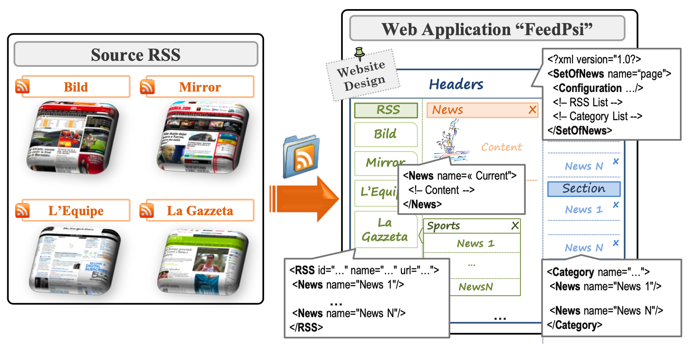

# 一种为客户端 Web 应用构建基于 XML 的 DSL 解决方案的方法
Enrique Chavarriaga, Francisco Jurado, Fernando Díez

2017/04 [original english](origin/approach_chavarriaga_computer_languages_systems_structures_2017_ps.pdf)

----
## 摘要
特定语言（DSL）凭借其提供的抽象层次，在构建应用时，能够减轻软件工程师与领域专家的工作负担。当领域限定于 Client-Side Applications（CSWA）时，通常会结合基于 XML 的语言、框架和组件，以提供快速、稳健且灵活的解决方案。本文提出一种设计方法，可用于为 CSWA 创建基于 XML 的 DSL 解决方案，包含评估引擎、编程模型及轻量级开发环境。该方法可同时运行（evaluate）多个基于 XML 的 DSL 程序，为 CSWA 领域的特定问题提供解决方案。为充分展示此创新方法的能力与潜力，我们将通过 *Anisha* 和 *FeedPsi* 两个案例进行阐释。 *(译注：关于 CSWA 没有定义)*

----
## 关键词
领域特定语言；XML 解释器；JavaScript；Web 应用；XML 编程语言。

----
## 1. 引言
领域特定语言（DSL）通过提供高层次抽象，用于建模解决特定领域问题的规范、结构和功能。DSL 的目标是通过让领域专家在构建高质量可靠系统时更高效地完成任务，从而简化系统的设计、定义和实现，进而提供领域特定解决方案 [52](#52)。简而言之，Fowler [16](#16) 将 DSL 定义为 “一种表达能力有限、专注于特定领域的计算机编程语言”。

领域特定语言（DSL）的开发需要借助扫描器 (scanner)、解析器和代码生成工具来评估领域特定模型，从而实现相关功能。然而，当基于 XML 标准进行开发时，XML 领域特定语言（XML-DSL）可利用通用解析器，如 XML 简单应用程序接口（SAX）和文档对象模型（DOM）[53](#53)。这些 API 已集成于多数编程语言中，使程序员能够访问并修改跨 XML 语言的结构与内容。由此，XML 既能以最契合建模需求的语言存储和交换自动文档化的结构化信息 [13](#13)、[55](#55)，又能通过标准 API 轻松实现语法规范与功能扩展。因此，XML-DSL 提供了可扩展且易于组合的直观DSL规范，其关联功能可借助目标编程语言现有的 API 快速实现。

过去十年的技术变革彻底改变了可交付的基于网络的信息系统的功能与类型。这些变革要求我们在为客户端网络应用程序（CSWA）提供解决方案时采取全新视角。当前，此类解决方案的设计与实现仍处于探索阶段 [46](#46)，主要基于动态网页构建及其相关技术 [36](#36)、[54](#54)。此外，Web 2.0 [1](#1) 提供了构建功能完善、体验愉悦且易于使用的网页所需的技术、服务和工具，其附加价值在于能够实现跨平台部署。

然而，尽管 CSWA 日益重要，且科学界与工业界对 DSL 表现出浓厚兴趣，据我们所知，能为 CSWA 创建 DSL 解决方案的研究仍寥寥无几。因此，本文旨在探讨为 CSWA 创建并实现 XML-DSL 的方法，这正是现有解决方案未能覆盖的领域。为此，本文提出  *Programmable Solutions Interpreter* （Psi），一种构建 CSWA 解决方案的方法，包含评估引擎、编程模型及轻量级开发环境，我们分别将其命名为 *PsiEngine* 、*PsiModel* 和 *PsiEnvironment* 。该方法支持创建并评估面向 CSWA 的 XML-DSL，通过封装功能模块并与其他 Web 组件及框架集成，从而构建快速、稳健且灵活的解决方案。

*PsiEngine* 的核心组件是 *PsiXML Interpreter*（简称 *PsiXML* ），这是一个能够评估 XML-DSL 程序的 JavaScript XML 解释器。 *PsiXML* 能够注册多种 XML-DSL，并能评估用注册的 XML-DSL 编写的多个程序。XML-DSL 程序是一组可编程标签，每组标签都关联着特定的功能。执行 XML-DSL 程序时，其核心在于评估每个 XML 标签的功能。此外，在 *PsiEngine* 中定义并实现的 XML-DSL，能够链接和交换异构信息（支持 XML 与 JSON 格式），同时应用最新的安全策略和良好的编程实践 [26](#26)、[60](#60)，从而能够为 CSWA 开发灵活的 XML-DSL。

*PsiModel* 为首席程序员们 (lead programmers) 建立了一个编程模型，用于生成 JavaScript 代码及配套文档，主要面向 XML-DSL 和可复用 JavaScript 组件的创建。最后， *PsiEnvironment* 作为轻量级环境，既利用 *PsiModel* 又使用 *PsiEngine* 。

通过这三个要素（ *PsiEngine* 、 *PsiModel* 和 *PsiEnvironment* ），本文目标是，在构建 CSWA 时， 使用 Model Driven Engineering（MDE）奠定基础。MDE 是一种以定义模型为核心的软件方法论，旨在简化信息系统的创建过程 [49](#49)。该方法融合了 DSL、XML-DSL 及 Domain-Specific Visual Language（DSVL）[28](#28) 等概念，并结合转换引擎与代码生成器。在此背景下，本文详述的 *PsiEngine* 与 *PsiModel* 正是实现前述目标的基石。

为展示 *PsiEngine* 的实现及其功能，同时操作 *PsiModel* 及其关联的 *PsiEnvironment*，我们将提供两个案例研究： *Anisha* 与 *FeedPsi* 。 *Anisha* 旨在构建两种 XML-DSL 以实现基础帧动画，该运行示例详细展示了多程序的解释与执行机制，以及信息绑定过程。与此同时，*FeedPsi* 作为新闻聚合 CSWA，旨在评估与其他网页组件、RSS 服务及框架的集成能力。两项案例均遵循文献 [59](#59) 提出的定性案例研究方法论，并将其调整以适应软件工程领域 [2](#2)。通过这两项案例研究，我们将涵盖采用本方法编程 XML-DSL 解决方案的核心特性。

本文其余部分结构如下：第 [2](#2-概述与相关工作) 节将重点介绍相关前沿研究；第 [3](#3-为客户端-web-应用构建-xml-dsl-的方法) 节将概述本方法的总体框架及核心特征，并包含 *Anisha* 运行实例；第 [4]() 节将阐述 *FeedPsi* 案例研究，总结 *PsiEngine* 的验证细节；第 [5]() 节将详细呈现研究成果；最后第 [6]() 节将通过总结性评论与未来工作展望结束本文。

----
## 2. 概述与相关工作
领域特定语言（DSL）在文献中尚未获得严格定义。如前所述，Fowler [16](#16) 将其定义为 “一种表达能力有限、专注于特定领域的计算机编程语言”。在 [51](#51) 中，Spinellis 指出 “DSL是为特定应用领域量身定制的编程语言：它并非通用语言，而是精确捕捉该领域的语义特征”。与此同时，Mernik 等人 [38](#38) 指出：“领域特定语言（DSL）是为特定应用领域量身定制的语言。相较于通用编程语言，它们在其应用领域内能显著提升表达能力和易用性。”

文献 [12](#12) 研究了语言的构成要素，并在考虑语言扩展、语言限制、语言统一、自我扩展及扩展组合等因素的基础上，协助对 DSL 进行分类。据此，我们的工作重点在于为 Web 客户端构建自我扩展语言及扩展组合方案。

似乎存在一种共识，即 DSL 是一种专为解决特定领域中具体问题而设计的编程语言。因此，其语法和语义的抽象程度由问题领域决定，旨在实现能够解决特定问题的信息系统。根据 [11](#11)、[16](#16)、[17](#17)、[23](#23)、[25](#25)、[31](#31)、[38](#38) 所述，DSL 已成为软件工程研究的独特领域及核心方法论基石。其价值已在软件工厂 [18](#18)、生成式编程 [9](#9) 及 MDE [10](#10)、[49](#49) 中得到验证。尤其从 MDE 视角看，文献 [10](#10) 中关于构建建模语言的软件产品、平台及转换工具的研究具有重要意义。

在 [32](#32) 中，我们发现了一项关于 DSL 的系统性映射研究（SMS），旨在识别 2006-2012 年期间的研究趋势。该研究的作者试图找出潜在的未解决问题，并分析了他们所称的文献人口统计。在该系统性映射研究中，作者观察到 DSL 社区似乎更关注支持 DSL 开发各阶段（分析、设计与实现）的新技术与新方法，而非新工具的研发，且仅有少量研究聚焦于验证与维护。此外，作者发现多数研究未说明其实现过程中使用的工具。这一发现意义重大，因为构建 DSL 解决方案需要借助 Lex 和 Yacc [4](#4) 或 Flex 和 Bison [34](#34) 等解释器与编译器工具进行实现。当前，Eclipse 和 Visual Studio .NET 等主流 IDE 已提供专门用于 DSL 实现的工具与语言。即便是通用编程语言，也能通过其特性实现相关任务。 IDE 工具的实例不胜枚举，其中 Eclipse 环境的插件尤为突出，例如：Stratego/XT [5](#5)、LISA [39](#39)、Spoofax [27](#27)、Antlr [42](#42)、 Xtext [3](#3) 和 Eclipse Modelling Project [19](#19)，以及 .NET 平台的 DSL Modeling [7](#7) 和 Boo [45](#45)（详见 [38](#38) 中多达 20 种开发工具）。在 [43](#43) 中，作者开发了 Onto2Gra 工具，通过本体论方法构建 DSL。支持构建 DSL 的通用编程语言工具有：Java [3](#3)、C# [30](#30)、Ruby [17](#17)、[14](#14)、Python [37](#37)、Clojure [25](#25)、Groovy [17](#17)、[11](#11)、Haskell [47](#47) 及面向切面编程 [29](@29) 等。

迄今为止，我们可以看到目前存在大量用于实现 DSL 的 IDE 和工具。然而，当我们专注于为 Web 客户端构建 DSL（尤其是 XML-DSL）时，哪种方案更值得推荐？前述的 SMS 并未明确提及为 Web 客户端创建 DSL 解决方案。但在为 Web 客户端构建解决方案的少数工具案例中，值得一提的是 JavaScript 解析器生成器 Jison [6](#6) ——它曾被用于实现 CoffeeScript 语言 [33](#33)。不过 CoffeeScript 并非 DSL，而是借助 Jison 编译为 JavaScript 的小型编程语言。

在为 Web 客户端寻求 DSL 解决方案时，可选方案寥寥无几，它们均仅专注于构建用户界面。例如：[21](#21)、[15](#15) 和 [50](#50) 等文献中，作者虽为 Web 客户端定义了特定的 XML-DSL，却未透露构建过程中所使用的工具。在 [21](#21) 中，我们看到一项针对临床应用的 XML-DSL 研究，用于定义和描述用户界面，不同的用户需要在这个界面上进行交互。在 [15](#15) 中，作者提出了 DUI 语言（Distributed Language Interface）来描述用户界面、任务组合和 Web 增强器。最后，在 [50](#50) 中描述了一种 XML-DSL，用于在 Web 客户端中定义不同的 3D 动画。

鉴于上述两项缺陷 -- 即需要为 Web 客户端研究构建新型 DSL 工具，以及 Web 客户端解决方案需支持 DSL，我们的研究重点在于为 CSWA 实现并执行 XML-DSL 解决方案。

----
## 3 为客户端 Web 应用构建 XML-DSL 的方法
在本节中，我们将详细介绍如何管理可在 CSWA 中直接解释和评估的 XML-DSL 解决方案。据此，本文将阐述与 *PsiEngine* （Programmable Solutions Interpreter Engine）相关的核心理念，以及如何在 Web 客户端中实现、评估该引擎，同时解释和执行代码。通过可运行示例，我们将阐述该方法涉及的若干核心概念：*PsiGrammar* 、*PsiLanguage* 以及 *PsiComponent* 。最后，我们将详细说明该方法所构建的编程模型，命名为 *PsiModel* ，以及为运用和测试该模型而开发的环境。

### 3.1 PsiEngine
[Fig 1](#fig-1) 展示了我们的方法框架。核心思路是获取 *PsiCode*，其用最合适 XML-DSL 编写，连同必要的 *Resources* 一同传入 *PsiEngine* 进行评估与解析。当 *PsiCode* 和 *Resources* 就绪后，*PsiEngine* 将其解析并转换为 JavaScript，这是通过解释其 DOM 并执行和 DOM 元素关联的 JavaScript 完成的。由此，我们获得解决 CSWA 特定问题的 *PsiObject* ，同时系统会报告相应的错误与警告信息以便后续处理。

[Fig 1](#fig-1) 展示了该方法的核心组件：*PsiEngine* 。它完全基于 Web 客户端技术开发，融合了 HTML5、CSS3、JavaScript 和 DOM 技术，并结合了 Web 2.0 的技术、服务和工具。由此我们获得了一个完全在 Web 客户端运行的引擎，通过定义特定的 XML-DSL，该引擎能够构建 Web 组件、Web 控件及/或动态网页，为 CSW A 中提出的特定问题提供解决方案。

#### Fig 1

*Fig 1: PsiEngine（Programmable Solutions Interpreter Engine）在 Web 客户端中执行 PsiCode*

*PsiEngine* 的核心是 *PsiXML Interpreter* ，其主要目标是评估和解释 *PsiCode* ，生成 JavaScript 代码并最终执行它。此外，它还拥有一个名为 *PsiData* 的公共共享区域，该区域允许运行中的 *PsiPrograms* 之间交换信息、功能和对象。

在 [Fig 1](#fig-1) 中，我们还能看到 *PsiXML* 如何管理多个 *PsiLanguage* Ψ = { 𝕃1, 𝕃2, ..., 𝕃m }，即它能够评估、解释和执行这些 XML-DSL。为此， *PsiXML* 会注册一组 *PsiLanguage Definitions* 。对于用 *PsiLanguage*  𝕃𝑗 编写的每个不同的 *PsiCode* 𝑆k ，*Programs Manager* 都会创建并管理对应的 *PsiProgram* 𝑃k。 *PsiProgram* 𝑃k 负责通过基于  *PsiLanguage*  𝕃𝑗 语法的句语和语义分析，将  *PsiCode* Sk 转换为 *PsiObject* 𝑂k （该转换由 *PsiXML* 的 *Translaor* 组件执行）。该转换包括处理 *PsiCode* 的 DOM 结构、验证每个 DOM 元素并执行对应功能（由 *Evaluator* 完成）。此外，*Programs Manager* 负责管理 *PsiXML* 能够评估的所有 *PsiPrograms* P = { 𝑃1 , 𝑃2 , ... , 𝑃n }。

*PsiLanguage* 与其他基于 XML 的语言存在相似性。在 Web 客户端中，定义和使用各类 XML-DSL 时，我们遵循与其他基于 XML 语言相同的方法，例如：XSL、SVG、MathML 等。简言之，这些语言均通过定义 XML 语法来丰富网页内容，每个 XML 元素都承载着特定语义，由对应功能模块在 Web 客户端解释后实现其目标。然而，尽管当前浏览器通过原生代码或插件实现解释器，我们的方案直接利用 *PsiEngine* 进行全部分析工作，该引擎使用基于服务器端动态更新的语言规范。由此，*PsiEngine* 能轻松管理新型 XML-DSL ，关联其语义对应的功能模块，并提供便于评估的运行环境。

另一方面，与其他基于 XML 的语言不同，*PsiLanguage* 能够将 *PsiCode* 与外部资源（包括 XML 和 JSON ）关联，以便在运行时使用和修改信息。关联信息意味着包含数据的 XML 以 DOM（XML-data DOM）形式存在，
因此 *PsiCode* 𝑆k 的任意元素均可引用 XML-data DOM 中的元素。同样地，
也可将 JSON 信息关联至 *PsiCode* 𝑆k 的元素。

#### 3.1.1 定义 PsiLanguage

为了定义 *PsiLanguage* 以便 *PsiEngine* 能够管理，我们需要定义其对应的语法。*PsiLanguage* 的 *PsiGrammar* 𝔾 将通过元组定义：

(1) 𝔾 = ＜𝕋 | Root | Δ ＞

其中 𝕋 = { Tag1, Tag2, ..., Tagn } 是标签集合，Root（对于某个 Tagj ∈ 𝕋, 1 ≦ j ≦ n ）是语法的根元素，Δ 是语言结构定义的对象：

(2) Δ = { Tagi ：Δi | Tagi ∈ 𝕋 }

其中 Δi ∈ Δ 是由下面定义的对象：

(3) Δi = { TAG: vT , CLASS: vC , CHILDREN:vH , MULTIPLICITY:vM , STRICT:vS , VALIDATOR:vV }

其中 vT 是标签名称，vC 是关联的类名称，vH 是子标签节点（默认为 null），vM 是子标签的多重性 （可能值：“0..1”，“1..1”，“0..n” 或 “1..n” ），vS 是子标签的严格验证（默认为 true），vV 指定验证标签属性（默认为 null）。

普遍认为，使用 DTD 和 XML Schema 能轻松描述 XML 文档的结构、语法约束及数据类型。在开发 *PsiEngine* 时，我们分析了这些工具在验证 *PsiCode* 中的应用。如前所述，我们的方法可实现数据与程序的分离。尽管 *PsiCode* 是用 XML 编写的，因此可通过 DTD 或 XML Schema 进行验证，但 XML 和 JSON 数据是在运行时加载并关联的。因此，从这个角度来看，需要一种替代方案来验证代码和数据。由 *PsiLanguage Structure Diagram（PsiLSD）* 与 *PsiGrammar Validator Attributes（PsiGVA）* 构成的组合方案解决了这一问题。

[Fig 2](#fig-2) (a) 中的 *PsiLSD* 展示了与 *PsiGrammer* 相关的语言结构的图形化表示。就其本身而言，[Fig 2](#fig-2) (b) 则展示了 *PsiGVA* 及其用于验证标签属性 vV 的特定语法。*PsiLSD* 和 *PsiGVA* 极大地简化了 *PsiXML* 语法的设计与开发。

#### Fig 2

*Fig 2: (a) PsiLanguage Structure Diagram；(b) PsiGrammar Validator Attributes*

定义 *PsiGrammar* 后，需实现其语义功能，即编码功能，其与 *PsiLanguage* 中每个标签 𝕋 = { Tag1, Tag2, ..., Tagn } 相关联。这些功能由一组类实现，类源自可复用的 JavaScript 组件（参见 [8](#8)、[58](#58) ）实现，随后与对应标签进行匹配。所有功能的评估与执行共同解决 CSWA 中的特定领域问题。

因此，*PsiLanguage* 𝕃 被定义为元组：

(4) 𝕃 = ⟨ 𝔾 | 𝕂 | 𝕋 ↔ C ⟩

其中 𝔾 是 *PsiLanguage* 的 *PsiGrammar* 定义（由 (1) 定义），𝕂 是可复用的 JavaScript 软件组件（称为 *PsiComponent* ），C = { Class1 , ... , Classn } 是在 𝕂 中实现的类的子集，最后， 𝕋 ↔ C 是 TagK 与 ClassK 之间的关联关系， 对于每个 Tagk ∈ 𝕋 以及 Classk ∈ C，分别对应。

[Fig 3](#fig-3) 展示了语法 𝔾 中的标签与其在 C 中的相应类关联。由于 *PsiLanguage* 中的一个标签可能用于定义语法结构的多个部分，因此可关联不同功能。同样地，一个类可以关联到不同标签。在 [Fig 3](#fig-3) (a) 中，我们看到 *PsiLSD* 如何将对应的 JavaScript 类名（即 (3) 中的 vc ∈ 𝛥i ）与其在 XML 语法中的相关标签名关联起来。*(译注：Fig 3 中没有看到（a)，笔误？)*

#### Fig 3

*Fig 3: 定义 PsiLanguage 的标签集与类集之间的关联图*

[Template 1](#template-1) 展示了如何开发 *PsiComponent* 𝕂，其中实现了管理所需功能的类及其在 *PsiGrammar* 中的关联标签。

#### Template 1

需要注意的是，那些将 C 与 *PsiLanguage* 关联的类都继承自一个抽象类（来自 *PsiLanguage Definitions* 的 *PsiElement* ）。该抽象类实现了每个元素的抽象行为。具体而言，它与 XML 源代码中的每个 DOM 元素（即每个标签）绑定起来，管理语法结构，并执行属性与子元素的验证。此外，该抽象类能通过事件集（调用对应 JavaScript 函数）执行各组件的专属功能。同时，*PsiElement* 抽象类还原生管理两种语言：
1. *PsiLanguage to Link Information（PsiLI）*，负责将 *Context* 或 *PsiData* 中存储的 XML/JSON 格式信息关联至对应类；
2. *PsiLanguage Code Attribute（PsiCA）*，用于评估标签属性中的 “inline” 代码。此内联 (inline) 代码旨在通过关联信息设置属性值。

由于这些语言已在 *PsiElement* 抽象类中实现，*PsiLI* 和 *PsiCA* 语言的使用可融入 *PsiLanguage* 的每个元素。这种方法能够原生地关联，外部 XML/JSON 信息资源与每个 *PsiLanguage* 的实现。通过将外部资源存储与 *PsiPrograms* 分离，资源可在组件、框架和 Web 应用间复用。一方面，*PsiLI* 允许 *PsiLanguage* 定义其与外部数据资源的关联；另一方面，*PsiCA* 提供了所需的语义，用于访问、使用和修改这些资源。这在创建 XML-DSL 时具有创新性，因为它能为任何 XML-DSL 提供异构的 XML/JSON 信息，而其他方法，如 XLink（XML Linking Language）则通过链接文档、图像和文件之至网络 (through to the web) ，来添加 XML 元素和资源。

有关 *PsiEngine* 的更多细节详见 http://hilas.ii.uam.es/api 。该网站包含 *PsiXML* 的交互式类图、详细的 *PsiLanguages* 定义及其他编程元素。

#### 3.1.2 运行示例：Anisha 案例研究
为展示该方法在系统化定义的开发流程中的运作机制，我们将首先定义语法，随后详述相关功能如何与各语法元素关联，最后演示解释器如何执行每种语言的源代码。为此，我们将采用名为 *Anisha* 的运行示例。*Anisha* 融合了两种 *PsiLanguages*：*ShapesPsi* 与 *AnimaPsi*。*ShapesPsi* 支持创建基于 SVG 的圆形与矩形，而 *AnimaPsi* 则能操控 *ShapesPsi* 定义的图形元素进行移动与停驻。

***ShapesPsi 语言***

[Frag 1](#frag-1) 展示了用 *ShapesPsi* 语言编写的示例代码。在此代码中，我们可看到如何创建一个以点 (100, 100) 为中心、标记为 “Circle”、半径为 30（所有单位均为像素）的红色圆形，以及一个以点 (250, 100) 为中心、标记为 “Rectangle”、宽度为 20、高度为 10 的蓝色矩形。运行效果可访问 http://hilas.ii.uam.es/Anisha/basic 查看。

#### Frag 1

如前所述，*ShapesPsi* 是一种遵循基于 XML 语法的 DSL，用于创建圆形和矩形。[Fig 4](#fig-4) (a) 展示了 *ShapesPsi* 语言的 *PsiLSD* ，其中根标签 *Shapes* 标志着程序的起始点。随后可定义必要的语法元素：圆形（多个 *Circle* 标签）和矩形（多个 *Rectangle* 标签）。

#### Fig 4

*Fig 4: (a) ShapesPsi 语言的 PsiLSD (b) Shapes 组件的类图*

[Fig 4](#fig-4) (b) 展示了 **Shapes** 组件的 UML 类图。**Shapes** 类定义了一组圆形和矩形。基类 *Base* 定义了通用图形，而 *Circle* 类在 SVG 画布上绘制带中心文本的圆形，*Rectangle* 类则绘制带中心文本的矩形。所有编码的圆形与矩形均存储于 *PSI Data* 中，以便其他程序和语言使用。建议读者访问 http://hilas.ii.uam.es/Anisha/api 查阅 **Shapes** 组件的详细实现。

因此，我们可以将 *ShapesPsi* 语法定义如下：

𝔾ShapesPsi = ⟨ 𝕋ShapesPsi │ Shapes │ 𝛥ShapesPsi ⟩

作为标签集

𝕋ShapesPsi = { Shapes, Circle, Rectangle }

标签根节点为 Shapes, 且 ΔShapesPsi = { ti : 𝛥i │ ti ∈ 𝕋ShapesPsi }

其实现遵循 [Frag 2](#frag-2) 中预先定义的模板。Shapes 标签包含一个名为 *name* 的必填属性，并包含 *Circle*和 *Rectangle* 标签。*Circle* 标签通过属性指定 id、圆心位置、半径（默认 10px）、标签及 CSS 样式。*Rectangle* 标签通过属性指定 id、起始点、宽高（默认均为 10px ）、标签及 CSS 样式。 [Frag 2](#frag-2) 展示了 𝕋 ↔ C 关联（如 (4) 所定义），即使用 [Template 1](#template-1)，将 *ShapesPsi* 语法中的标签与 *ShapesPsi* 语言的 *PsiComponent* 类建立关联。完整 JavaScript 代码可访问 http://hilas.ii.uam.es/js/psi/Anisha.js 查看。此外，*Anisha* 案例研究的源代码将请参看 http://github.com/echavarriaga/Anisha 。

#### Frag 2

在展示如何为 *Shapes* 组件实现 JavaScript 功能后，我们将演示如何使用 *PsiLI* 和 *PsiCA* 语言。为此，我们将详细说明如何为 *ShapesPsi* 指定两个新的可编程标签（Circle 和 Rectangle）。我们将利用两个信息源：XML 文档和 JavaScript 对象。

以下是一个基于两个角色的简单游戏。首先，[Frag 3](#frag-3) 展示了如何从 XML 文件中提取角色信息。其次，[Frag 4](#frag-4) 呈现了角色的特征如何定义 *Context* 对象，以及如何通过 *PsiData* 加载并注册 XML 文件（[Frag 3](#frag-3) ）。

#### Frag 3

#### Frag 4

[Frag 5](#frag-5)  展示了一个基于 *PsiLI* 和 *PsiCA* 语言的 *ShapesPsi* 程序。Circle 标签定义了 *data-document* 属性，其值采用 *PsiLI* 语言编写并由 *PsiXML* 解析。因此 *PsiData* 对象会查找 id 值等于 **p1** 的角色（jQuery 选择器 **Character[id=p1]** ），并将结果赋值给变量 *info*，该变量被添加至 *Circle* 类的实例中。此外，*data-context* 属性从标识为 **p1** 的 *Context* 对象中获取 *features* 属性值，并将该值赋给类实例的 *qt* 变量。值得注意的是，*data-context*（ *Context* 对象信息）和 *data-document*（*PsiData* 信息）属性均被记录，且在任何 *PsiLanguage* 中所有标签都原生支持这两种属性。

此外，[Frag 5](#frag-5) 展示了*Circle* 标签的 *label* 属性，如何运用 *PsiCA* 语言从 *info* 获取信息。同理，*center* 和 *style* 属性也通过 *PsiCA* 语言从 *qt* 获取信息。

#### Frag 5

在此，我们再次强调其原生关联异构信息源（XML 或 JSON）与程序元素的能力，包括 *PsiLI* 和 *PsiCA*。绑定至该元素的类接收信息并根据需求进行处理。这丰富了编程体验，因为元素的属性可被转换为 Object 或 DOM 元素。

***AnimePsi 语言***

继续 *Anisha* 的运行示例，[Fig 5](#fig-5)  展示了 *AnimePsi* 语言的实现，该语言可移动 *ShapesPsi* 定义的图形。此语言包含两个标签：*Animates* 和 *Move*。[Fig 5](#fig-5) (a) 呈现了 *AnimePsi* 语言的 *PsiLSD*，[Fig 5](#fig-5) (b) 则展示了其 *PsiGVA*。

根据 [Fig 5](#fig-5) (a)，*Animates* 根标签定义了一组图形运动，即多个 *Move* 标签。*Move* 标签定义了对图形的引用（ *key* 属性）、运动路径（ *path* 属性）、路径步数（ *steps* 属性）、运动时长（ *seconds* 属性）、初始等待时间（ *wait* 属性，默认值为 0 ）以及是否重复运动（ *repeat* 属性，默认值为 “no” ）。

#### Fig 5

*Fig 5:  (a) AnimePsi 语言的 PsiLSD。(b) AnimePsi 语言的 PsiGVA。(c) Anime 组件的类图。*

**Anime** 组件实现了与 *AnimePsi* 语言相关的功能，如 [Fig 5](#fig05) (c) 的类图所示。该组件包含两个类：*Animates* 和 *Move*，分别绑定至 *Animates* 和 *Move* 标签。*Animates* 类负责启动动画程序，而 *Move* 类则根据 SVG *path*标签的定义，实现与 *Move* 标签绑定的移动功能。建议读者查阅 http://hilas.ii.uam.es/Anisha/api 中 *Shapes* 组件的详细实现方案。

在 [Frag 6](#frag-6) 中，我们可以看到角色移动在前一个片段中定义。在评估这个 *AnimePsi* 程序时，“Luke” 接近 “Obi-Wan”，后者随即逃离。评估过程可见于 http://hilas.ii.uam.es/Anisha/runs。

#### Frag 6

*Anisha* 案例研究的主要目标在于展示 *PsiEngine* 的若干特性。首先，该示例验证了异构源信息（XML与JSON）的绑定能力，这一特性赋予 *PsiEngine* 中的 XML-DSL 高度灵活性。其次，*Anisha* 测试了多个 *PsiLanguage* 的共存能力，以及在快速信息交换与跨功能协作情况下运行多个 *PsiProgram* 的能力。总体而言，*PsiEngine* 支持创建高度抽象化的简洁 XML-DSL，这些语言兼具可扩展性与可组合性。

### 3.2 Psi 编程模型及其轻量级环境
目前，代码生成已成为软件工程的核心活动，尤其是 MDE [49](#49) 备受关注。在构建信息系统时，代码生成能显著节省时间、提升效率、提高质量并增强标准化程度 [44](#44)、[49](#49)。在此背景下，为简化 *PsiLanguage* 𝕃 的创建，我们采用前述方法提出 *PsiModel*。*PsiModel* 支持定义 *PsiGrammar* 𝔾 、支持 *PsiComponent* 𝕂 的实现，及其他 JavaScript 组件。

*PsiModel* 通过代码后置 (code-behind) 技术将 *PsiLanguage* 规范与 *PsiComponent* 实现及其关联分离。为此，*PsiModel* 涉及如 [Fig 6](#fig-6) 所示的两种 *PsiLanguage* ：
- *MPsi Specification Language*：一种 *PsiLanguage*，用于指定编程元素，即可编程标签。
- *MIPsi Implementation Language*：一种 *PsiLanguage*，用于实现通过 *MPsi* 语言指定的编程元素。

#### Fig 6

*Fig 6: 用于生成 JavaScript 代码和文档的 PsiModel Schema*

通过此方法，*MPsi* 与 *MIPsi* 分别实现了编程元素的定义与实现，包括：*Var*、*Object*、*Enum*、*Script*、*Class*（采用 [8](#8)、[58](#58) 中给出的类定义）、*Component*（采用 [8](#8)、[58](#58) 中给出的组件或模块定义）以及 *ComponentPsi*（定义并实现 *PsiGrammar* 与 *PsiComponent* 以生成 *PsiLanguage* ）。有关 *MPsi* 与 *MIPsi* 语言规范及实现的更多细节，请参阅 http://hilas.ii.uam.es/psimodel 。

为在构建 *PsiLanguage* 时使用包含 *MPsi* 和 *MIPsi* 的 *PsiModel* ，我们实现了名为 *PsiEnvironment* 的轻量级开发环境。[Fig 7](#fig-7) 展示了通过 URL 访问的 *PsiEnvironment* 快照：

(5) http://hilas.ii.uam.es/PsiXML/viewer.html?psifile=\<name\>

其中 *\<name\>* 代表项目或组件名称。此外，每个项目或组件的源代码均可在 http://github.com/echavarriaga/PsiSource/ 获取。

例如，[Fig 7](#fig-7) 展示了 *Anisha* 案例研究（ psifile=*Anisha* ）。“Specification” 选项卡包含 *MPsi* 定义，而 “Implementation” 选项卡则包含 *MIPsi* 实现。

#### Fig 7

*Fig 7: 应用 PsiModel 的轻量级开发环境*

*PsiEnvironment* 实现了多项功能，包括为 *MPsi*、*MIPsi*、JavaScript、XML、HTML 和 CSS 语言提供代码自动完成。它还具备可视化组件，用于在线显示 *PsiLSD* 图、UML 类图以及源代码。一旦定义并实现 *PsiLanguage*，*PsiEnvironment* 即可自动生成 JavaScript 代码。

*PsiEnvironment* 的另一项功能是为生成的 JavaScript 代码以及 *PsiModel* 语言，计算一套所对应的软件度量指标。这些指标包括：代码行数 [40](#40)（ SLOC、LLOC 和 CLOC ）、圈复杂度 [35](#35)、Halstead 度量 [20](#20) 及可维护性指数 [41](#41) 。为执行这些计算，我们采用了基于 NodeJS（ nodejs.org ）实现的 Excomplex [48](#48) 工具包。

### 3.3 最后总结
在本节中，我们介绍了使用 *PsiEngine* 创建 XML-DSL 的方法，并将其命名为 *PsiLanguage*。通过 *Anisha* 运行示例，我们演示了 *PsiLanguage* 的创建过程及其与 *PsiEngine* 相关功能的结合。此外，我们还提出了 *PsiModel* ，一种编程模型及其对应的轻量级编程环境，旨在简化语言规范制定与 *PsiComponent* 的实现过程。*PsiComponent* 的设计与实现可概括为以下步骤：

1. 创建 *PsiLSD* 并指定 *PsiGVA*。
2. 为 *PsiComponent* 创建 UML 类图。
3. 基于 *PsiLSD* 和 *PsiGVA* ，使用 *PsiEnvironment* 实现 *PsiComponent* 功能。
4. 对 *PsiComponent* 执行功能测试。

以下章节将重点介绍 *FeedPsi*，一款完全采用所提方法开发的 Web 应用程序。最后一节则致力于通过定性案例研究方法对 *PsiEngine* 进行验证。

## 4 FeedPsi Web 应用案例研究
为验证我们的方法，本案例研究旨在展示如何运用 *PsiEngine* 对名为 *FeedPsi* 的 Web 应用进行规格定义与实现。简而言之，该 Web 应用旨在创建并部署动态网页，通过聚合多个网络源的内容构建一个新闻门户。这些内容源可采用两种最常见的格式：RSS [57](#57)、[22](#22) 与 Atom [56](#56)、[24](#24)，二者均基于 XML 编写。

在本节中，我们将完整呈现从问题分析到实现的整个流程，并全程运用 *PsiEngine* 引擎。该流程始于如何构建 *FeedPsi Language* 并将其封装为 *PsiComponent* 组件，继而评估 *PsiProgram*，最终生成动态网站。

### 4.1 分析与设计
[Fig 8](#fig-8) 展示了 *FeedPsi* Web 应用程序的设计。该系统管理 RSS 订阅源，支持用户选择、显示、按类别存储及/或处理新闻内容。此外，图中呈现的 *FeedPsi* 语言，通过 *Feed Component* 实现，并在所示的 *PsiXML Interpreter* 上进行评估。*FeedPsi* 需管理：RSS 订阅源列表（含多个 RSS 标签）、分类列表（含多个 Category 标签）以及用户当前选定新闻列表（含单个 *MainNews* 标签）。读取 RSS 订阅源时，新闻标题将显示于悬浮子菜单（见 [Fig 8](#fig-8) ）。经标记后，新闻可显示或存储于任意分类以便后续阅读。

所设计的 Web 应用程序无需服务器端编程，使得整个应用程序的部署能够直接在网页客户端完成，从而最大限度地降低服务器端的计算成本。

为更清晰地阐释本方案的应用场景，下文将展示另一个采用该方法的案例研究 *FeedPsi*。该动态 Web 应用程序完全基于本方案开发而成。*(译注：这段文字有些突兀，估计是修改造成的)*

#### Fig 8

*Fig 8: 基于 PsiLanguage 的通过 RSS 订阅聚合新闻的 Web 应用程序设计*

### 4.2 订阅源组件规范
基于我们 DSL 方法实现的用于管理和显示 RSS 订阅源的 Web 应用程序，首先需按前述说明制定对应的 *Feed Component* 规范。接下来我们将详细说明具体步骤。

[Fig 9](#fig-9) 展示了 *FeedPsi* 语言的 *PsiLSD*，[Fig 9](#fig-9) (b) 则展示了其 *PsiGVA*。*SetOfNews* 标签是 *FeedPsi* 程序评估中的根元素，包含 RSS 源列表（ *RSS* 标签）、分类列表（ *Category* 标签）以及当前显示的新闻（ *MainNews* 标签）。

*RSS* 标签包含标识符、名称及 RSS 源的 URL。它能通过 AJAX 连接从 RSS 新闻服务获取数据。*Category* 标签按类别存储新闻列表，包含标识符和分类标题。*MainNews* 标签则包含当前呈现给用户的新闻列表。最后，*News* 标签包含从 RSS 源获取的新闻，具有唯一标识符，当其属于 *MainNews* 标签时将被显示。

#### Fig 9

*Fig 9: (a) FeedPsi 语言的 PsiLSD 表示。(b) FeedPsi 语言的 PsiGVA 表示。(c) Feed 组件的类图。*

[Fig 9](#fig-9) (c) 展示了 Feed Component 的类图。Feed Component 的详细实现可通过以下网址查看： http://hilas.ii.uam.es/FeedPsi/api ，其中包含类图和文档页签。Feed Component 的完整 JavaScript 代码可通过 http://hilas.ii.uam.es/js/psi/FeedPsi.js 访问。此外，源代码将在 http://github.com/echavarriaga/FeedPsi 中提供。

在类图 [Fig 9](#fig-9) (c) 中，我们可以看到与新闻集合（ *SetOfNews* 类）相关联的功能，该集合支持添加和移除 RSS 源及分类。每个 RSS 源（ *RSS* 类）均具备通过关联 URL 发起 AJAX 调用以更新内容的能力，可创建新闻条目，并借助 *SetOfNews* 类生成新闻标题的子分类。

此外，可通过 *PanelNews* 类管理（添加、删除或验证）分类（ *Category* 类）和当前显示的新闻（ *MainNews* 类）。*MainNews* 类已实现用于可视化展示从 RSS 源或不同分类中选取的新闻。同时，*News* 类定义具有唯一 ID 的新闻条目，并负责新闻的显示。*UserInterface* 类负责处理并呈现 *FeedPsi* 应用程序的用户界面。

### 4.3 运行 FeedPsi Web 应用程序
为展示 *Feed Component* 如何与 *FeedPsi* 语言协同运行以实现 *FeedPsi* Web 应用程序（ http://hilas.ii.uam.es/FeedPsi ），我们将演示其如何处理以下期刊 (periodicals) 的 RSS 源：*Bild、Mirror、AS、La Gazzeta、L’Equipe和El Tiempo*（ 见 [Fig 10](#fig-10) ）。

因此，[Frag 7](#frag-7) 展示了实现 *FeedPsi* Web 应用程序（新闻聚合器）的 *FeedPsi* 源代码。

#### Frag 7

[Fig 10](#fig10) 展示了 *PsiXML* 处理源代码后生成的 Web 应用程序。在 http://hilas.ii.uam.es/FeedPsi/index.html?list=〈name〉 中，可评估其他 *FeedPsi* 程序，其中〈name〉可选取 *science、spain、sport-es、technology* 和 *journal* 等类别。

最后需说明，本案例研究的目的并非部署完全调试完毕的 Web 应用程序，而是更清晰地展示如何运用 *PsiComponent、PsiLanguage* 及 *PsiXML* 概念构建 Web 应用程序。

#### Fig 10

*Fig 10: FeedPsi Web 应用程序*

----
## 致谢
本研究由 B2T-Concept 公司（ http://www.b2tconcept.com/ ）的 DSVL-B2T 研发部门提供部分支持。

----
## 参考文献
#### 1
Anderson, P. 
Web 2.0 and Beyond: Principles and Technologies. 
London: Chapman and Hall/CRC, 2012.

#### 2
Baxter P, Jack S. 
Qualitative Case Study Methodology: Study Design and Implementation for Novice Researchers. 
The Qualitative Report;2008:13-4.

#### 3
Betinni L. 
Implementing Domain-Specific Languages with Xtext and Xtend. 
Birmingham: Packt Publishing Ltd; 2013, p. 1-11.

#### 4
Brown D, Levine J, Mason T. 
Lex & Yacc. 2nd ed. 
New York: O'Reilly Media, Inc; 1992.

#### 5
Bravenboer M, Trygve K, Vermaas R, Visser E. 
Stratego/XT: A language and toolset for program transformation. 
Science of Computer Programming. 2008; 72(1–2), p.52-70. 
http://dx.doi.org/10.1016/j.scico.2007.11.003.

#### 6
Carter Z. 
JS sequence diagrams. 
http://jison.org; 
2009 [accessed 30.10.16].

#### 7
Cook S, Jones G, Kent S, James D. 
Domain-Specific Development with Visual Studio DSL Tools. 
Denver: Addison-Wesley Professional; 2007, p. 1-23.

#### 8
Crockford D. 
JavaScript: The Good Parts. 
Sebastopol: O'Reilly Media, Inc; 2008, ch. 5.

#### 9
Czarnecki K, Eisenecker U. 
Generative Programming: Methods, Tools and Applications. 
Denver: Addison-Wesley; 2000.

#### 10
Da Silva AR. 
Model-driven engineering: a survey supported by a unified conceptual model. 
Computer Languages, Systems & Structures. 
2015; 43, p.139-155.

#### 11
Dearle F. 
Groovy for Domain-Specific Languages. Birmingham: 
Packt Publishing Ltd; 2010, ch. 1.

#### 12
Erdweg S, Giarrusso PG, Rendel T. 
Language composition untangled. 
Proceedings of the 12th Workshop on Language Descriptions, Tools, and Applications, LDTA 2012.

#### 13
Fawcett J, Quin L, Ayers D. 
Beginning XML. 5th ed. 
Wrox Press; 2012.

#### 14
Fanagan D, Matsumoto Y. 
The Ruby Programming Language. 
Sebastopol: O’reilly Media, Inc.; 2005, ch. 8.

#### 15
Firmenich S, Rossi G, Winckler M, Palanque P. 
An approach for supporting distributed user interface orchestration. 
International Journal of Human-Computer Studies, 2014;72:1: p. 53- 76.

#### 16
Fowler, M. 
Domain Specific Languages. 
Denver: Addison-Wesley Professional; 2010, p. 21-27.

#### 17
Ghosh, D. 
DSLs in Action. 
Greenwich: Manning Publications, 2010, p. 9-15.

#### 18
Greenfield J, Short K. 
Software Factories: Assembling Applications with Patterns, Models, Frameworks, and Tools. 
New Jersey: Wiley Publishing; 2004.

#### 19
Gronback RC. 
Eclipse Modeling Project: A Domain-Specific Language (DSL) Toolkit. 
Denver: Addison-Wesley Professional; 2009.

#### 20
Halstead M. 
Elements of Software Science. 
New York: The Computer Science Library; 1977.

#### 21
Herzberg D et al. 
Specifying computer-based counseling systems in health care: A new approach to user-interface and interaction design. 
Journal of Biomedical Informatics. 2009; 42:2: p. 347-355.

#### 22
Holzner S. 
Secrets of RSS. 
Berkeley: Peachpit Press.; 2006, ch. 3.

#### 23
Hudak P. 
Building domain-specific embedded languages. 
ACM Comput. 1996;196:4.

#### 24
Johnson D. 
RSS and Atom in Action: Web 2.0 Building Blocks. 
Greenwich: Manning Publications Co.; 2006, p. 70-77.

#### 25
Kelker R. 
Clojure for Domain-specific Languages. 
Birmingham: Packt Publishing Ltd.; 2013, ch. 1.

#### 26
Kern C. 
Securing the tangled web. 
Communication ACM 2014;57:9: p. 38-47.

#### 27
Kats L, Kalleberg K, Visser E. 
Domain-Specific Languages for Composable Editor Plugins. 
Elsevier: Proceedings of the Ninth Workshop on Language Descriptions, Tools, and Applications (LDTA'09), 
Electronic Notes in Theoretical Computer Science 2009;253:7, p. 149-163.

#### 28
Kelly S, Tolvanen J. 
Domain-Specific Modeling: Enabling Full Code Generation. 
Wiley-IEEE Computer Society Press 2008.

#### 29
Kniesel G, Winter V, Siy H, Zand M. 
Making aspect-orientation accessible through syntax-based language composition. 
IEEE: IET Software 2009;3:1, p. 1-13.

#### 30
Kourie, D.G., Fick, D. & Watson, B.W. (2008). 
Virtual machine framework for constructing domain-specific languages. 
IET Software. IEEE, 3, 3, 219-237.

#### 31
Kosar T, et al. 
Comparing general-purpose and domain-specific languages: An empirical study. 
Computer Science and Information Systems 2010;7:2, p. 247–264.

#### 32
Kosar T, Bohra S, Mernik M. 
Domain-Specific Languages: A Systematic Mapping Study. 
Information and Software Technology 2016;71, p. 77-91.

#### 33
Lee P. 
CoffeeScript in Action. 
Greenwich: Manning Publications Co.; 2014, ch. 1.

#### 34
Levine J. 
Flex & Bison. 
Sebastopol: O'Reilly Media, Inc.; 2009.

#### 35
McCabe T. 
A Complexity Measure. 
IEEE Transactions on Software Engineering 1976;SE- 2:4, p.308-320.

#### 36
McDaniel A. 
HTML5: Your visual blueprintTM for designing rich web pages and applications. 
Indianapolis: Jhon Wiley & Sons, Inc.; 2011, ch. 3-8.

#### 37
McGuire P. 
Getting Started with Pyparsing. 
Sebastopol: O'Reilly Media, Inc.; 2007.

#### 38
Mernik M, Heering J, Sloane AM. 
When and how to develop domain-specific languages. 
ACM Comput. Surv. 2005;37:4, p. 316–344.

#### 39
Mernik M, Lenic M, Avdičaušević E, Zumer V. 
LISA: An Interactive Environment for Programming Language Development. 
Springer Berlin Heidelberg, Lecture Notes in Computer Science 2002;2304, p. 1-4.

#### 40
Nguyen V, Deeds-Rubin S, Tan T, Boehm B. 
A SLOC Counting Standard. 
University of Southern California, Center for Systems and Software Engineering, 
http://sunset.usc.edu/csse/TECHRPTS/2007/usc-csse-2007-737/usc-csse-2007-737.pdf; 
2007 [accessed 13.06.16].

#### 41
Oman PW, Hagemeister J, Ash D. 
A Definition and Taxonomy for Software Maintainability. 
Moscow: Technical Report, University of Idaho, Software Engineering Test Laboratory; 1991.

#### 42
Parr T. 
The Definitive ANTLR 4 Reference. 2nd ed. 
Raleigh: Pragmatic Bookshelf; 2013, part 1.

#### 43
Pereira MJ, Fonseca J, Henriques PR. 
Ontological approach for DSL development. 
Computer Languages, Systems & Structures. 2016; 45:1, p.35-52.

#### 44
Prout A, Atlee JM, Day NA, Shaker P. 
Code generation for a family of executable modelling notations. 
Software and Systems Modeling; 2012;11:2, p. 251-272.

#### 45
Rahien A. 
DSLs in Boo: Domain-Specific Languages in .NET. 
Greenwich: Manning Publications Co.; 2010, ch. 3-4.

#### 46
Sajja PS, Akerkar R. 
Intelligent Technologies for Web Applications. 
Minneapolis: CRC Press; 2012, ch. 1.

#### 47
Serrano, A. 
Beginning Haskell A Project-Based Approach. 
New York: Apress; 2014, part 4.

#### 48
Stilwell J. 
npm: Escomplex, v 1.3. 
https://www.npmjs.com/package/escomplex; 
2014 [accessed 15.07.16].

#### 49
Schmidt DC. 
Model-driven engineering. 
Computer-IEEE Computer Society 2006;39:2:25.

#### 50
Shim H, Kang B, Kwag K. 
Web2Animation - Automatic Generation of 3D Animation from the Web Text. 
IEEE/WIC/ACM: Proceedings of the 2009 International Joint Conference on Web Intelligence and Intelligent Agent Technology (WI-IAT '09).

#### 51
Spinellis D. 
Notable design patterns for domain-specific languages. 
Journal of Systems and Software 2001;56:1, p. 91-99.

#### 52
Voelter M, et al. 
DSL Engineering: Designing, Implementing and Using Domain-Specific Languages. 
Dslbook.org; 2013, p. 23-38.

#### 53
Document Object Model (DOM) Level 3 Core Specification, 
http://www.w3.org/TR /2004/REC-DOM-Level-3-Core-20040407/; 
2004 [accessed 30.06.16].

#### 54
Web Design and Applications, 
http://www.w3.org/standards/webdesign/; 
2014 [accessed 28.06.16].

#### 55
XML Technology, 
http://www.w3.org/standards/xml/; 
2014 [accessed 27.06.16].

#### 56
Wittenbrink H. 
RSS and Atom. 
Birmingham: Packt Publishing; 2005, ch. 4.

#### 57
Woodman M. 
How to Build an RSS 2.0 Feed. 
Sebastopol: O'Reilly Media, Inc.; 2006.

#### 58
White A. 
JavaScript Programmer’s Reference. 
Indianapolis: Wiley Publishing, Inc.; 2009, ch. 10.

#### 59
Yin RK. 
Case Study Research: Design and Methods. 5st ed. 
London: Sage Publications, Inc.; 2014.

#### 60
Yue C, Wang H. 
A measurement study of insecure javascript practices on the web. 
ACM Transaction Web 2013;7:2, p. 1-39.
